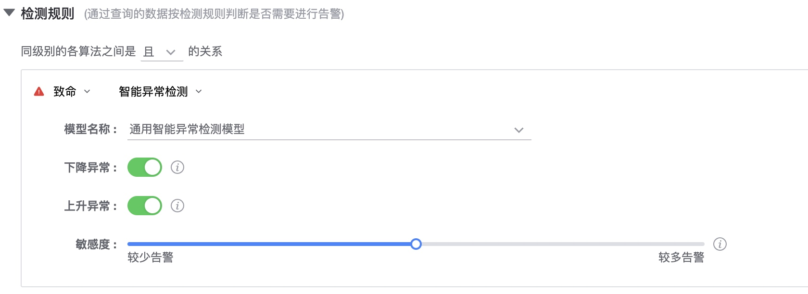
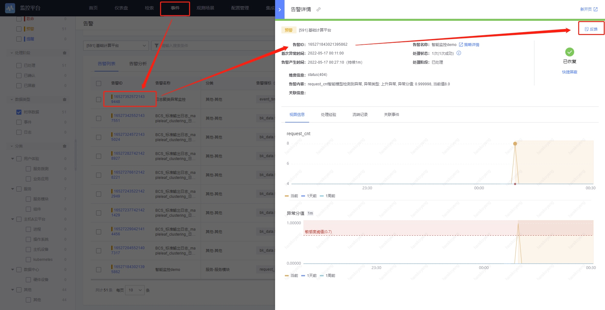

# 单指标智能异常检测

AIOps相关的能力依赖蓝鲸AIOps平台，蓝鲸监控对接了AIOps平台的场景服务，在AIOps平台添加一个模型就可以直接在蓝鲸监控使用。 

### 适用的数据

1. 数据类型：指标数据，支持多维度的指标数据
2. 数据来源：监控采集，默认上报的，计算平台tspider的可以在监控查看到的数据。 自定义上报和日志的数据不包括在内。 

### 配置方法

1. 监控数据中选择添加监控指标。

2. 模型名称中选择“通用智能异常检测模型”。

3. 配置希望检测的异常方向：向上、向下。
4. 配置敏感度，如果不清楚可以先不动，等有效果之后再根据告警情况进行调整，敏感度越高命中的告警更多，敏感度越低命中的告警越少。
  PS：配置完成后有一段时间的延迟，并且智能学习有一定的学习过程。
  
5. 接收到告警后，如果不准确，可以在告警详情中进行反馈，模型会定期持续训练

### 适用的数据场景

智能异常检测适用于大部分时序指标，特别适用于以下三种场景。

#### 场景一：指标呈现周期性波动 

当指标呈现周期性波动时，难以设置合理的静态阈值来检出图中明显的异常点，该场景下使用智能异常检测，既能保证检测的准确性，也能避免重复告警对用户的骚扰。

#### 场景二：指标呈现趋势性增长或下降

当指标呈现合理的增长或下降趋势时，使用静态阈值会在指标持续下降/上升期间被检测为异常；该场景下使用智能异常检测，能够自适应曲线的下降/上升趋势，当且仅当指标变化幅度明显过大时才被检测为异常。

#### 场景三：指标呈现突增或突降趋势

当指标呈现无法预期的突增或突降变化时，难以设置合理的静态阈值识别出曲线的突增点，该场景下使用动态异常检测，则可自动捕捉不同程度的突增或突降变化，对于指标变化幅度明显过大时会被检测为异常。

