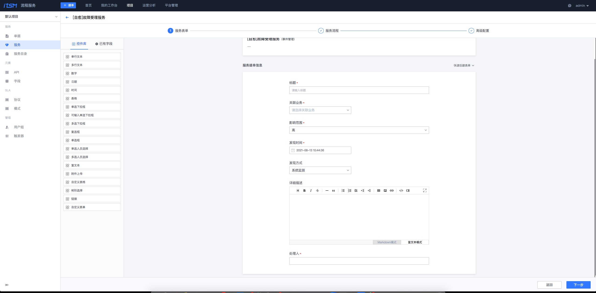

# 处理套餐-流程服务

流程服务即ITSM，可以通过流程编排将各个角色串起来，告警事件触发流程让不同的角色协同工作也是经常使用的一种方法。 

## 第一步： 创建工单项目和服务流程

### 新建服务

访问流程服务> 项目 > 服务 > 新建

配置服务名称， 所属目录以及服务类型

* 所属目录可以根据业务自身需求进行目录管理，如基础设备，基础服务等
* 服务类型一般选择事件管理 或者 问题管理

### 表单设计

可以通过从已有模板，已有服务克隆提单表单，也可以自定义表单进行表单设计

### 服务流程设计

可根据业务的解决问题流程进行自定义流程设计

