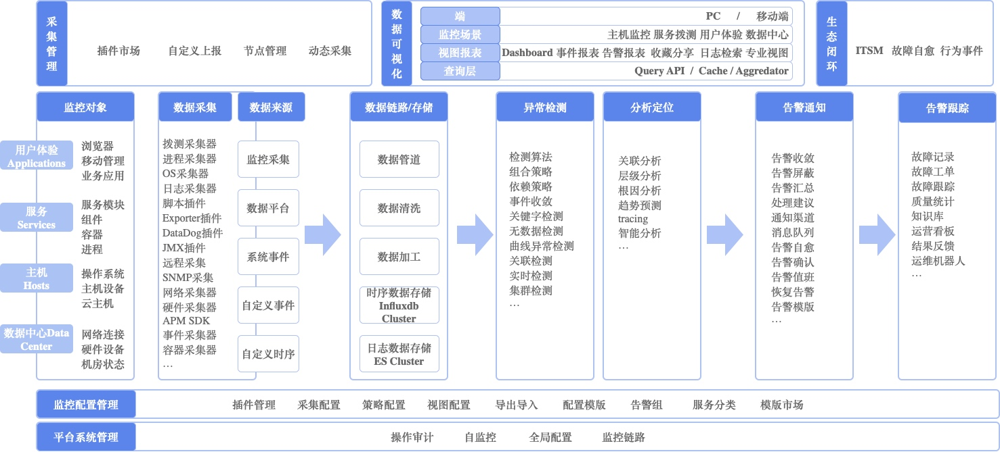

# 产品架构

监控平台致力于实现一站式监控平台，目标要做到**快**、**稳**、**准**、**全**。

* **快**： 数据上报快、数据处理快、问题定位快、故障处理快

* **准**： 问题定位准确、信息准确、智能决策

* **稳**： 告警及时、不漏告、不多告、海量数据处理能力

* **全**： 数据全、管理齐、生态闭环

## 架构图

要了解监控平台主要掌握三条主线：

* **第一条：数据处理主线**
    * 从`监控对象`通过多样的`数据采集`，不管是何种`数据来源`都将进入监控平台的`数据链路/存储`，对数据进行`异常检测`和`分析定位`，确定要如何进行`告警通知`，对于产生的告警有完整的`告警跟踪`和`生态闭环`，并且将最后的数据反馈给监控做为判断的依据

* **第二条：数据可视化**
    * 日常工作中通过 `pc/移动端`来使用各种`监控场景`来进行巡检，在发现问题的时候还可以通过各种`视图报表`来进行问题的综合定位，提供了各种数据可视化的工具

* **第三条：配置管理**
    * 便利的`采集管理`减少采集配置繁琐，配套齐全的`监控配置管理`和`平台系统管理`让管理工作更加的容易

## 监控平台能力

从下至上依次介绍：

* **监控对象**：监控对象是蓝鲸监控需要满足的对象服务，从上至下都贯穿了整个监控对象使用的理念。 
* **数据接入**：按数据种类有Metrics、Traces、Events、Logs、Alerts五种类型的划分。提供了Pull、Push、本地采集、远程采集、跨云分区采集能力，并且具备有采集的托管能力。 
* **基础能力**：监控的核心服务能力，基于不同的数据类型有不同的数据处理能力，每个服务都可以独立配置和复用，满足上层监控场景和需求的复杂需求。
* **智能服务**：提供各种AI相关的能力，助力监控的各个功能更加的智能和好用。 
* **监控场景**：针对不同的监控对象，提供不同的开箱限用的观测场景视角，用户也可以自定义自己的观测场景满足个性化的需求。 

## 简易数据上报链路示意图

1. 可以实现跨云区域传输
2. 支持本地PULL、远程PULL、PUSH等能力
3. 蓝色虚线为蓝鲸监控相关的组件，其他为蓝鲸的组件

