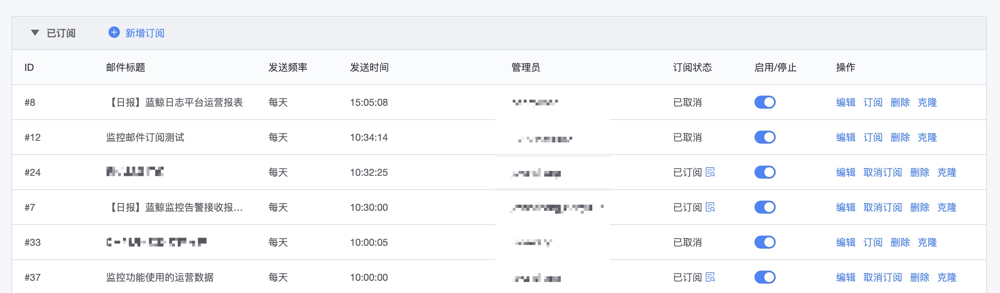

# 邮件报表订阅

## 功能说明

邮件订阅报表功能,可以将仪表盘里面的所有图表进行订阅,并且监控平台的一些公共运营数据也可以订阅.

导航位置: 仪表盘->邮件订阅 

可以解决的场景有:

1. 订阅监控平台的公共运营数据,如功能的使用情况,告警事件趋势,告警通知情况等等.
2. 订阅仪表盘内的所有数据.
3. 可以跨仪表盘订阅
4. 可以跨业务订阅
5. 可以订阅给其他人(可以没有申请仪表盘权限的人,如老板)
6. 可以退订,也可以恢复订阅
7. 订阅的仪表盘视图有相应的链接可以直接进行跳转

## 新建订阅

1.  该功能不需要申请权限,但要订阅仪表盘的数据所以一定需要有仪表盘的权限.

* 1) 可以指定接收人,主动给需要的人.
* 2) 被订阅的人可以主动退订,在订阅列表里面会看到退订的人员
* 3) 管理员:后续可以编辑和修改的人
* 4) 发送频率:支持多种,那么这个时间范围会与仪表盘联动,如选择按周,那么对应的图表数据就是这一周的.
* 5) 添加内容: 是添加具体的报表内容 , 后面详细介绍
* 6) 添加内容后的内容,可以进行排序,编辑和删除.
* 7) 测试的时候是发送给自己

### 订阅内容

#### 视图截取

按仪表盘里面的单个视图进行获取，可以订阅一个或多个仪表盘里面的部分视图

* 1) 子标题和说明 都会展示在报表里面
* 2) 模块布局当前有1行一个,1行2个固定的布局
* 3) 内容分为两块,内置: 表示平台提供的公共数据,可以按自己有权限的业务进行多选.
* 4) 仪表盘: 代表的是有权限业务的仪表盘

#### 整屏截取

按单个仪表盘进行发送

## 发送历史

发送历史可以查看到发送的情况

