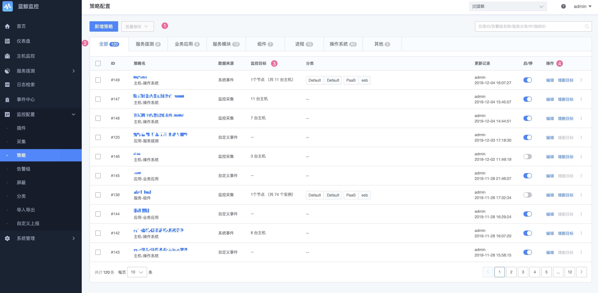
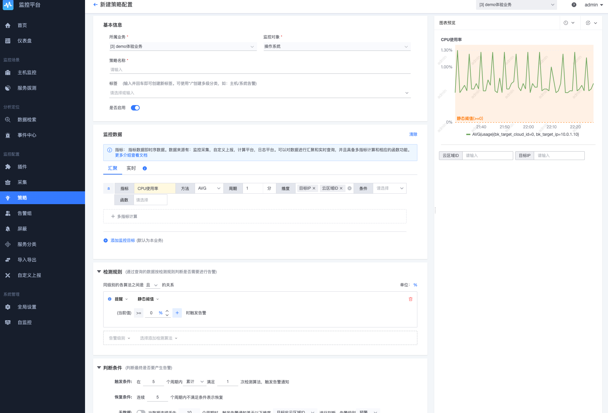
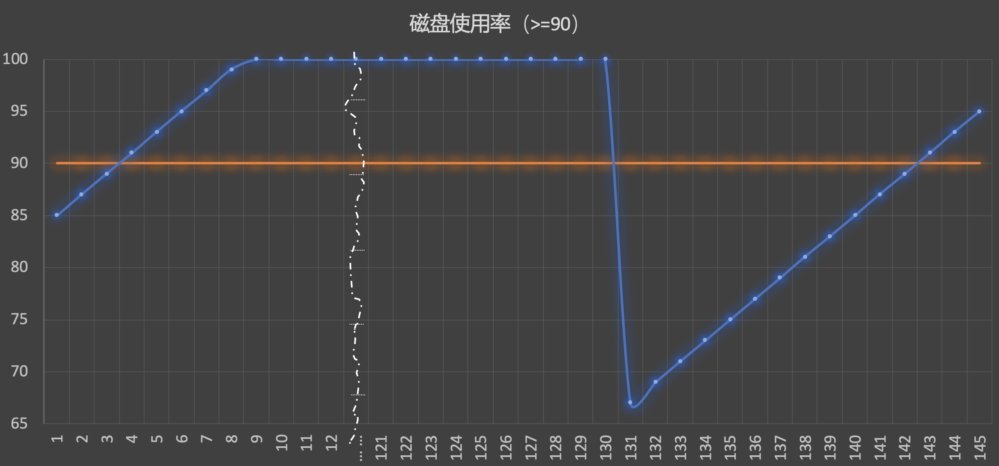

# 策略配置

时序数据，事件数据，日志数据都是通过策略的配置规划产生告警事件，并触发告警通知等动作达到监控告警的目的。

## 前置步骤

**导航路径**：导航  →  监控配置  →  策略  →  新建

策略配置的基本过程：

* 第一步： **填写基本信息**
    * 策略名称：会显示在告警通知里面
    * 监控对象：是指标选择的一种分类条件，也是本条策略的分类
* 第二步：**监控项设置** - 判断异常点
    * 选择一个监控项，时序-指标，事件-事件名称，日志关键字
    * 计算公式：AVG MAX MIN SUM COUNT 实时
    * 监控周期：默认是 1 分钟，建议大于等于采集的周期
    * 监控维度：检测的粒度，是 IP/实例/某个数据维度
    * 监控条件：指的是维度条件，如 挂载点=/
    * 监控目标：对于监控采集的都可以快速的选择监控目录，还可以基于集群和模块进行维度进行告警
        > **监控目标范围选择**
            基于 CMDB 采集的数据是必选，如采集配置中的任务，操作系统，进程，系统事件等
            基于自定义上报或者数据平台或者服务拨测的无此选择
    * 检测算法和设置：如静态阈值
* 第三步：**高级设置** - 非必需项
    * 触发条件：是防抖机制，5 个周期内满足 3 次监控项的算法才进行告警通知。
    * 恢复条件：是连续的周期内不满足触发条件才代表恢复。
    * 告警模版：自定义告警通知模版
* 第四步：**告警通知设置**
    * 恢复通知
    * 通知时间段
    * 通知方式：告警组，如果没有需要的告警组需要进行新建 [告警组说明](./alarm-group.md)

**工作原理**：

**了解概念**：

* **异常点**：时序数据通过算法检测判断有异常的点
* **告警事件**：多个异常点为同一类为事件，一般具有持续性
* **告警通知**：多个告警事件通过收敛规则，风暴抑制等手段汇总成告警通知

> 更多查看[术语解释](../../concepts/glossary.md)

## 主功能一览

* 支持的数据类型策略：
    * 时序指标策略
    * 系统事件策略
    * 自定义事件策略
    * 日志关键字策略
    * 日志时序策略
    * 数据平台来源指标策略
* 策略方法
    * 计算公式：AVG MAX MIN SUM COUNT 实时
    * 监控汇聚：监控维度 和 监控条件
    * 集群监控：基于 CMDB 业务拓扑任意节点进行监控
    * 检测算法：8 种算法
* 防抖机制
    * 触发条件
    * 恢复机制
* 告警通知
    * 模版预览
    * 变量列表
    * 收敛方法
* 通知控制
    * 通知间隔
    * 生效时间
    * 告警通知组
    * 消息队列通知方式
    * 告警恢复通知

## 功能介绍

* 批量修改功能：可以批量的修改策略的一些项到期望的设置。 如：告警组，触发条件，恢复条件，通知间隔，恢复通知
* 增删目标：快速变更策略生效的范围
* 快捷屏蔽：快速屏蔽该策略产生的所有告警通知，影响通知的接收
* 启停策略：快速的启用和停用策略，影响事件的产生

### 第一步：基本信息设置

* **策略名称**：用于形容告警策略的具体意义，便于在发出告警时，用户能从告警的标题快速的确认问题的来源。
* **监控对象**：具体分类及概念查看[术语解释](../../concepts/glossary.md)。有两个作用：
    * 确定策略的分类属于哪一处。
    * 帮助指标，事件和日志做一个分类的筛选

### 第二步： 监控项设置

#### 选项监控项

监控项的选择是必需项，监控项的选择范围由“监控对象”决定。

**时序数据**：监控项为指标 Metric，监控指标的来源有，监控采集，数据平台，自定义上报，[日志字段提取](./custom-report.md)

**事件数据**：监控项为事件名称 Event，事件名称的来源有，系统事件，自定义事件上报

**日志关键字**：监控项为选择[索引集]的“检索语句”即关键字内容

#### 监控项汇聚计算

* **计算公式**：指的是在监控周期内数据的计算方式，如一个周期内出现了多个数据点，要如何取值的问题。如果一个周期内只有一个数据点，当然这些计算公式就都是一样的结果
    * 汇聚的运算方法：支持 SUM，AVG，MAX，MIN，COUNT
    * 实时：指的是直接按数据点进行判断，所以实时也就没有办法基于维度聚合

> 注意： 有些监控项是没有所有可选的汇聚方法，如关键字和拨测的期望响应码就是 COUNT。

* **监控维度**：是汇聚的最小粒度，如维度是 IP，那么会以 IP 维度进行告警；如果是实例，那么会以实例维度进行告警；如果是某个数据维度如模块节点，那么就是以模块节点进行汇聚判断。更多使用方法查看场景案例[如何进行集群监控](../../guide/cluster_monitor.md)
* **监控条件**：指的是维度或者指标的条件，目的就是找到最准确的数据进行策略检测

#### 监控目标范围选择

监控目标范围还是在选择数据的检查准确性范围。只有使用了 CMDB 方式采集数据才会有目标范围的选择，如监控采集配置的，操作系统默认采集的，进程采集，系统事件采集等。

同样分为静态和动态，建议使用动态这样可以自动随着 CMDB 的变化而变化，避免人工同步的过程。

另外如果想监控集群状况，可以结合监控维度来达到集群，模块的监控需求。

#### 级别和检测算法

* **告警级别**：分为提醒、预警和致命三种级别，目的是为了让用户能够方便的根据告警数值的大小、抖动趋势的高低来指定不同的处理方式和通知对象。相应的告警组里面也会有相应的配置。通知出来的信息也会基于不同的级别样式会有所区别，还会影响收敛和汇总的策略
* **检测算法**：提供了 8 种检测算法，每种算法有适用的一个场景。具体算法的说明查看附录 [算法说明](../addenda/algorithms.md)

### 第三步： 高级设置

* **触发条件**：是一种防抖机制，控制数据的敏感度，当然越不敏感告警通知的及时性越差，越敏感告警通知越多
* **恢复条件**：是判断问题恢复的方法，也是决定了事件恢复的结束时间
* **告警通知模版**：影响告警通知查看的内容，因为不同的通知渠道都有字符的限制，所以默认的告警通知是做了自动转换和截段处理等。目的是在有限的字符限制内提供更有用的信息。通知的种类有：
    * 异常单条告警 按级别
    * 同策略不同目标 按级别
    * 异常跨策略汇总告警 按级别)
    * 以上对应的恢复通知
> 更多告警通知模版的配置请查看场景案例[如何设置自己的通知模版](../../guide/notify_case.md)
*  **告警风暴抑制**：指的是当同一时刻达到了某个平台设置的最大上限将进行跨策略汇总告警通知
    *  配置方法：导航 →  系统管理 →  全局配置 →  告警通知汇总设置
    *  更多告警汇聚和收敛说明请查看附录[通知收敛&汇总机制说明](../addenda/coverge.md)

#### 触发条件、恢复条件工作原理

数据经过算法检测后，会得到一个个的异常点。如果每一个异常点，都发送通知的话，那么在数据抖动或持续异常的场景下，一段时间内会多次收到通知，造成告警风暴。为了防止因为数据抖动等场景导致的告警骚扰，可以通过设置触发条件、恢复条件，以及通知间隔这三种方式来进行告警抑制。

- 页面设置

- 触发条件

    只有在连续多个检测周期中满足多次检测算法，才触发告警通知。

    如设置触发条件为 5 个周期满足 3 次检测算法。则表示在连续 5 次数据检测中，有 3 次或 3 次以上检测结果满足检测算法，那么则触发告警。

如上图，2、7、17、18、19、20、21...等这些点都满足检测算法，但是从检测窗口来看。

> 注：检测窗口，当前点往前看 5 个周期，在这 5 个周期内看有多少个点满足条件。

只有 19、20、21...等这些才满足触发条件(5 个周期满足 3 次)，满足条件的才触发告警通知。从而可以有效的避免因抖动而产生的多次告警。

- 恢复条件

    恢复条件，是在触发条件的基础上来判断，只有**连续**多次不满足触发条件则表示恢复。

    如设置恢复条件为连续 5 个周期不满足触发条件，表示在连续 5 次触发条件检测中，没有一次满足触发条件，则告警恢复。

如上图，19、20、21、22、23、24、25、26 等这些点都是满足触发条件(5 个周期满足 3 次)，那么从 27 开始，27、28、29、30、31、32 这些点都是不满足触发条件的。那么告警会在 31 这个点恢复，因为这个点首次达到连续 5 次不满足触发条件。

> 注意：
> 触发条件里的周期，分两种情况：
> 时序类：按用户配置的聚合周期来
> 事件类：事件只有异常的时候才有数据，没有周期的概念，所以这里的周期固定为 1 分钟，5 个周期，即 5 分钟

#### 无数据工作原理

无数据检测是在策略配置中的附加功能，在高级选项下配置，当连续 n 个周期未拉取到数据后，则触发告警。

假如配置连续 5 个周期未上报数据，

如图：

|时间| 无数据检测(连续 5 个周期无数据) | 是否告警|
|---|---|---|
|第 1 分钟|有数据|无|
|... ...|有数据|无|
|第 6 分钟|1 个周期无数据，不满足条件|无|
|第 7 分钟|2 个周期无数据，不满足条件|无|
|第 8 分钟|3 个周期无数据，不满足条件|无|
|第 9 分钟|4 个周期无数据，不满足条件|无|
|第 10 分钟|5 个周期无数据，满足条件|产生告警|

> 注：无数据告警同样有触发条件、恢复条件、告警间隔等这些。会跟随策略的配置。

### 第四步： 告警通知设置

* **告警恢复通知**：默认恢复是不进行通知的
* **通知间隔**：指的是未恢复或未确认前则每隔多久将再进行告警
* **通知时间段**：如果能确认每个时间段不需要接收通知也没有问题，那就设置吧。默认是整天
* **通知方式**：默认是告警组，一般情况下接收告警的人都是相对固定的。通过告警组的设置和变更将更加的方便，还可以支持多个告警组。告警组的使用方法详细查看[告警组说明](./alarm-group.md)
    * 除了告警组，将还会支持故障自愈，webhook，工单的对接方式

#### 设置通知间隔工作原理

- 页面设置

- 说明

    在持续异常的情况下，前面的触发条件会一直满足，则会一直触发告警，称为[持续事件]，为了防止频繁的收到告警，可以设置两次通知之间的最小间隔。如上图，通知间隔设置 2 个小时，一直产生告警的话，只要是未恢复，那么会按 2 个小时的最小间隔来发送。

这里引用触发条件里的图片，19、20、21、22、23、24 等都是满足触发条件，则都会触发告警通知，如果设置了告警间隔 120 分钟，那么只有在 19 会发送一次通知，后面的都不会发送，如果一直持续满足触发条件的话，那么下一次就是 139 这个点之后再通知一次。

#### 事件生成原理

- 如下图，磁盘使用率告警，配置如下
    - 检测算法：>= 90
    - 触发条件：5 个周期满足 1 次
    - 恢复条件：连续 5 个周期不满足触发条件
    - 通知间隔：120 分钟

- 数据点

- 异常点

- 每个时间点判断结果

|时间|检测算法(>= 90)|触发条件(5 个周期满足 1 次)|通知(间隔 120 分钟)| 是否恢复 |
|---|---|---|---|---|
|第 1 分钟|无|无|无|无|
|第 2 分钟|无|无|无|无|
|第 3 分钟|无|无|无|无|
|第 4 分钟|满足>90|5 个周期满足 1 次|产生新的事件，并通知。 下一次通知时间第 124 分钟|无|
|第 5 分钟|满足>90|5 个周期满足 2 次|被收敛，不通知|无|
|... ...|满足>90|... ...|... ...|... ...|
|第 123 分钟|满足>90|5 个周期满足 5 次|被收敛，不通知|无|
|第 124 分钟|满足>90|5 个周期满足 5 次|产生通知。 下一次通知时间第 244 分钟|无|
|第 125 分钟|满足>90|5 个周期满足 5 次|被收敛，不通知|无|
|... ...|满足>90|... ...|... ...|... ...|
|第 130 分钟|满足>90|5 个周期满足 5 次|被收敛，不通知|无|
|第 131~134 分钟|无|5 个周期分别满足 4~1 次|被收敛，不通知|无|
|第 135~138 分钟|无|无|被收敛，不通知|不满足触发条件 1~4 次|
|第 139 分钟|无|无|结束通知，重置下次告警时间|不满足触发条件 5 次，事件恢复|
|第 140 分钟|无|无|无|无|
|... ...|无|... ...|... ...|... ...|
|第 143 分钟|满足>90|5 个周期满足 1 次|产生新的事件，并通知。 下一次通知时间第 263 分钟|无|
|第 144 分钟|满足>90|5 个周期满足 2 次|被收敛，不通知|无|

该事件变化情况可以在事件详情的事件流水中查看。

### 主机运营字段

在 CMDB 进行主机运营字段的设置，默认会与监控进行联动，不会进行告警通知。所以该字段可以与发布相关操作进行联动。

具体的区别：在监控的全局设置中可以设置更多的状态。

* 主机不监控字段列表：该主机下的策略不会产生任何告警事件
* 主机不告警字段列表：该主机下的策略会产生告警事件，在事件中心中可以查看到，但不会有告警通知发送到人，是被屏蔽状态

### 监控目标范围抑制

对于监控采集的，基于 CMDB 采集的数据可以做到监控目标范围的抑制。举一个例子：

* 环境：一个集群下面机器 90%都是 500G，但是某些机器或某个模块是 2T，那么统一设置磁盘空间的告警策略超过 80%时进行告警，这个对于 2T 的服务器就不太合理，因为按百分比剩余的空间太多
* 配置方法：
    * 先创建一个全局的 A 策略，监控目标为该集群，静态阈值超过 80%进行告警
    * 再创建一个小范围的 B 策略，监控目标为那几个特殊的服务器或者那个模块，静态阈值就可以设置超过 90%才进行告警
* 效果就是：
    * A 策略和 B 策略配置的内容都一样，只是监控目标的范围区别，那么小范围中的服务器会优先大范围生效。达到告警抑制的效果

### 监控等级抑制

监控默认有三个等级，从低到高依次是：提醒、预警、致命。

那么在策略判断的时候会先以高等级进行判断，一旦符合高等级的条件，就不再再检查低等级的。达到等级抑制效果而不会进行重复的告警。

### 更多相关的场景案例

* [如何对进程进行监控](../../guide/process_monitor.md)
* [如何监控日志平台的数据](../../guide/log_monitor.md)
* [如何监控数据平台的数据](../../guide/bigdata_monitor.md)
