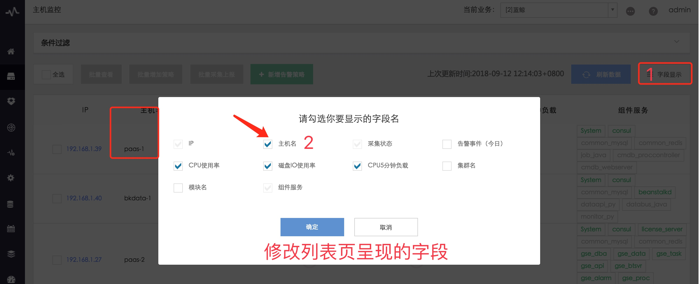
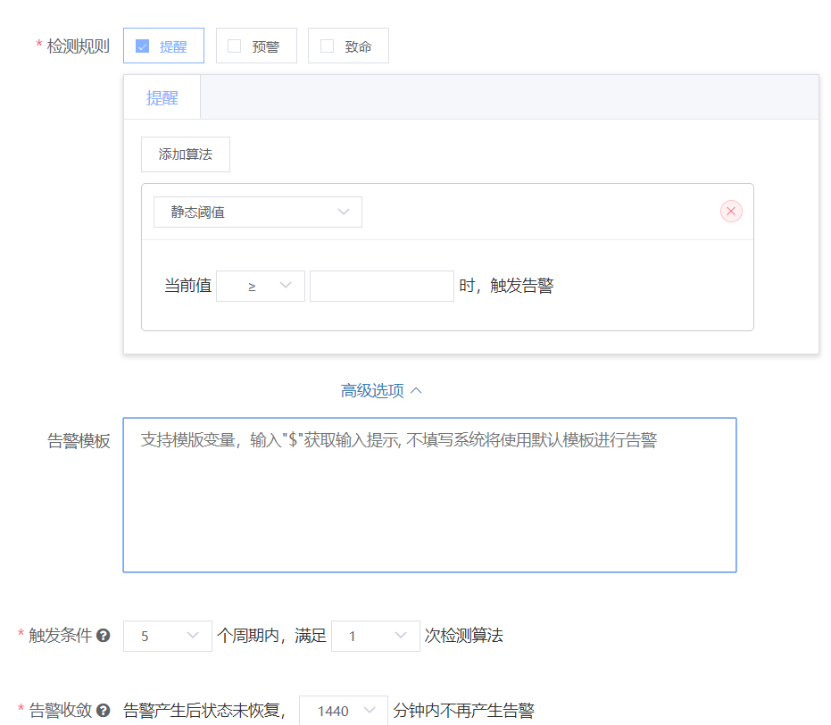
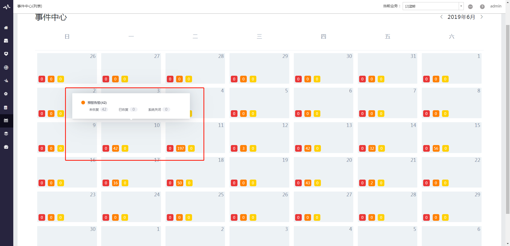

# 主机监控

如何通过蓝鲸监控简单快速保障业务基础主机的稳定运行。

## 前置步骤

依赖组件：配置平台，管控平台，节点管理

用户需要将受控主机导入配置平台并安装 Agent (超链配置平台快速入门)，或通过节点管理直接在对应业务下安装 Agent 导入主机(超链节点管理快速入门)。

# 通过视图查看主机基础性能

蓝鲸监控从配置平台的接口中拉取主机信息，受控机安装 Agent 后，采集器会发现并定时上报(1 次/分钟)主机基础性能信息，经过蓝鲸数据链路处理后，在主机监控页面即可查看对应主机的基础性能数据。

- 视图：包含主机监控列表页、主机监控详情页、进程资源监控页

  - 主机监控列表页

    支持对当前业务的指标的 CPU 使用率、磁盘 IO 使用率、CPU5 分钟平均负载进行排序，了解当前业务下使用资源最多的主机。

    

    

    - 查询条件支持关联配置平台

    

    - 按照配置凭条标准属性分组展示

    

  - 主机监控详情页

    主机监控包含 CPU、内存、磁盘、系统、网络 5 类共 32 项指标，满足用户对主机基础性能的实时精准查询。

    

  - 进程端口及资源监控

    进程端口监控配置完成后，会根据所属的主机，在主机监控列表页-进程服务中展示，点击进程可查看 [进程监控](./process_monitor.md)

    

# 主机监控策略配置

- **1. 系统默认策略**

为方便用户使用，新建业务导入主机后系统会自动创建 Corefile 产生、 CPU 总使用率、系统重新启动等 11 项指标的常见监控策略，用户根据实际场景可以创建新的策略，以产生告警。

> 默认策略详情请查看 [附录](host_monitor_end.md)

- **2. 用户自定义策略**

  2.1 可在主机监控勾选主机后选择批量增加策略，或者到监控配置-主机监控中选择指标类型编辑策略。

  - 批量增加策略。

  

  - 在监控配置中找到需要配置的指标。

  

- **3. 选择监控对象**

  - 按主机 IP ，通过 IP 选择器选择单台或多台主机，一般测试时会使用。

  

  - 按业务拓扑，根据你选择的配置平台集群和模块自动拉取主机信息，主机移入/移除将自动适应监控策略。

  

- **4. 检测规则**

  - 分级告警：多个告警级别勾选上时，分别可以配置不同的算法和触发条件。

    - 例：配置 CPU 总使用率告警策略，可在同一条策略中配置当前值>50%触发提醒级别告警，当前值>70%触发预警级别告警，当前值>90%时触发致命级别告警。高级别的告警会覆盖低级别的告警。

  - 检测算法：根据用户需求提供多种算法规则。

    - 如 CPU 使用率一类指标可采用静态阈值检测，如服务器在线人数等指标可采用同比/环比算法进行检测。

  

  > 建议 : 默认选择 5 个周期满足 N 次检测算法
  > (1)抖动类的指标如 CPU 总使用率，N 可选择 3；非抖动类的如磁盘使用率，N 可选择 1。
  > (2)为告警收敛的恢复检测做准备。比如 5 分钟内满足 2 次检测算法，则恢复检测的触发条件是`检查前5个周期满足少于2次检测算法`。

- **5. 触发条件**

  时序类指标( CPU 、内存等)的检测周期默认为采集周期，事件类告警固定为 1 分钟。

  

  

- **6. 告警收敛**

  - 为避免因一段时间内持续触发告警导致的告警风暴，告警产生后如状态未恢复，在“N”小时内不会再次发出该告警，比如“N”= 24 ，则发出告警通知后，24 小时内不再产生该告警，如业务需要告警持续产生(触发一次告警，发出一条通知)，请将“N”设置为 0 。

  - 告警恢复检测：和告警检测条件相反，例如触发条件为`“5个周期内，满足3次检测算法”`，则 告警恢复检测的触发条件是“当满足触发条件时，会检查是否满足 `前5个周期少于3次检测算法`"。

  

> 默认再次产生告警时间是 24 小时。
> 告警收敛后，事件中心会默认只显示发出的告警，收敛告警不会再展示。

  - 无数据告警：如果勾选上该项，指标持续产生数据，突然不上报数据时，会产生无数据告警，建议用于 CPU、内存、磁盘等本身会长期上报，不上报代表异常的数据。

> 无数据检测周期即数据上报周期，用户没有配置的情况下一般默认为 1 次/分钟。

  

  > 若上报数据本身不连续，则不建议开启。

  - 告警收敛触发和示例：
    - 触发条件和告警收敛设置如下：

      

    - 在第 15 周期满足触发条件(第 11-15 周期有 2 次满足检测算法：阈值>=100)，同时在前 5 个周期满足恢复检测条件(第 10-14 周期满足少于 2 次检测算法)，于是在第 15 个周期产生告警。

    - 在第 21 周期满足触发条件(第 17-21 周期有 2 次满足检测算法)，但在前 5 个周期不满足恢复检测条件(第 16-20 周期不满足少于 2 次检测算法，告警未恢复)，于是在第 21 个周期不产生告警。

    - 如果从第 16 个周期开始至未来 24 小时一直满足触发条件，则期间不再产生告警，直到 24 小时后重新满足触发条件则产生告警，此处是考虑一直满足触发条件但仅通知一次，用户可能会遗漏处理。

      

- **7. 通知方式**

  - 分级告警：

    - 勾选上分级告警即可对不同级别告警分配不同的通知方式和通知角色。

      

    - 不勾选则该策略下告警统一配置通知方式和通知角色。

      

  - 告警方式：可选择告警产生/恢复时是否发出通知。

  - 通知方式：角色自动从配置平台同步，角色联系方式会从 PaaS 平台的用户管理中获取。

  - 通知方式：通知方式分为：邮件/企业微信&微信公众号/短信/电话，配置方式请参考 PaaS 文档

> 主/备份 负责人代表配置平台中，主机配置的 主/备份 负责人字段对应的人员角色。

- **8. 告警屏蔽**

# 告警查询

在蓝鲸监控主菜单 - 事件中心处可以不同的形式查看历史告警数据

  - 1. 列表模式：通过列表形式展示历史告警数据，提供多种维度让用户可以精确过滤展示相应的告警

    

  - 2. 日历模式：通过日历形式展示历史告警数据，方便用户通过时间维度展示历史告警数据

    
