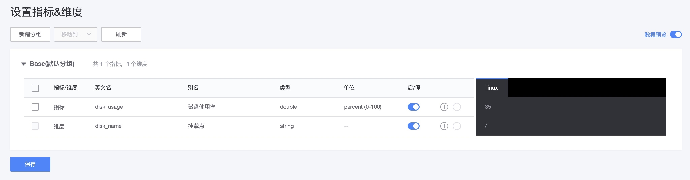
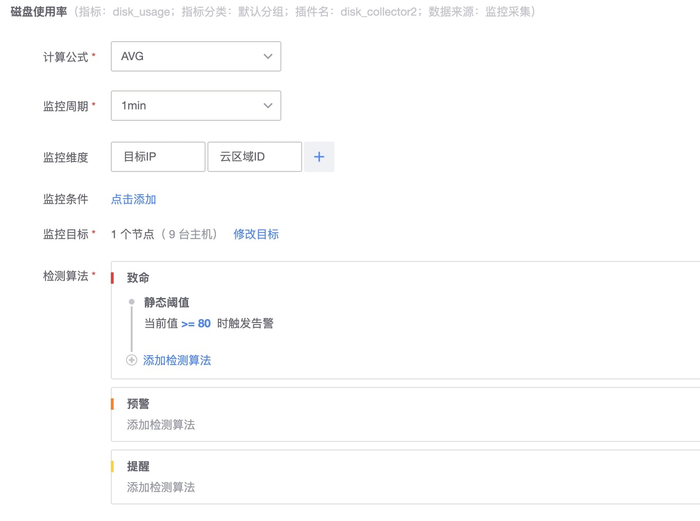
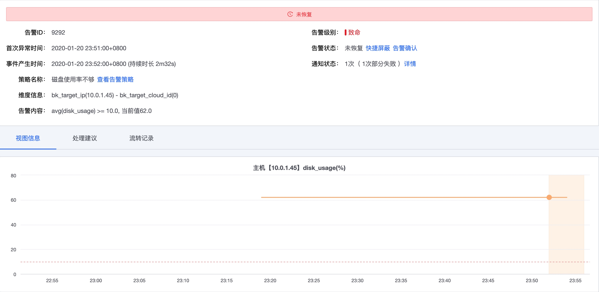

# 如何通过脚本进行监控

脚本的是一种灵活和快速的监控采集方式，不同层的监控对象都可以用脚本来完成。当默认的开箱即用的功能不能满足个性化需求时，脚本是一个非常高效的办法。

## 前置步骤

通过脚本进行监控，大致分为如下步骤：

* 第一步：脚本插件定义，调试
* 第二步：采集配置，检查视图
* 第三步：配置策略，事件中心
* 第四步：配置仪表盘视图

## 第一步： 脚本插件定义

**导航位置**：导航  →  监控配置  →  插件  →  新建

脚本采集插件直接在线就可以进行各种脚本的编写和调试，能快速的满足监控采集的需求。

**脚本插件工作原理**：


**脚本插件定义步骤**：

* (1) 插件定义
    * 【必要】插件基本信息
    * 【必要】选择系统并编写脚本内容
    * 【可选】配置参数
    * 【可选】补充 logo 和描述信息
* (2) 插件调试
    * 参数填写
    * 调试机器选择
    * 调试过程
    * 保存

接下来以 `磁盘使用率为例` 为例实现脚本采集以及指标监控。


脚本内容：

```bash
#!/bin/bash

#获取磁盘使用率
disk_name="$1"
diskUsage=`df -h | grep ${disk_name} | awk -F '[ %]+' '{print $5}'`

echo "disk_usage{disk_name=\"${disk_name}\"} ${diskUsage}"
```

设置参数：

参数为位置参数 如 shell 的 `$1`。


### 插件调试：选择服务器并填写参数

> 注意：这里的服务和下发都是测试联调。填写的内容在后面的采集配置是一样的，主要就是为了验证插件制作是否合理，结果是否如预期。


### 确认联调结果并设置指标和维度

当联调获取到数据后会进行指标维度的设置确认。



* **指标分组**：指标比较多的时候可以进行分组方便后续的使用
* **单位设置**：可以设置单位，单位是上报的数值的基础单位，后续的展示会根据单位进制进行动态的显示
* **数据预览**：可以非常方便的看到调试获取的数据值是否符合预期

> 注意：当保存后指标维度还可以继续进行设置 (在调试窗口的左下角)
> 
> 注意：整个调试过程超时时间为 600 秒，如果 600 秒内没有保存就会关闭这个调试过程，保证服务器上不会有残留的调试进程。

### 保存插件


> 注意：做了每次修改都需要进行联调成功才能真正的保存。

## 第二步： 添加采集配置

正常新建一个插件后就可以直接点击“新增采集配置”，自动创建一些内容。如果返回列表页了，还可以从如下导航进入。

**导航位置**：导航  →  监控配置  →  采集  →  新建

采集步骤：

* 1） 插件选择和参数填写
* 2） 选择目标
* 3） 采集下发
* 4） 完成

### 1）采集参数填写

选择好插件就可以进行参数的内容填写。


### 2）选择目标

选择目标可以是静态和动态两种方式。建议使用动态的方式。

* 静态：只有操作系统基于 IP 选择能基于静态 IP 选择，静态 IP 支持手动输入和服务拓扑的方式选择
* 动态：最小只能选择到模块级别。基于任意节点，就可以满足扩缩容后自动实现采集的扩缩容

### 3）采集下发

采集下发，可以查看采集下发的过程，当失败的时候还可以进行重试。当然直接离开还是会异常执行完成。最后可以在列表页的“状态”查看最终的结果。

### 4）完成

完成后会引导去“检查视图”和“策略配置”。


### 检查视图

检查视图验证采集的正确性。


## 第三步： 策略配置

策略配置步骤：

* 1） 基本信息：
    * 策略名称：在告警通知里面会显示。
    * 监控对象：影响指标的影响范围。
* 2） 监控项：
    * 监控指标的选择
    * 监控统计方法： 监控维度，条件，周期，公式选择
    * 检测算法选择和配置
    * 高级选项：收敛规则，通知模版。
* 3） 通知设置：
    * 通知间隔
    * 通知时间段
    * 通知方式：告警组设置
* 4） 监控目标范围选择

### 基本信息和监控项


> 注意：监控对象选择影响指标选择的范围，也决定了当前策略的分类。

### 指标项设置


#### 监控目标范围选择

同样分为静态和动态，建议使用动态方式。




### 通知设置


### 事件中心

在事件中心查看策略命中的告警事件。


查看告警详情：



## 第四步： 仪表盘视图配置

把常用的指标视图设置到仪表盘中。


