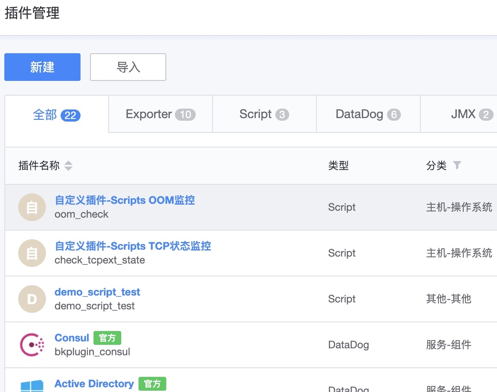
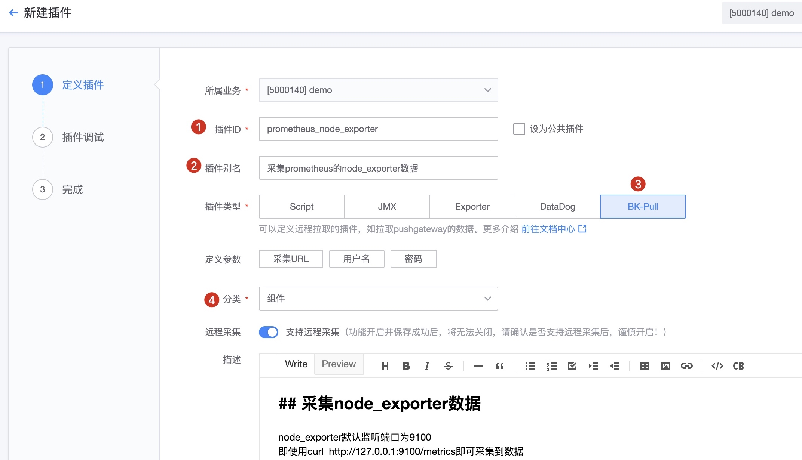

# 如何直接获取 Prometheus 的数据

监控平台支持了 Prometheus 的数据上报格式，并且也提供一些便利的工具，但并不代表监控平台是可以完全兼容的，因为整个架构和 Prometheus 是不一样的，存储也不一样，所以直接获取 Prometheus 的数据只是获取 Exporter 暴露出来的数据。

服务器已经运行了 Prometheus 的 Exporter 或者 pushgateway 或者 服务暴露出来的 metrics 接口，此时，无需对原有的采集插件进行任何改动，只需要按照如下的步骤操作即可接入到监控平台。

## 前置步骤

**工作原理**

**操作步骤**

* 第一步：制作 BK-Pull 插件
* 第二步：下发采集
* 第三步：查看数据
* 第四步：配置告警

##  第一步： 制作 BK-Pull 插件

制作插件，选择 BK-Pull 方式

调试插件

## 第二步： 下发采集任务

## 第三步： 查看采集数据

通过采集任务的“检查视图”查看数据。

## 第四步： 配置告警

配置告警参考[策略配置功能说明](../alarm-configurations/rules.md)

