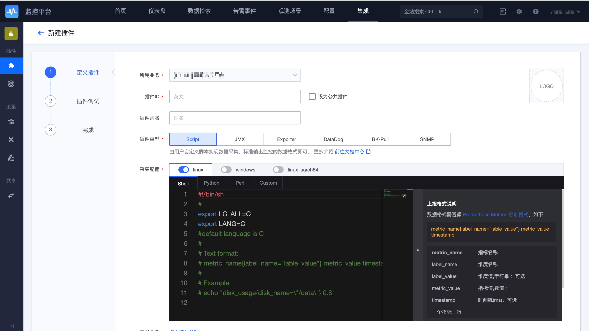
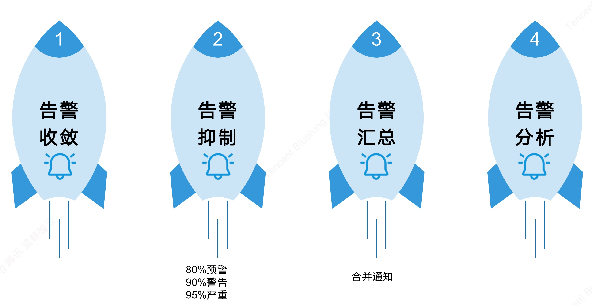

## 核心优势

1. **生态闭环：** 依托蓝鲸 PaaS 深度整合了 CMDB，故障自愈，日志平台，作业平台，节点管理，数据平台，工单等能力。随着生态的完善监控的智能化将更加强大

2. **观测场景-开箱即用：** 默认的主机、进程监控，拨测能力，容器监控和APM，还有默认的系统事件，策略配置，可以满足基本的开箱即用

3. **数据集成-支持采集管理：** 一个简单的脚本，就可以采集数据，支持脚本的在线调试采集，全生命周期托管，无需考虑脚本如何部署如何管理问题。
    支持 Prometheus 的 Exporter 数据采集格式，可以简单的将 Exporter 迁移至监控平台的插件。
    支持远程采集

4. **SDK上报：** 支持通过 HTTP、Prometheus SDK、Opentelemetry SDK 自定义上报时序和事件数据。

5. **告警配置-告警及自愈：** 灵活的策略配置满足单机，单实例，集群，多维度等告警需求；内置了 8 种检测算法；多种告警收敛等防止告警风暴等

