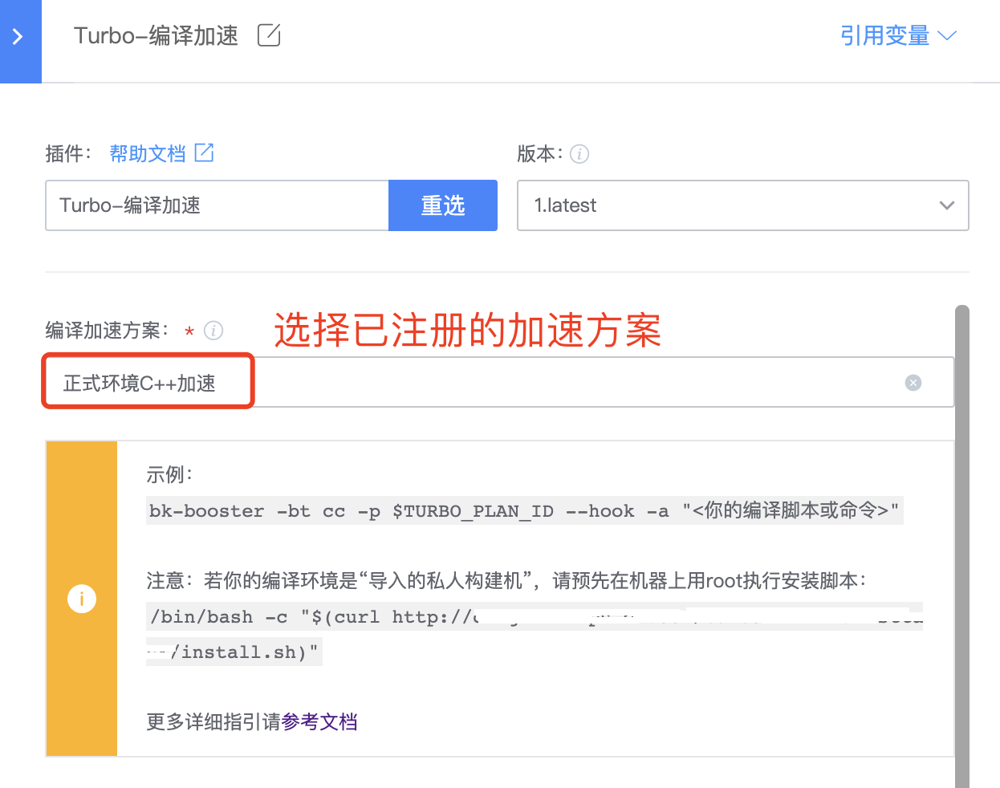

# Linux C/C++ 编译加速

> Linux C/C++ 编译加速支持 pch、gcov、分布式预处理等功能<br/>
> 如下教程指引如何配置并进行 Linux C/C++ 编译加速

## 一、获得加速方案 ID

若已有满足需求的加速方案，在[方案列表](../Services/turbo_plan_list.md)快速复制方案 ID，或点击方案名称进入查看页面复制方案 ID

### Step1 访问 BKCI，导航栏进入服务 → 编译加速

首次时，进入页面如下，点击立即使用进入方案定制页面：


### Step2 填写方案配置


方案配置包括：

- 方案名称：作为标识名称，可以填写诸如“xxx 个人加速”、“每日构建加速”、“构建机出包加速”等等。
- 加速模式：选择要创建的加速模式，一旦创建，加速模式不可修改。
- 方案说明：可以写一些备注或者说明在这里。
- 编译环境：根据你的本地环境，选择对应的编译环境，如果列表中没有，请联系管理员快速支持。
- 是否启用 ccache：按需勾选是否要开启 ccache，若开启，则会在本地优先考虑 ccache，没有命中的部分再使用分布式加速。
- 优先调度区域：根据本地环境的区域，就近选择。

### Step3 提交注册，获得专属方案 ID

点击提交后，会生成一个你专属的方案 ID，这个 ID 后续也可以在“加速方案”→点击方案名字，进入详情页面查询到。

方案 ID 是使用加速的凭证，里面包含了你的环境信息、配置信息、权限信息。**请妥善保管好你的方案 ID，不要随意透露给他人。**

## 二、在流水线中使用编译加速

### 准备工作

如果你的流水线所选择的环境是**私有构建机**，那么需要提前在你的机器上以 root 权限安装 client。

``` bash
/bin/bash -c "$(curl http://<您的服务域名>/turbo-client/disttask/install.sh)"
```

如果你的流水线选择的是公共构建机，则**无需这个步骤**。

### Step1 修改编译脚本

假设原编译脚本为：

```bash
cd ${WORKSPACE}/master

./autogen.sh
./configure --disable-pump-mode

make clean
make -j all
```

可见，前面部分的命令在做一些准备工作，实际编译指令是：

```bash
make -j all
```

我们只需要修改这句，用加速器来执行编译指令，即可获得加速。

```bash
bk-booster -bt cc -p $TURBO_PLAN_ID --hook -a "make -j@BK_JOBS all"
```

其中 bk-booster 是插件提供的加速器，用来启动加速
命令中的参数含义分别为

- -bt cc，指定场景为 cc，用于 linux 下的 c/c++编译。
- -p $TURBO_PLAN_ID，指定方案 ID，在“Turbo 编译加速”插件中，会默认注入选中的方案的 ID。
- --hook，开启命令 hook，会自动劫持 gcc/clang 等编译器，实现加速。
- -a "make -j@BK_JOBS all"，指定要执行的编译命令，其中@BK_JOBS 作为占位符，在运行时会自动替换为推荐的并发数量。

### Step2 打开流水线，添加 “Turbo 编译加速”插件


> 注意：这个步骤之前需添加拉代码插件

### Step3 选择已注册好的加速方案



### Step4 配置编译脚本

编译脚本可以使用文件管理，提交到代码库，流水线中仅需填写脚本文件的相对路径即可：


也可以将编译脚本配置到插件里：


## 三、在本地构建机使用编译加速

### Step1  首先在机器上安装加速工具包（使用 root 执行）

```bash
/bin/bash -c "$(curl http://<您的服务域名>/turbo-client/disttask/install.sh)"
```

### Step2 拷贝加速方案 ID

详见此文档第一章节

### Step3 使用加速工具来启动加速

例如原来的编译脚本为：

```bash
make -j gamesvr
```

用 Step1 中安装的工具，结合 Step2 中的方案 ID，来执行加速：

```bash
bk-booster -bt cc -p <步骤2中拷贝的ID> --hook -a "make -j@BK_JOBS gamesvr"
```

其中 bk-booster 是插件提供的加速器，用来启动加速。
命令中的参数含义分别为:

- -bt cc，指定场景为 cc，用于 linux 下的 c/c++编译。
- -p <加速方案 ID>，指定方案 ID。
- --hook，开启命令 hook，会自动劫持 gcc/clang 等编译器，实现加速。
- -a "make -j@BK_JOBS gamesvr"，指定要执行的编译命令，其中@BK_JOBS 作为占位符，在运行- 时会自动替换为推荐的并发数量。
