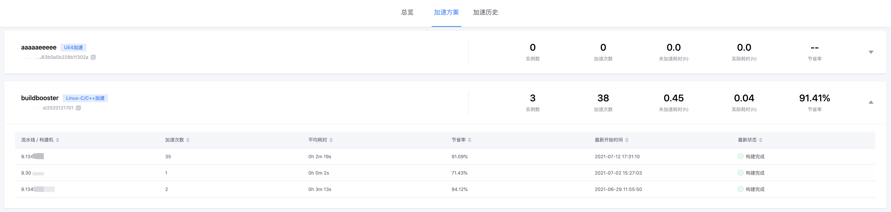

# 加速方案管理

> 使用编译加速时，首先需制定一个加速方案。 
> 加速方案是一组配置的集合，决定了加速时的执行环境等信息，不同场景下的加速配置项不同。

## 新建加速方案

新建加速方案可以获得一个新的方案配置和 ID。

1. 方案名称：可以填写诸如“xxx 个人加速”、“每日构建加速”、“构建机出包加速”等等。
2. 加速模式：选择要创建的加速模式，一旦创建，加速模式**不可修改**。
3. 方案说明：可以写一些备注详细说明使用场景、注意事项等，备忘或方便项目其他成员了解。

> 不同的加速模式，需要的加速参数不一样，以 Linux C/C++为例，需要如下参数：

4. 编译环境：根据你的项目所需环境（如本地环境），选择对应的编译环境。
5. 是否启用 ccache：按需勾选是否要开启 ccache，若开启，则会在本地优先考虑 ccache，没有命中的部分再使用分布式加速。
6. 优先调度区域：根据构建机（如本地环境或流水线构建机）所在的区域，就近选择，若不确定，保持默认即可。

## 修改加速方案

已经创建的方案，可以修改其编译环境等配置，例如编译器升级了，可以在原有方案里重新选择新的编译器版本。

## 查看加速方案

已经创建的方案，可以在列表中点击名称查看。

查看页面包含如下内容

1. 方案的基本信息，包括方案 ID、方案名称、加速模式和方案说明
2. 可以启用/禁用方案。禁用后，即使编译命令中指定了加速方案，也不会进行加速。
3. 加速参数，根据加速模式不同有不同的加速参数
4. 使用指引，根据加速模式不同有不同的使用指引
5. 更新记录，可以查看创建和最近更新信息

## 删除加速方案

尚未支持
