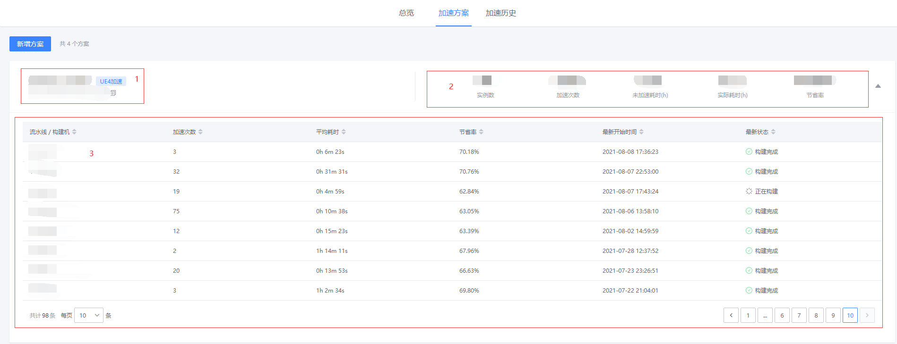

# 加速方案列表

> 可以在加速方案列表查看方案的使用统计

## 列表

加速列表如下图所示：

包含三部分：

### 1. 方案名称和 ID

可以在此快捷复制方案 ID
点击方案名称进入查看方案详情界面

### 2. 当前方案的使用统计

包括：

- 实例数
- 加速总次数
- 未加速耗时（h）（预估）
- 实际耗时（h）
- 节省率

### 3. 实例列表

使用此方案的实例，发起加速的一个入口为一个实例，如一条流水线、或者一台本地构建机
每个实例包含如下信息：

- 实例名称：流水线名称或者构建机 IP
- 加速次数：单实例的执行次数
- 平均耗时：单实例的凭据耗时
- 节省率：单实例的节省率
- 最新开始时间：当前实例最近一次执行的开始时间
- 最近状态：当前实例最近一次执行的状态
  