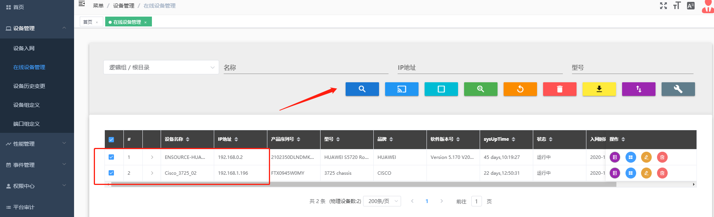
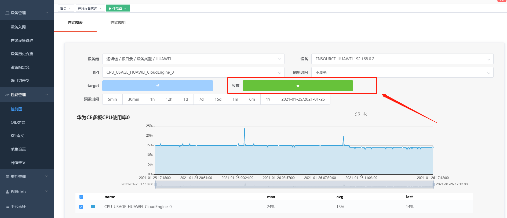
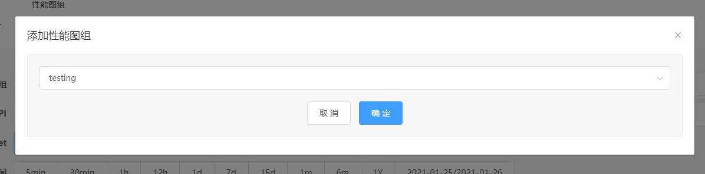
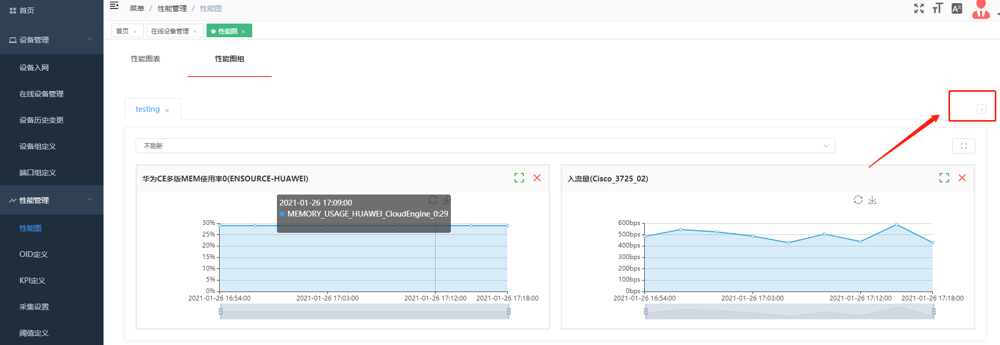
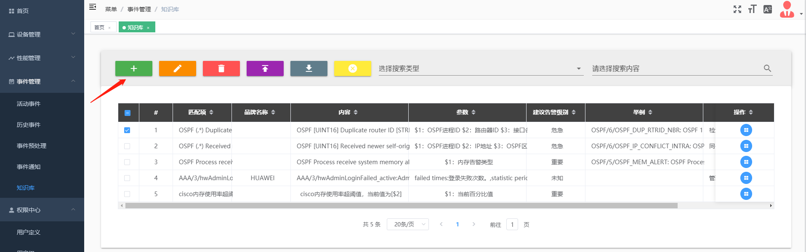

## 场景案例

### 如何批量更新已入网设备的配置信息

当我们纳管的一些设备的配置信息发生变更后我们想手动批量更新这部分设备的配置信息时，无需一台台手动更新。

#### 操作步骤

从在线设备管理页面手工勾选需要更新的设备，点击重新发现即可更新设备配置信息。

### 如何添加常用性能视图到性能图组

当我们需要频繁查看一些固定设备的固定 KPI 时，我们可以将这些 KPI 收藏到固定的性能图组内，方便直接在性能图组内查看性能数据

#### 操作步骤

1、在性能图找到这台设备的 KPI 的性能数据点击收藏按钮

选择要加入的性能图组点击确定

2、点击性能图组，点击右侧“+”号，弹出性能图组对话框，勾选应用的性能图组，点击添加到查看详情按钮

3、在性能图组中就可以看到收藏的性能图数据

### 如何对常见的 syslog 的处理建议进行录入

知识库中内置了常见主流网络设备的 syslog 处理建议，为网络设备的常见故障提供了解决方案。除内置的 syslog 告警知识处理条目外另外还支持用户自主录入处理建议方便对设备出现的 syslog 告警提供告警建议，进行更高效的处理。

#### 操作步骤

1、在知识库页面中点击新增知识库按钮

2、录入网络设备品牌名称、添加 syslog 的助记符、添加 syslog 中的占位符参数、建议的告警级别、示例的 syslog 的消息正文、简单的说明信息、以及告警处理建议，告警内容示例

