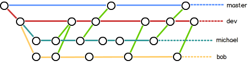
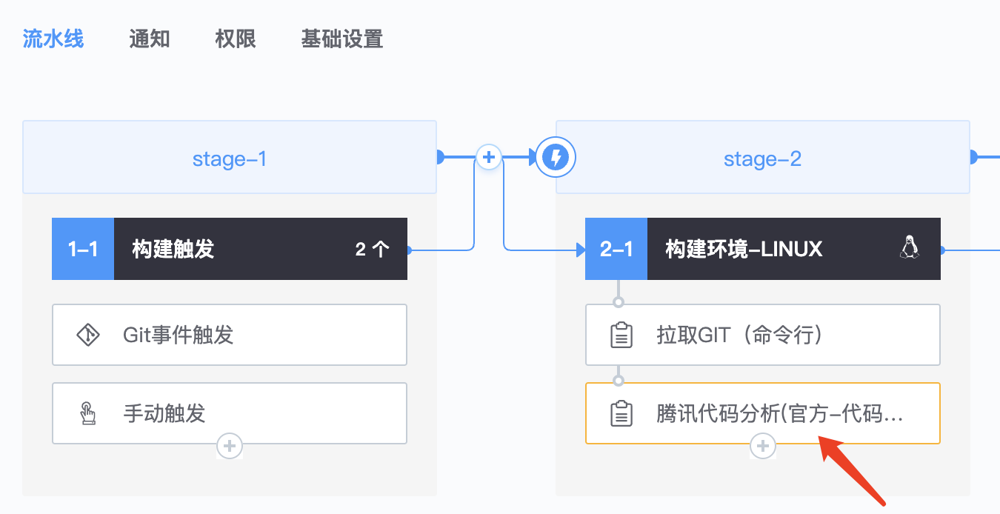
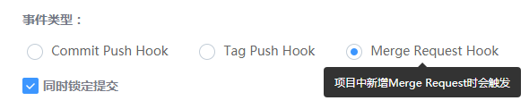
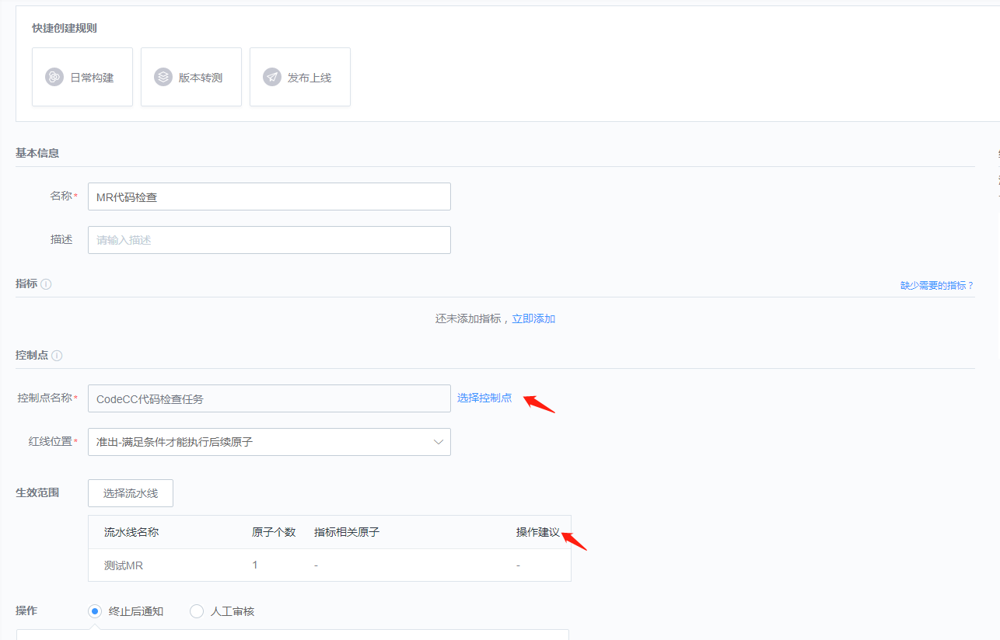
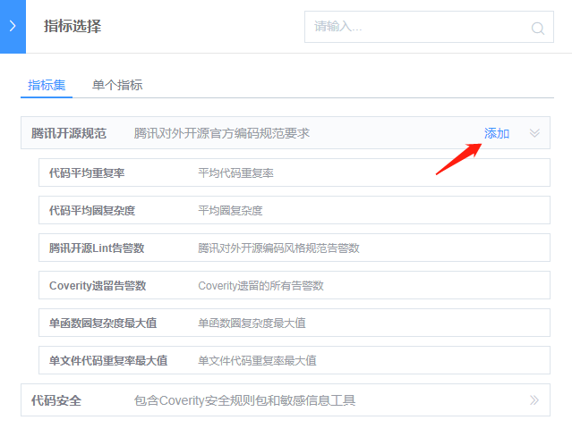
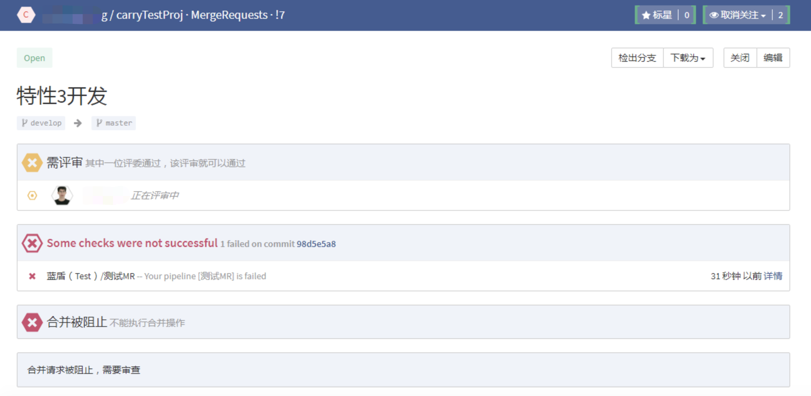
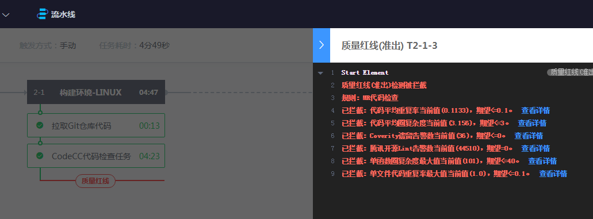

##1、Git的分支策略和MR/PR

在实际开发中，我们通常按照几个基本原则进行分支管理：

首先，master分支应该是非常稳定的，也就是仅用来发布新版本，平时不在上面干活；

那在哪干活呢？干活都在dev分支上，也就是说，dev分支是不稳定的，到某个时候，比如1.0版本发布时，再把dev分支合并到master上，在master分支发布1.0版本；

小伙伴们每个人都在dev分支上干活，每个人都有自己的分支，时不时地往dev分支上合并就可以了。

那么当我们将个人的分支合并到dev时，需要发起Merge Request请求和代码检视。当然，从dev合并到master也是如此。下图为工蜂的合并请求入口。

##2、创建MR触发的流水线

创建一条流水线，并添加“Git事件触发”。其中Git事件类型选择Merge Request Hook，并勾选“同时提交锁定”。

##3、配置质量红线

在CodeCC等可配为质量红线控制点的原子会有一个快捷入口，用于快速创建一条质量红线规则。

点击后进入创建质量红线的界面，此时控制点和生效范围都已经自动选择好。

选择需要的指标，例如可以选择腾讯对外开源规范的指标集，能够确保合入的代码符合腾讯对外开源代码规范。

4、发起MR和代码检视

此时发起MR和代码检视，将会触发流水线扫描，并将执行结果回写到代码库平台。

如果代码不符合质量红线的要求，将会显示流水线执行失败，可以点击详情前往查看具体原因。

