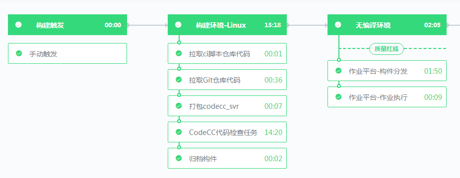
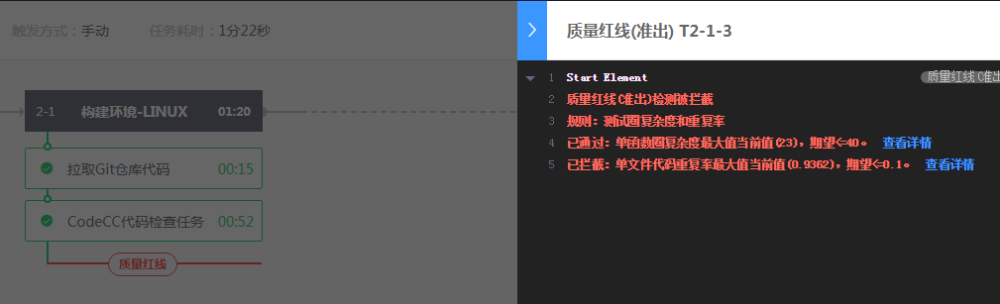

## 什么是质量红线

如果你有这些需求，质量红线能够很好地帮助你：

- 当我们在Merge Request代码和代码检视时，总是希望能够对合入的代码先进行一系列代码检查，确保其符合团队代码规范、无Coverity告警；

- 当我们在版本转测时，总是期望能够先进行单元测试，并保障有足够高的代码覆盖率；

- 当我们在版本发布时，总是希望进行了一系列详尽的缺陷和安全的代码检查以及冒烟测试。

质量红线是指通过设置质量标准，控制流水线的行为，使得其产出物必须符合质量标准的一种服务。它能够支持Git Merge Request、日常构建、版本转测、版本发布等场景下对软件产品质量的保证。

## 支持CodeCC代码检查指标

质量红线支持设置CodeCC代码检查的指标，包括代码缺陷、代码安全、代码规范、重复代码、复杂度等五大纬度、十余款工具的产出物。你可以轻松便利地选择自己需要的指标，设置期望阈值。

例如有：

腾讯开源规范指标集
代码安全指标集
内存相关指标集
……
## 支持自定义指标

对于一些个性化的的指标，例如单元测试、自动化用例测试等，可以通过创建一个自定义指标，然后通过脚本任务原子上报数值，来使用质量红线的功能控制流水线。

## 支持研发商店插件指标

研发商店的插件开发者可以在开发过程中定义好自己的质量红线指标，使用质量红线的能力。

## 最终效果

以下为顺利通过质量红线的效果。该流水线的代码质量成功满足了要求，可以进行作业平台-构件分发（测试环境部署）。

以下为被质量红线拦截的效果。该流水线的代码质量未能满足预期要求，被红线拦截。

