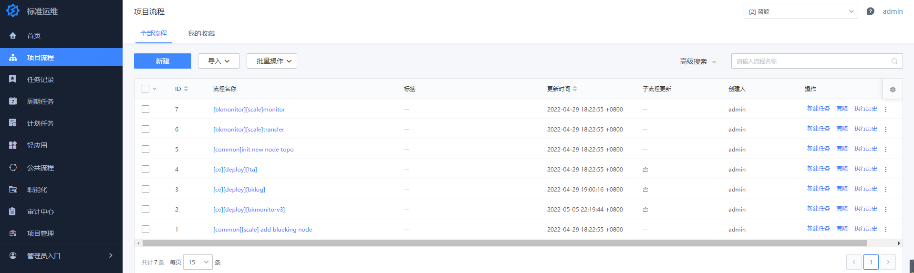
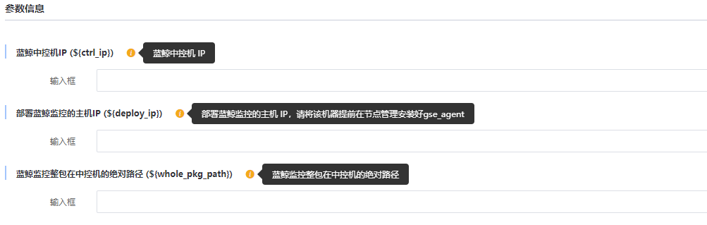
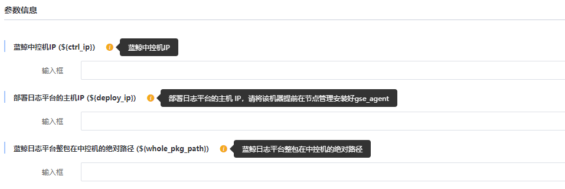

# 监控日志套餐部署

> 该套餐属于蓝鲸社区版增值套餐，请确认基础套餐已经部署完成；如未部署请参考[基础套餐部署](./detail_install.md)

该套餐主要适用于监控告警、日志采集的分析的场景。

主要包含蓝鲸相关产品：监控平台、日志平台

## 前期准备

> 说明：因模块间存在依赖关系，需要按照顺序依次部署： `监控平台 -> 日志平台`。

该套餐部署是通过标准运维流程实现，在部署前需要做如下准备：

### 1.准备机器

> 为了更稳定的功能使用，建议生产环境使用跟基础套餐独立的机器资源。

- 建议操作系统： CentOS 7.6
- 建议机器配置
  - 生产环境：建议 8 核 16 G，硬盘 100G 以上（可根据实际情况适当调整配置），机器数量：2 台
  - 功能体验：建议 8 核 16 G，机器数量：1 台

### 2.实现免密

开始部署前，请确保新增主机跟中控机已实现免密。

```bash
ssh-copy-id <ip>
```

### 3.请先前往节点管理，对新增主机进行 agent 安装

- 前往节点管理进行安装，根据图中步骤填写相关信息。


- 安装成功示意图，如果失败请解决报错后再进行重试或者重装。


### 4.下载套餐安装包

- 前往 [蓝鲸官网下载页](https://bk.tencent.com/download/) 下载监控告警及日志服务套餐软件包。

```bash
cd /data
tar xf bkce_co_package-6.1.2.tgz
```

### 5. 将需要部署产品的标准运维流程模版导入至标准运维

标准运维流程模版 [下载](https://bkopen-1252002024.file.myqcloud.com/ce/0c364fe/bk_sops_co_package-6.1.2.dat)

**详细步骤：** `打开标准运维 -> 项目流程 -> 导入 -> 点击上传 -> 创建新流程`


假设需要部署的 `监控告警及日志服务套餐包` 已放置中控机的 `/data` 目录 ，`对应套餐包的标准运维流程模版` 已导入至标准运维。导入可参考如下:



### 6.检查 install.config

检查 install.config 文件是否已经包含增强套餐的相关模块分布。如果有请先移除相关模块。

```bash
value_modules=(monitorv3\(influxdb-proxy\) monitorv3\(monitor\) monitorv3\(grafana\) influxdb\(bkmonitorv3\) monitorv3\(transfer\) beanstalk log\(grafana\) log\(api\) kafka\(config\) monitorv3\(unify-query\) monitorv3\(ingester\))

for module in ${value_modules[@]}; do if grep ${module} /data/install/install.config >/dev/null; then echo -e "The \e[1;31m ${module} \e[0m module exists in install.config, please remove it before deploying."; fi; done
```

## 开始部署

### 监控平台

选择 `[ce][deploy][bkmonitorv3]` 流程模版进行新建任务，根据提示填写相关信息。确认填写信息无误后，开始执行任务。

填写信息包括：

- `ctrl_ip`：基础环境的中控机 IP
- `whole_pkg_path`：部署监控平台安装包的绝对路径
- `deply_iplist`：新增的机器 IP（如果基础环境的资源有富余，可以复用）

该部署流程主要相关操作：

- 将监控平台安装包放至指定目录
- 生成监控平台 install.config 配置
- 初始化新增节点机器
- 授权监控平台所需的 MySQL 访问权限
- 安装监控相关依赖、监控平台后台、监控平台 SaaS



### 日志平台

选择 `[ce][deploy][bklog]` 流程模版进行新建任务，根据提示填写相关信息。确认填写信息无误后，开始执行任务。

填写信息包括：

- `ctrl_ip`：基础环境的中控机 IP
- `whole_pkg_path`：部署日志平台安装包的绝对路径
- `deply_iplist`：新增的机器 IP（如果基础环境的资源有富余，可以复用）

该部署流程主要相关操作：

- 将日志平台安装包放至指定目录
- 生成日志平台 install.config 配置
- 初始化新增节点机器
- 授权日志平台所需的 MySQL 访问权限
- 安装日志平台相关依赖、日志平台后台、日志平台 SaaS



# 配置可选功能

## 应用监控（APM）
应用监控支持 OpenTelemetry 标准。蓝鲸提供部署 OTel 服务器的方案，以便与监控平台集成。

### 启动 OTel 服务
通过蓝鲸 “节点管理” 系统部署 OTel 服务端。

请通过蓝鲸桌面访问 “节点管理” 系统，在 “插件状态” 界面选择至少 1 台服务器。

然后点击 “安装/更新” 按钮，在弹框中选择 `bk-collector` 插件。连续点击 “下一步” 确认版本后，点击 “立即执行” 开始部署。

当插件安装成功后，我们得到了一批 OTel 服务端。

如果在弹框中未找到 `bk-collector` 插件，请下载 `bk-collector` 插件包，在 “插件包” 界面选择 “导入插件”，选择文件 “bk-collector-0.5.2.66.tgz”，连续点击 “下一步” 导入插件，再次重新执行上述操作。
```
# bk-collector-0.5.2.66.tgz 下载地址
https://bkopen-1252002024.file.myqcloud.com/gse_plugins/bk-collector-0.5.2.66.tgz 
```

### 调整蓝鲸监控配置
让蓝鲸 “监控平台” 知晓我们部署的 OTel 服务端 IP，以便推送配置信息。

请通过蓝鲸桌面访问 “监控平台” 系统，点击顶部导航右侧的齿轮图标，在弹出菜单中选择 “全局设置”。

在 “全局设置” 界面，找到配置项 “自定义上报默认服务器”，填写刚才部署的 OTel 服务端 IP。如果有多个 IP，需要逐个 IP 填写。填写完毕后点击页脚 “提交” 按钮保存配置。


### 接入应用监控
您可以参考使用文档接入自己的应用。