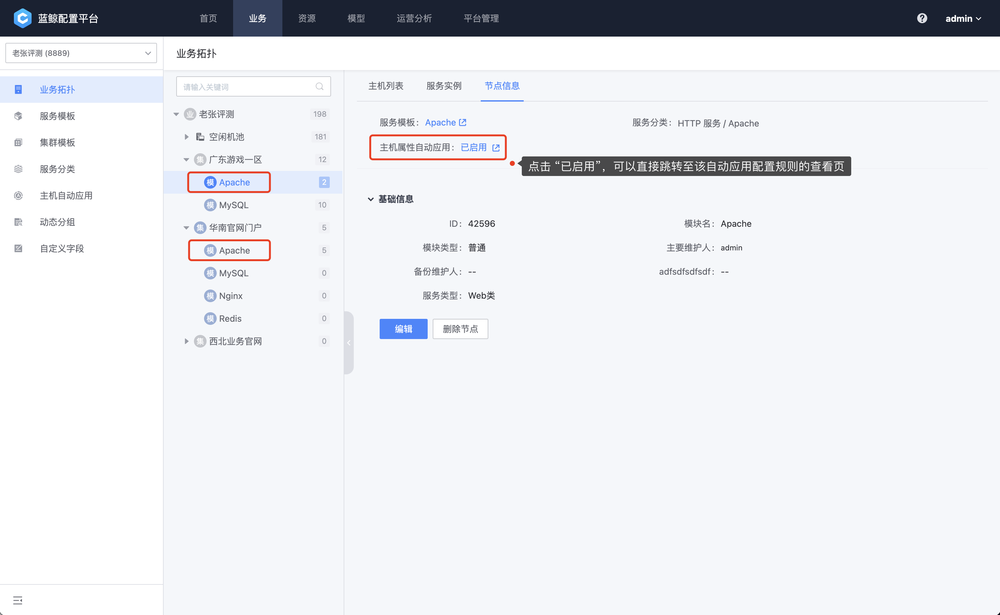

# 主机自动应用

主要用于配置主机属性的自动应用。即主机发生转移或新加入模块，会根据目标模块的策略自动触发修改主机属性。

## 启用自动应用

进入到“业务-主机自动应用”，选择需要配置的模块（支持选择空闲机或者普通的业务模块），点击右侧的“立即启用”。

图1：启用自动应用

启动自动应用有两个步骤。

### 步骤一：配置自动应用的属性

图2：选择需要配置自动应用的属性

图3：配置自动应用属性

### 步骤二：现存主机属性修改为自动应用配置

此步骤会把当前模块中所有主机与配置的属性设定为一致，列表中显示了哪些主机的属性需要修改。

需要注意的是，第二个步骤执行完成，策略才能够保存，中途退出策略的配置会被丢弃。

图4：应用到现有主机

图5：策略保存成功

自动应用策略配置成功以后，当主机新增到当前模块，会自动应用配置的属性（此案例中会把主要负责人和备份负责人设定为 admin）。

## 关闭自动应用

自动应用策略已经生效时，可以在左侧的拓扑中看到对应模块后有一个绿色的对号。

当模块不再需要自动配置的特性时候，点击拓扑树上对应的模块，然后点击关闭。

图6：关闭自动应用

这时候会弹出一个提示框，是否保存当前的配置项，如果只是临时关闭，可以选择保存，后续需要应用的时候再启用，之前的配置过的属性就不需要重复选择和填写。如果是不再需要配置，选择不保存即可，下次再次开启，从零开始配置。

关闭自动应用的时候，已经存在当前模块的主机属性不会发生变动。

此外在关闭状态，无论是否保存了之前的配置，主机移入当前模块，属性不会发生改变。

图7：关闭自动应用确认

## 进阶用法：“按服务模板”配置自动应用

上面我们介绍的是通过 `按业务拓扑` 的方式配置自动应用规则，它与 `按服务模板` 配置的差别是：前者是应用到拓扑节点的实例级别，而后者（按服务模板）则是面向所有该服务模板生成的节点实例，是一种动态的配置模式；我们更推荐用户使用模板来规范、标准化的管理业务的配置，不论是拓扑还是主机属性的管理。

下图显示的是该服务模板（示例中的 `Apache`）所关联的模块节点，都会被应用该规则：

