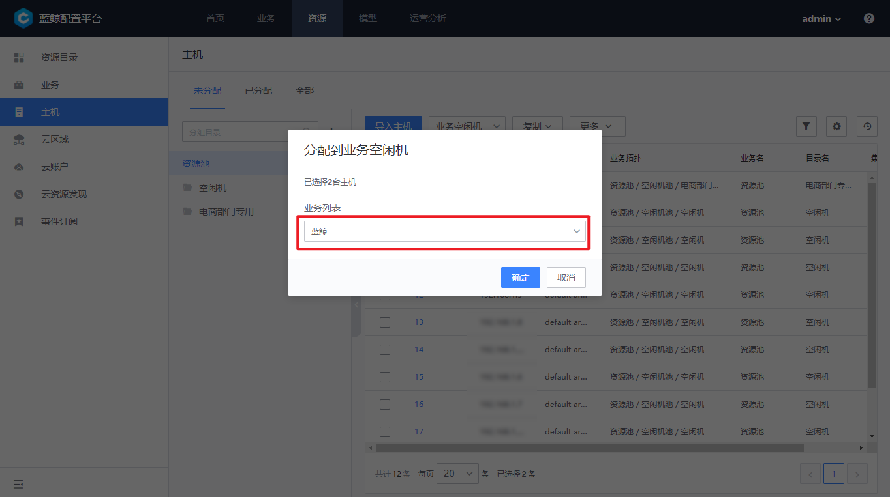

# 主机由 A 业务模块转移到 B 业务模块

具体步骤：

**主机分配到 A 业务空闲机池 -- 主机上交资源池 -- 主机分配到 B 业务空闲机池 -- 主机分配到 B 业务**

> Note：
> 主机的业务属性变更信息不会与节点管理同步，所以在主机转移之前请在节点管理卸载主机的 Agent ,主机转移之后再在节点管理重装 Agent 。

## 1. 从普通模块下的主机分配到 A 业务空闲机池

导航栏进入 "业务资源 -- 业务拓扑" 页面。

查看 A 业务 a1 模块下的主机，勾选需要转移的主机，点击上方的 【转移到】 按钮，在对话框中选择目标模块 "空闲模块"，在对话框中选择转移的目标模块，这里选中“空闲机”。进入下一步确认服务实例的变化，即完成转移操作

## 2. 主机上交资源池

导航进入 "业务资源 -- 业务拓扑" 页面

查看业务的 "空闲机" 模块，勾选刚刚转移过来的主机，点击上方的 【转移到】 按钮，在对话框中选择 "资源池"，点击 【确认】 完成转移。

## 3. 主机分配到 B 业务空闲机池

进入到“资源--主机--未分配”，选中刚刚转入过来的主机，选择“分配到--业务空闲机”

选择需要转移到的目标业务

## 主机分配到 B 业务的模块

进入到业务中，找到空闲机下的主机，转移到所需要分配的模块即可

