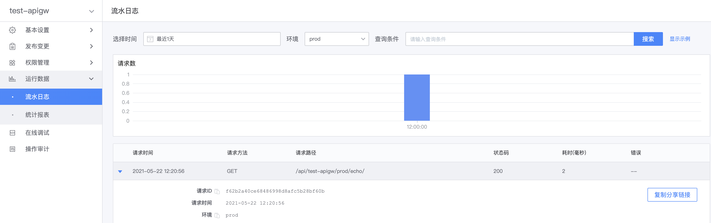

# 网关 API 请求记录

网关支持查询网关 API 的请求记录，以方便排查问题。但由于日志量较大，对于后端接口响应状态码为 20X 的请求，
将会进行采样，仅能查询部分请求的记录；对于超长的参数及响应内容，也将截断，仅展示部分内容。

在网关管理页，展开左侧菜单**运行数据**，点击**流水日志**，即可进入请求记录查询页。

输入精确的查询条件，将有利于快速定位请求记录，更多查询规则请参考[请求日志查询规则](../reference/log-search-specification.md)

