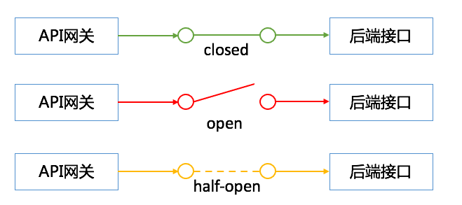
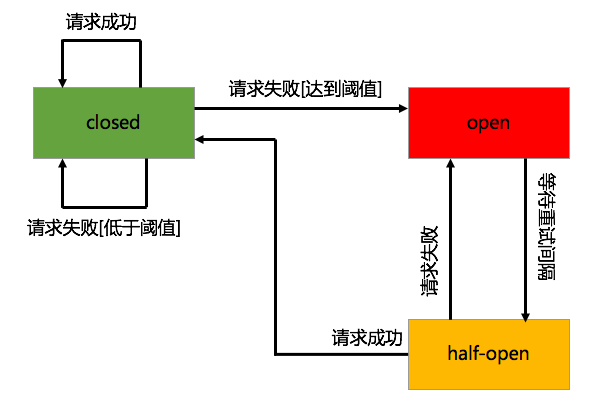
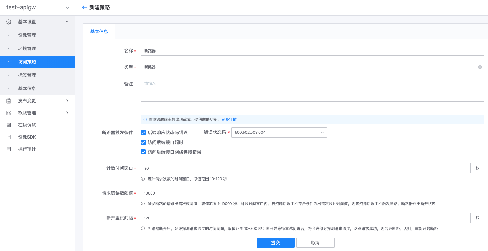

# 断路器

## 断路器概述

断路器是 API 网关保障调用链路高可用的一种重要机制。在后端系统故障时，可以快速响应调用请求，
并减少对故障服务的访问，保障调用链路的高可用，防止故障的级联效应。

### 断路器模型

断路器基于[断路器模式](https://martinfowler.com/bliki/CircuitBreaker.html)实现，其内部维护了一个状态机，共有三种状态：
- closed 状态，断路器初始状态，该状态下，断路器保持闭合，可访问后端接口
- open 状态，断开状态，该状态下，断路器开启，不可访问后端接口
- half-open 状态，半开状态，该状态下，仅允许部分探测请求访问后端接口，其余请求不可访问后端接口。如果探测请求响应正常，则表示探测成功，断路器重置到 closed 状态，结束断路，否则，表示探测失败，断路器切回到 open 状态

断路器三种状态下，网关与后端接口的连通情况，如下图所示

断路器三种状态之间的转换关系，如下图所示：

### 网关断路器设计

网关资源的后端支持多个主机，为防止其中一台主机故障影响其它主机，网关为资源后端的每个主机绑定了一个单独的断路器。

如果资源后端某主机的断路器断开，则不再向该主机发送请求，在等待断开重试时间后，允许探测请求通过该主机后端接口，若探测请求成功，断路器重置到 closed 状态，结束断路，否则，探测失败，断路器切回到 open 状态

如果资源后端所有主机的断路器均处于断开状态，则请求该资源时，将直接返回 503 错误。

## 配置断路器策略

### 新建『断路器』策略

在网关的管理页，展开左侧菜单**基本设置**，点击**访问策略**，打开策略管理页，点击**新建策略**。

填写配置项
- 名称：策略名称
- 类型：选择`断路器`
- 策略配置：包括断路器触发条件、计数时间窗口、请求错误数阈值、断开重试间隔，具体参考下面描述

**断路器触发条件**
- 后端响应状态码错误，若后端响应状态码在指定状态码范围内，则判定此次请求失败
- 访问后端接口超时
- 访问后端接口出现网络连接错误

注意：请求符合勾选的断路器触发条件之一时，将会被记录到请求出错次数，在计数时间窗口内，记录的请求出错次数达到阈值，则触发断路

**计数时间窗口**
- 统计请求次数的时间窗口，取值范围 10~120 秒；网关采用滑动窗口的方式，统计当前时间之前，计数时间窗口内的请求次数

**请求错误数阈值**
- 触发断路的请求出错次数阈值，取值范围 1~10000 次；计数时间窗口内，若断路器符合条件的出错次数达到阈值，则该断路器触发断路，断路器处于 open 状态

**断开重试间隔**
- 断路器断开后，允许探测请求通过的时间间隔，取值范围 10~300 秒；断路器断开并等待重试间隔后，断路器切换到 half-open 状态，将允许部分探测请求通过，若探测请求成功，则结束断路，断路器重置到 closed 状态，否则，断路器切回 open 状态

### 将策略绑定到环境或资源

请参考[访问策略-概述](./summary.md)
