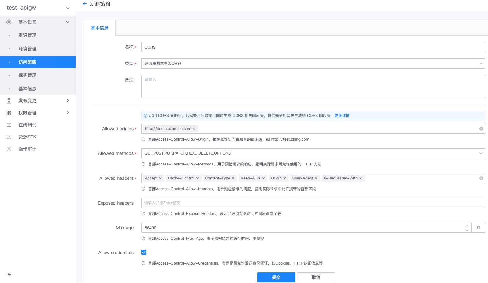
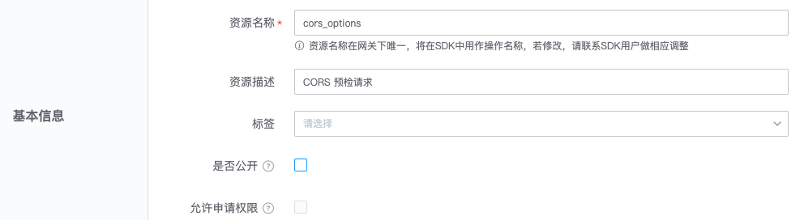
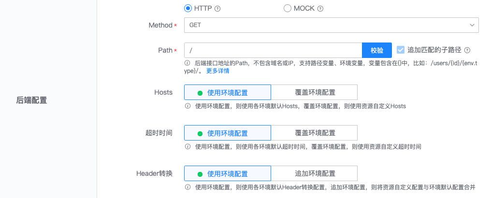

# 跨域资源共享(CORS)

[跨域资源共享(CORS)](https://developer.mozilla.org/zh-CN/docs/Web/HTTP/Access_control_CORS)是一种机制，
该机制使用附加的 HTTP 头，支持在浏览器中，Web应用可以访问另一个源的资源。

出于安全性，浏览器限制脚本内发起的跨源 HTTP 请求。根据同源策略，应用只能请求同一个域的 HTTP 资源，除非响应报文包含了正确 CORS 响应头。

配置跨域资源共享(CORS)，有三个步骤：
- 创建『跨域资源共享(CORS)』策略
- 创建预检请求的网关资源 
- 将策略绑定到环境或资源

## 创建『跨域资源共享(CORS)』策略

在网关的管理页，展开左侧菜单**基本设置**，点击**访问策略**，打开策略管理页，点击**新建策略**。

填写配置项
- 名称：策略名称
- 类型：选择`跨域资源共享(CORS)`
- 策略配置：
    - Allowed origins: 首部 Access-Control-Allow-Origin，指定允许访问该服务的请求域，如 http://demo.example.com
    - Allowed methods: 首部 Access-Control-Allow-Methods，用于预检请求的响应，指明实际请求所允许使用的 HTTP 方法
    - Allowed headers: 首部 Access-Control-Allow-Headers，用于预检请求的响应，指明实际请求中允许携带的首部字段
    - Exposed headers: 首部 Access-Control-Expose-Headers，表示允许浏览器访问的响应首部字段
    - Max age: 首部 Access-Control-Max-Age，表示预检结果的缓存时间，单位秒
    - Allow credentials: 首部 Access-Control-Allow-Credentials，表示是否允许发送身份凭证，如 Cookies、HTTP 认证信息等



注意事项：
- 如果环境或资源绑定了`跨域资源共享(CORS)`策略，而后端接口也生成了 CORS 相关的响应头，将优先使用网关生成的 CORS 响应头 
    ```
    # 网关生成 CORS 响应头
    Access-Control-Allow-Origin: http://demo.example.com
    Access-Control-Allow-Credentials: true

    # 后端接口生成响应头
    Access-Control-Allow-Origin: http://demo2.example.com
    Access-Control-Allow-Credentials: true

    # 请求方获取到的 CORS 响应头
    Access-Control-Allow-Origin: http://demo.example.com
    Access-Control-Allow-Credentials: true
    ```

## 创建预检请求的网关资源 

跨域资源共享规范要求，对可能对服务器数据产生副作用的 HTTP 请求，浏览器必须首先使用`OPTIONS`方法发起一个预检请求`preflight request`，
从而获知服务端是否允许该跨域请求。为支持`预检请求`，网关需创建一个请求方法为 OPTIONS 的资源。

在网关的管理页，展开左侧菜单**基本设置**，点击**资源管理**，打开资源管理页，点击**新建资源**，支持`预检请求`的资源配置样例如下：

基本信息
- 资源名称：cors_options
- 资源描述：CORS 预检请求
- 是否公开：否
- 允许申请权限：否



前端配置
- 请求方法：CORS
- 请求路径：/，匹配所有子路径：是


后端配置
- 类型：HTTP
- Method：OPTIONS
- Path：/，最佳匹配的子路径：是



安全设置
- 应用认证：是/否（预检请求，将忽略此配置）
- 校验访问权限：是/否（预检请求，将忽略此配置）
- 用户认证：否


注意事项：
- 创建资源后，需生成并发布版本，使资源生效
- 该资源或对应的环境，需绑定`跨域资源共享(CORS)`策略

## 将策略绑定到环境或资源

请参考[访问策略-概述](./summary.md)
