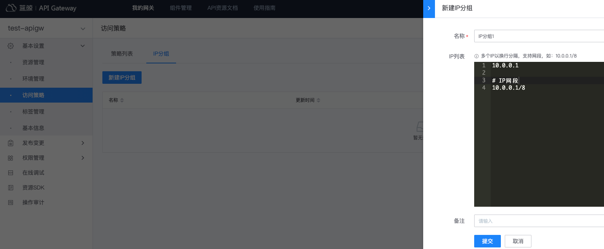

# IP 访问控制

IP 访问控制，用于`允许`或`拒绝`某些请求来源的 IP 访问资源，实现基于请求来源 IP 的权限控制。
- `允许`IP 访问，即设置 IP 白名单，只有指定的 IP 可以访问资源
- `拒绝`IP 访问，即设置 IP 黑名单，拒绝指定的 IP 访问资源，其它未指定的 IP 可以访问资源

配置 IP 访问控制，有三个步骤：
- 创建 IP 分组
- 创建`IP 访问控制`策略
- 将 IP 访问控制策略绑定到环境（IP 访问控制策略仅支持绑定到环境）

### 创建 IP 分组

IP 分组，支持对 IP 进行分组，方便管理。

在网关的管理页，展开左侧菜单**基本设置**，点击**访问策略**，打开策略管理页，切换到**IP 分组**，点击**新建 IP 分组**。

IP 分组的配置：
- 支持配置单个 IP，如：10.0.0.1
- 支持配置 IP 段：如：10.0.0.1/8
- 允许空行，解析 IP 时，空行将被忽略
- 支持注释，注释行以`#`开头，解析 IP 时，注释行将被忽略

### 创建『IP访问控制』策略

在网关的管理页，展开左侧菜单**基本设置**，点击**访问策略**，打开策略管理页，点击**新建策略**。

填写配置项：
- 名称：策略名称
- 类型：选择`IP 访问控制`
- 策略配置：
  - 访问控制类型：可选值：`允许`、`拒绝`，`允许`即设置 IP 白名单，`拒绝`即设置 IP 黑名单
  - 策略 IP 分组：点击**添加**，可将已创建的 IP 分组添加到策略。IP 分组为空时，若类型为`允许`，表示不允许任何 IP 访问，若类型为`拒绝`，表示允许任何 IP 访问。

### 步骤三：将策略绑定到环境

IP 访问控制策略，仅支持绑定到环境，如何绑定请参考[访问策略-概述](./summary.md)
