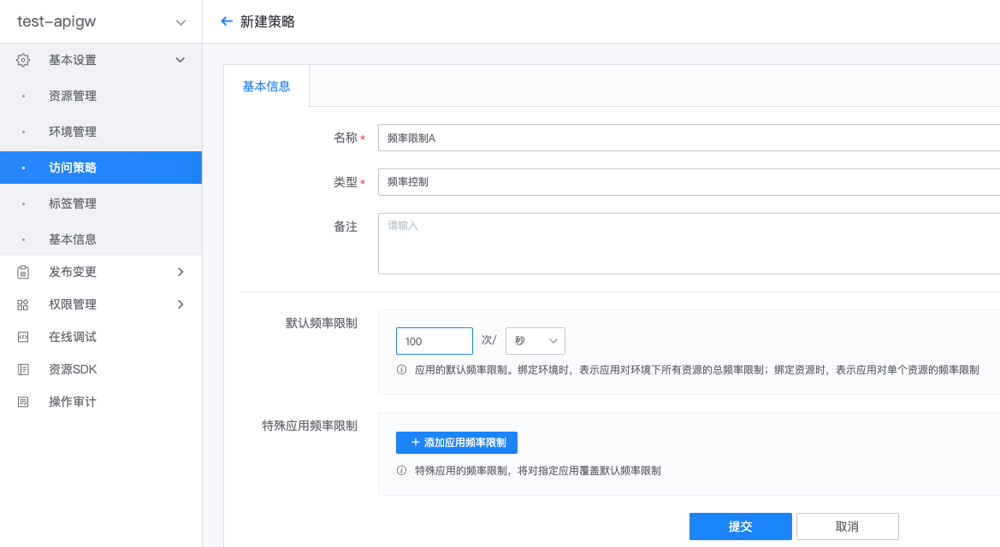
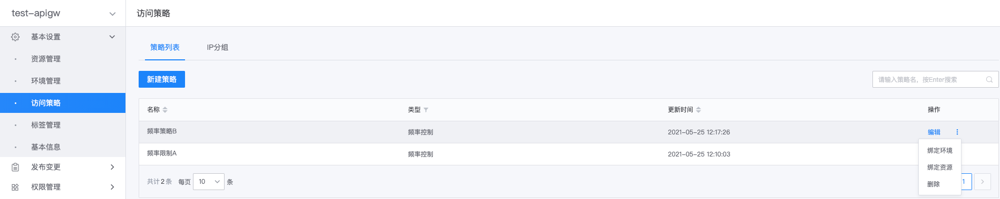
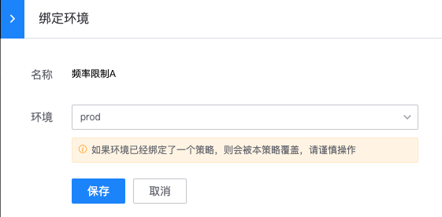
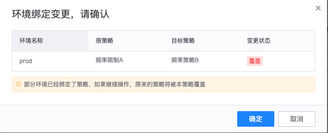
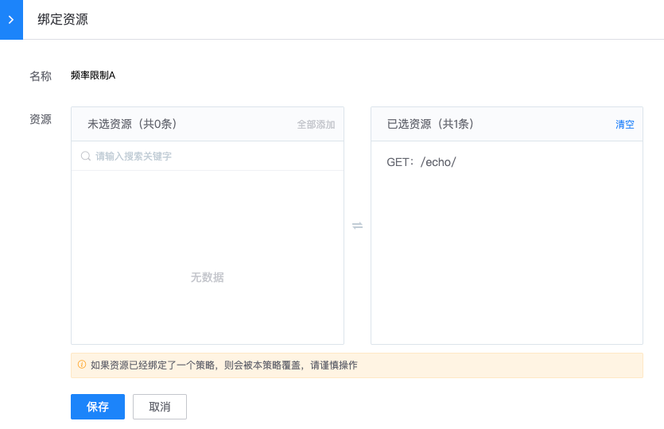
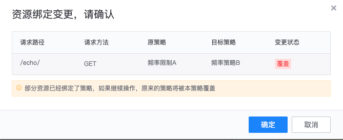
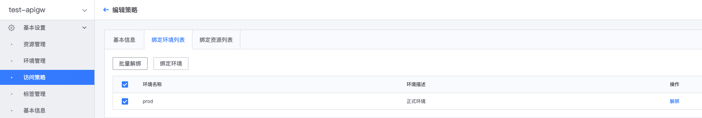

# 概述

网关访问策略以插件的形式，为网关资源的访问添加附加控制。目前，网关支持的访问策略有以下几种类型：
- [频率控制](./rate-limit.md)
- [IP访问控制](./ip-access-control.md)
- [跨域资源共享(CORS)](./cors.md)
- [断路器](./circuit-breaker.md)
- [免用户认证应用白名单](./user-verified-unrequired-apps.md)

## 新建策略

在网关的管理页，展开左侧菜单**基本设置**，点击**访问策略**，打开策略管理页，点击**新建策略**。

填写策略名称，选择策略类型，填写策略配置（不同类型配置不同，具体参考各类型策略的说明文档），点击**提交**，即可创建策略。

## 绑定策略到网关环境或资源

新建访问策略后，需要将其绑定到网关环境或资源，才能生效（不需要发布版本）。

策略绑定注意事项：
- 同一个环境或资源，只能绑定同一类型的一个策略，比如，一个环境只能绑定一个频率控制策略
- 策略绑定到环境，对环境下每一个资源生效（频率控制策略除外）
  - 频率控制策略，是对环境下所有资源的总访问频率进行限制
- 策略绑定到资源，仅对该资源生效
- 同一类型的策略，同时绑定到环境和资源，则绑定到资源的生效（频率控制策略除外）
  - 频率控制策略，环境和资源的策略同时生效，将先校验资源的频率限制，再校验环境的总频率限制

### 绑定策略到网关环境

在网关管理页，展开左侧菜单**基本设置**，点击**访问策略**，进入访问策略管理页。

在策略列表的操作项中，点击**绑定环境**，打开策略绑定页。

选择待绑定环境，点击**保存**，即可绑定策略到环境。

如果环境已绑定某类型的策略，绑定同一类型的新策略时，将覆盖已绑定的策略。

### 绑定策略到网关资源

参考上一步，进入策略管理页，在策略列表的操作项中，点击**绑定资源**，打开策略绑定页。

选择待绑定资源，点击**保存**，即可绑定策略到资源。

如果资源已绑定某类型的策略，绑定同一类型的新策略时，将覆盖已绑定的策略。

## 查看策略绑定及解绑

进入策略管理页，在策略列表的操作项中，点击**编辑**，进入策略编辑页。

点击**绑定环境列表**，**绑定资源列表**，可查看策略当前绑定的环境或资源列表。选择环境或资源后，点击**批量解绑**，可解绑策略。

