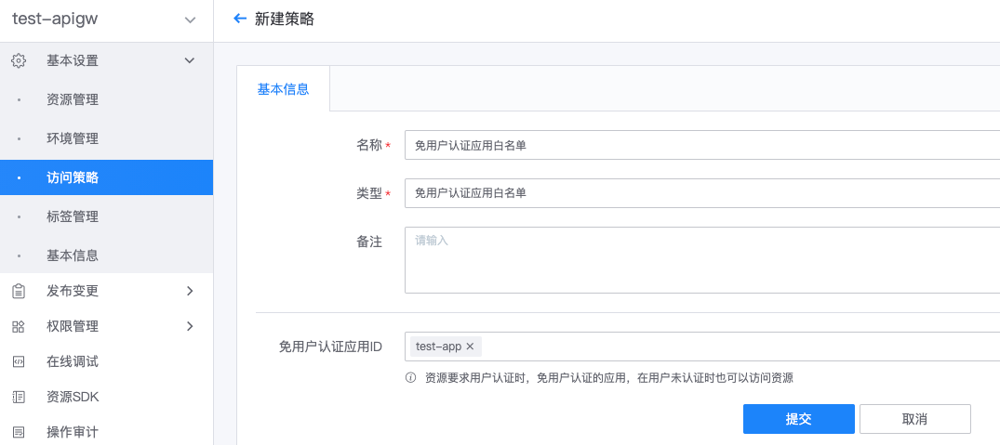

# 免用户认证应用白名单

网关资源启用用户认证时，可使用`免用户认证应用白名单`策略，对部分应用免除用户认证。

## 新建及绑定策略

### 新建『免用户认证应用白名单』策略

在网关的管理页，展开左侧菜单**基本设置**，点击**访问策略**，打开策略管理页，点击**新建策略**。

填写配置项：
- 名称：策略名称
- 类型：选择`免用户认证应用白名单`
- 策略配置：
    - 免用户认证应用ID：添加免除用户认证的蓝鲸应用ID（即 bk_app_code），可参考[获取蓝鲸应用账号](../use-api/bk-app.md)

### 将策略绑定到环境或资源

请参考[访问策略-概述](./summary.md)
