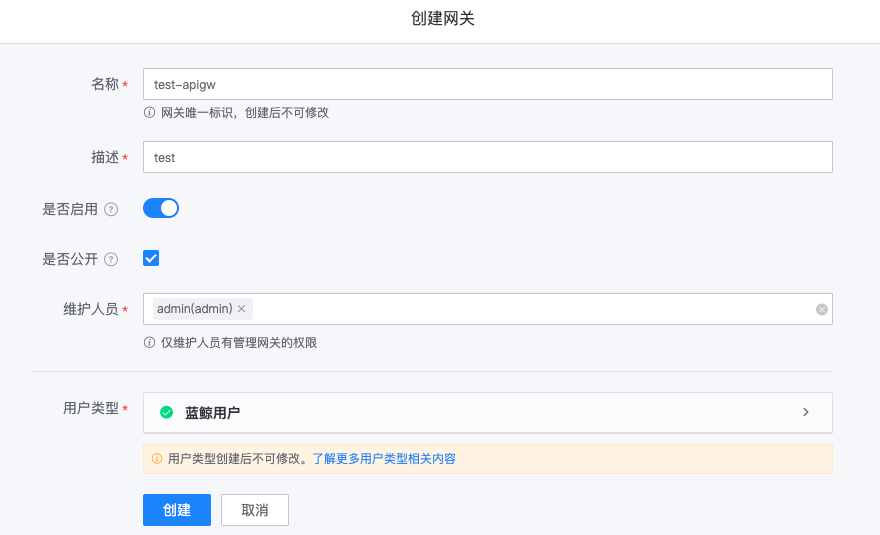

# 创建网关 API

本文将引导您在 API 网关中，将 HTTP 协议的后端接口接入网关，并使用蓝鲸应用账号，访问该网关 API。

## 概述

本文的主要操作步骤如下：
- 创建网关
- 新建环境
- 新建资源
- 生成和发布版本
- 在线调试
- 创建蓝鲸应用和为蓝鲸应用授权
- 调用网关 API

## 创建网关

网关是一组资源的集合，需要先创建网关，然后在网关下，新建环境、新建资源。

访问`蓝鲸 API 网关`，在**我的网关**菜单下，点击**创建网关**。输入网关名称，示例中，我们使用名称`test-apigw`，用户类型使用默认值。



## 新建环境

在网关`test-apigw`的管理页，展开左侧菜单**基本设置**，点击**环境管理**，进入网关的环境管理页。

上一步创建网关时，系统默认创建环境`prod`，可直接使用此环境，点击**编辑**，进入环境的编辑页。

将环境**代理配置**中的`Hosts`改为后端接口的域名。示例中，后端接口的地址为：http://test.example.com/echo/，则Hosts应设置为：http://test.example.com。


## 新建资源

此步骤会将后端接口的信息配置到网关，主要包括几个部分：基本信息，前端配置，后端配置，安全设置。

在网关`test-apigw`的管理页，展开左侧菜单**基本设置**，点击**资源管理**，进入网关的资源管理页，点击**新建资源**。

### 新建资源 - 基本配置

配置资源名称，资源名称将在 SDK 中用作方法名，并在展示文档时作为资源唯一标识，示例中，资源名称配置为`echo`。


### 新建资源 - 前端配置

前端配置包括请求方法、请求路径，用于设置用户请求该网关 API 的接口协议，`网关域名` + `环境名称` + `资源请求路径` 即为网关 API 的完整接口地址。

例如，若期望的网关 API 接口协议为 GET http://{domain}/{stage-name}/echo/，则应将请求方法设置为 GET，请求路径设置为 /echo/。


### 新建资源 - 后端配置

后端配置为网关请求后端接口的配置，包括后端接口的请求方法、Path、Hosts、超时时间等。

Path 仅包含后端接口地址的路径部分，不包含域名。示例中，完整的后端接口地址为：http://test.example.com/echo/，则 Path 应配置为：/echo/

Hosts 选择`使用环境配置`，网关请求后端接口时，将获取环境代理配置中的 Hosts，与资源配置中的 Path 组合出完整的后端接口地址。
本示例新建环境步骤中，环境`prod`的 Hosts 配置为：http://test.example.com，则资源 Hosts 与 Path 组合出的后端接口地址为：http://test.example.com/echo/。


### 新建资源 - 安全设置

安全设置主要定义了访问网关 API 时的几项要求：
- 应用认证：是否需要提供蓝鲸应用账号，若勾选，需先申请一个蓝鲸应用账号，才可访问该网关 API
- 校验访问权限：是否校验蓝鲸应用访问网关 API 的权限，若勾选，则网关需给应用授权，或应用需申请访问该网关 API 的权限，才可访问
- 用户认证：是否需要提供用户登录态或 access_token，以校验用户身份

示例中，取消勾选**用户认证**，暂不对用户进行认证。


## 生成和发布版本

新建资源后，并不会直接生效，而是，需要生成版本，并将版本发布到环境，才能对外提供网关 API。

在网关`test-apigw`的管理页，展开左侧菜单**发布变更**，点击**版本管理**，在版本管理页，点击**生成版本**。

填写版本标题，方便对版本进行区分，点击**生成**即可生成版本。


生成版本成功后，将会弹出提示，点击提示框中的**发布版本**。


在版本发布页，选择待发布的环境，示例中，创建环境步骤配置了环境`prod`，选择此环境，填写发布日志，点击**发布**，即可将版本发布到环境`prod`。


至此，我们已经创建了网关、环境、资源，并生成、发布了版本。发布版本之后，即完成了该网关 API 的完整创建流程。接下来，我们将对该网关 API 进行在线调试，及调用。

## 在线调试

在网关`test-apigw`的管理页，展开左侧菜单**在线调试**，环境选择`prod`，请求资源选择新建的资源`/echo/`。点击**发送请求**，页面右侧，即为请求详情，包括请求参数及响应。


## 创建蓝鲸应用和为蓝鲸应用授权

由于新建资源时，安全设置配置了**应用认证**和**校验访问权限**，因此，需要申请一个蓝鲸应用账号，并为此应用授权访问该网关 API 的权限，才可以访问该网关 API。

### 创建蓝鲸应用

访问`蓝鲸开发者中心`创建应用。

- 应用ID：为应用唯一标识，示例中，可设置为：test-app。
- 应用引擎：为简化创建流程，关闭应用引擎
- 应用市场：访问地址可设置为"暂不设置"


### 获取蓝鲸应用账号

访问`蓝鲸开发者中心`，点击导航菜单**应用开发**，搜索并进入上一步创建的应用。


在应用管理页，展开左侧菜单**基本设置**，点击**基本信息**。鉴权信息中的`bk_app_code`和`bk_app_secret`，即为访问网关 API 所需的蓝鲸应用账号。


### 为蓝鲸应用授权

在网关`test-apigw`的管理页，展开左侧菜单**权限管理**，打开**应用权限**页，点击**主动授权**。

在弹出的右侧页面中，蓝鲸应用ID填写上一步创建的蓝鲸应用`test-app`，点击保存即可为应用授权。


## 调用网关 API

在网关`test-apigw`的管理页，展开左侧菜单**基本设置**，打开**资源管理**页。在资源列表中，查找前面步骤创建的资源，并点击**详情**，
展开页面中的资源地址，即该网关 API 的接口访问地址。


请求网关 API 时，将蓝鲸应用账号（`bk_app_code + bk_app_secret`）信息放在请求头**X-Bkapi-Authorization**中，值为 JSON 格式字符串。
假定网关 API 的请求地址为：http://bkapi.example.com/api/test-apigw/prod/echo/，则用 curl 访问网关 API 示例如下：

```powershell
curl 'http://bkapi.example.com/api/test-apigw/prod/echo/' \
    -H 'X-Bkapi-Authorization: {"bk_app_code": "test-app", "bk_app_secret": "test-app-secret"}'
```
