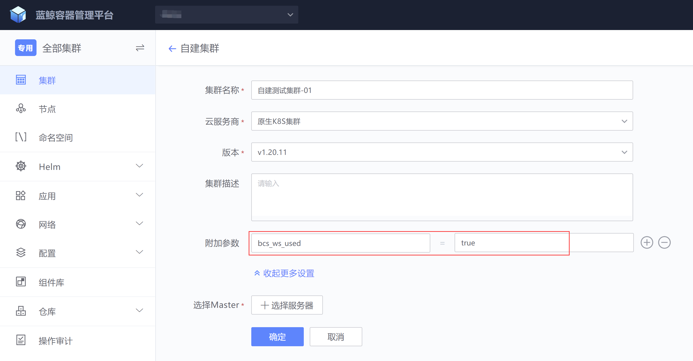
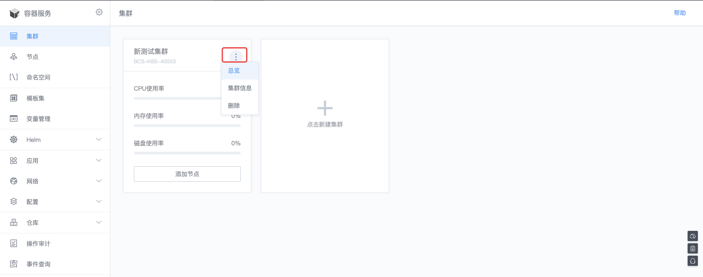
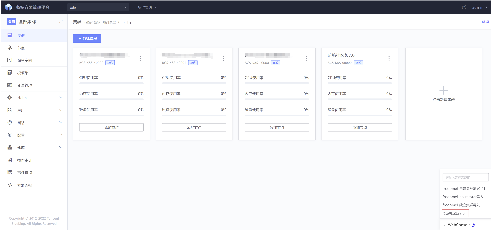
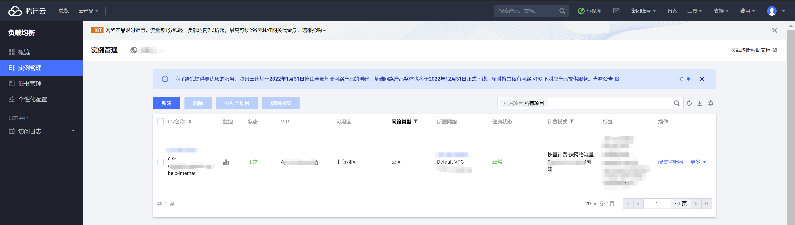
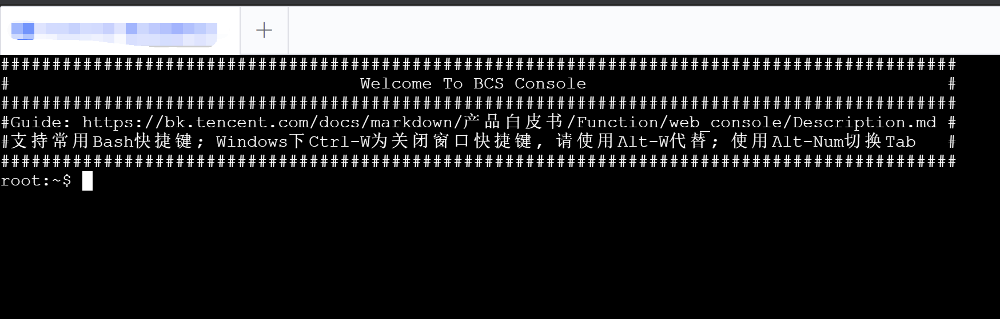
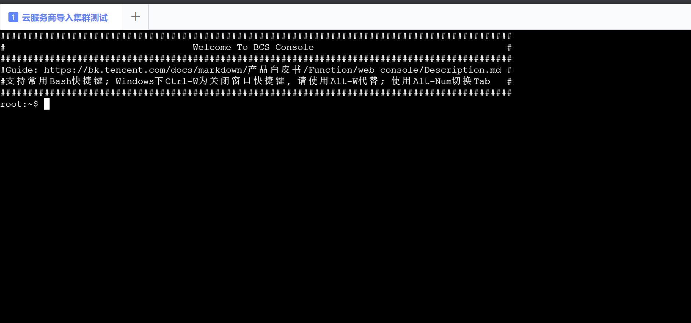

# 集群管理

## 一. 启用容器服务
如果当前项目未启用过容器服务，会看到如下的启用页面。如果是管理员，这里会直接出现有权限的业务列表(业务列表来源于配置平台)；非管理员需要单独申请。


可以点击【查看帮助】，了解如何申请业务权限。


通过绑定有权限的业务，正式【启用容器服务】


## 二. 前置条件

### 网络连通性保证

因为业务集群与蓝鲸容器服务后台模块部署的集群相互有服务请求，使用前要保证网络连通性

- 容器平台管理业务集群需要访问业务集群的ApiServer服务
- 业务集群内会部署bcs-k8s-watch（上报集群元数据与事件）、cluster-autoscaler（节点自动扩缩容）会调用容器管理平台后台服务

推荐节点出口使用NAT网关（出口IP白名单问题，因为业务会创建多个集群，每个集群添加多个节点，这样出口IP会经常变更、删除与新增，不利于白名单管理），业务服务接入层对外使用负载均衡产品来实现

### 蓝鲸容器服务出口暴露

目前业务集群内需要调用两个容器管理平台后台服务

- bcs-k8s-watch

  调用bcs-stroage接口，以域名的方式调用，例如：https://bcs-api.{蓝鲸平台域名}:31024

- bcs-kube-agent（自建集群需要，导入集群无需）

  调用bcs-api-gateway接口，以域名方式调用，例如：https://bcs-api.{蓝鲸平台域名}:31443

- cluster-autoscaler（节点自动扩缩容)

  调用bcs-api-gateway接口，以域名方式调用，例如：https://bcs-api.{蓝鲸平台域名}:31443

如何获取bcs-api域名？

```bash
# 在蓝鲸集群（蓝鲸社区版7.0(BCS-K8S-00000）中执行命令获取ingress域名
kubectl get ingress stack-bcs-api-gateway-http -n bcs-system
stack-bcs-api-gateway-http   nginx   bcs-api.xxx.xxx.com   172.17.247.1   80      24d
```

先检查域名是否已经解析，如果没有解析可以参考以下域名解析方法

- 个人或企业的域名解析系统（推荐）
- 在coredns中指定hosts解析，配置hosts详情可参考https://coredns.io/plugins/hosts/（不推荐）
- 节点主机的hosts中配置hosts解析，需要重启coredns pod所在节点的docker服务与重建coredns（不推荐）

域名解析的目的地址是什么？

- 如果业务集群与蓝鲸部署集群（蓝鲸社区版7.0 BCS-K8S-00000）能直通，可以使用NodePort，域名解析到蓝鲸集群的任一节点即可，缺点是只能解析到单个节点，没有高可用，为临时使用方案，不推荐
  ```bash
  # 在蓝鲸集群（蓝鲸社区版7.0(BCS-K8S-00000）中执行命令获取bcs-api-gateway、bcs-storage NodePort信息
  kubectl get svc -n bcs-system|grep -E 'bcs-storage|bcs-api-gateway'
  bcs-api-gateway  NodePort  172.18.254.206  8081:31595/TCP,80:31000/TCP,443:31443/TCP,9091:30868/TCP
  bcs-storage  NodePort  172.18.252.140  50024:31024/TCP,50025:31025/TCP
  ```

- 如果业务集群与蓝鲸部署集群（蓝鲸社区版7.0(BCS-K8S-00000）不能直通，则需要在NodePort前加一层负载均衡（如CLB）做高可用，需要配置两条规则
  | 服务名称        | 协议 | VIP        | VPORT | RSIP             | RSPORT |
  | --------------- | ---- | ---------- | ----- | ---------------- | ------ |
  | bcs-api-gateway | TCP  | 负载均衡IP | 443   | 蓝鲸集群所有节点 | 31443  |
  | bcs-storage     | TCP  | 负载均衡IP | 31024 | 蓝鲸集群所有节点 | 31024  |

​       域名解析到负载均衡VIP即可，注意，如果负载均衡实例有安全组，需要创建放通业务集群出口IP的安全组规则

### 安装gse_agent

蓝鲸容器平台安装gse_agent是为了保证以下功能的正常运行

- 蓝鲸容器监控，它使用gse_agent作为数据管道上报数据
- 蓝鲸日志平台，它使用gse_agent作为数据管道上报数据
- 节点模版自定义流程功能，它使用gse_agent执行job平台与标准运维任务
- 节点自动扩缩容自定义流程功能，它使用gse_agent执行job平台与标准运维任务
- 自建集群使用标准运维安装kubernetes组件，它使用gse_agent执行标准运维任务

gse_agent安装详情请参考：https://bk.tencent.com/docs/document/7.0/235/39703

非直连网络环境安装gse_agent请参考：https://bk.tencent.com/docs/document/7.0/235/39787

## 三. 创建集群

集群作为容器调度的基础，启用完容器服务后，首先需要创建集群。平台提供了两种创建集群的方式，一种是新建集群，另一种是导入已有集群。


####  创建集群 Master 节点


点击展开更多设置，附加参数设置，此步骤为非必选，有特殊场景时才会使用到该参数

| 变量名         | 描述                                                    | 默认值                |
| -------------- | ------------------------------------------------------- | --------------------- |
| DOCKER_LIB     | Docker数据目录                                          | /data/bcs/lib/docker  |
| DOCKER_VERSION | Docker版本                                              | 19.03.9               |
| KUBELET_LIB    | kubelet数据目录                                         | /data/bcs/lib/kubelet |
| K8S_VER        | 集群版本                                                | 1.20.11               |
| K8S_SVC_CIDR   | 集群Service网段                                         | 10.96.0.0/12          |
| K8S_POD_CIDR   | 集群Pod网段                                             | 10.244.0.0/16         |
| bcs_ws_used    | 使用websocket模式，适用于集群与蓝鲸服务集群不在同一内网 | false                 |

如果需创建集群节点的网络与蓝鲸服务集群（蓝鲸项目下的集群蓝鲸社区版7.0 BCS-K8S-00000）不在同一内网的情况下，需要开启websocket模式，在附加参数中填入“bcs_ws_used = true”



选择【新建集群】，通过【选择服务器】，完成 Master 节点的选择。


点击【确定】后，开始创建集群。可以通过【查看日志】观察集群的创建过程。


集群 Master 创建完成后，可以点击【总览】查看集群状态。


可以看到成功添加了一个 Master 节点。但其实当前集群并非可用，因为通常 Master 节点并不会设置成调度节点，而是需要添加 Node 节点(业务容器实际运行所在的主机)。


#### 安装bcs-kube-agent

创建完集群后会自动部署bcs-kube-agent、bcs-k8s-watch组件，以下是具体查看方式

```bash
# 保证bcs-kube-agent是Ready与Running状态
kubectl get pod -n bcs-system
NAME                              READY   STATUS    RESTARTS   AGE
bcs-kube-agent-685b985f94-rg5sg   1/1     Running   0          82m

# 日志查看没有明显错误
kubectl logs bcs-kube-agent-685b985f94-rg5sg --tail=10 -n bcs-system
```


集群创建后还不能马上使用蓝鲸容器管理平台管理集群，要做到管理集群的能力，必须安装好bcs-kube-agent，用于上报集群信息到容器平台后台，具体操作如下：

- 注意：目前bcs-kube-agent只支持在蓝鲸容器管理平台上创建的集群上安装，导入的集群无需安装，否则导入集群会出现异常

- 选择其中一台master角色服务器，如果master服务器上没有安装helm，可以执行下面命令安装，也可以自己去网上下载

  `wget https://bkopen-1252002024.file.myqcloud.com/ce7/tools/helm && chmod +x helm && mv helm /usr/bin/`

- 添加chart包镜像仓库

  ```shell
  helm repo add blueking https://hub.bktencent.com/chartrepo/blueking
  ```
  
- 如果命名空间bcs-system不存在，则需要创建命名空间

  `kubectl create ns bcs-system`

- bcs-kube-agent需要访问容器平台服务bcs-api-gateway，具体配置方法请参考 “前置条件中的蓝鲸容器服务出口暴露章节”

  `kubectl edit cm coredns -n kube-system`

- 创建bcs-kube-agent所需证书

  把以下内容保存到上一步集群master服务器上，文件名为：bcs-client-bcs-kube-agent.yaml

  ```
  apiVersion: v1
  data:
    ca.crt: 
    tls.crt: 
    tls.key: 
  kind: Secret
  metadata:
    name: bcs-client-bcs-kube-agent
    namespace: bcs-system
  type: kubernetes.io/tls
  ```

  通过webconsole或ssh到集群“蓝鲸社区版7.0”

  

  ```shell
  # 在集群中执行如下命令
  kubectl get secret bcs-gateway-bcs-services-stack -n bcs-system -o yaml
  ```

  把里面的ca.crt、tls.crt、tls.key里面的内容填充到bcs-client-bcs-kube-agent.yaml里

  执行 `kubectl apply -f bcs-client-bcs-kube-agent.yaml `创建好证书

- 通过helm chart安装bcs-kube-agent

  把以下内容保存文件为bcs-kube-agent-values.yaml

  ```
  global:
    serviceMonitor:
      enabled: false
    env:
      BK_BCS_clusterId: {集群ID}
  args:
    BK_BCS_API: {BK_BCS_API_GATEWAY}
    BK_BCS_APIToken: {BK_BCS_APIToken}
    BK_BCS_reportPath: /bcsapi/v4/clustermanager/v1/clustercredential/%s
  image:
    registry: hub.bktencent.com/dev
    repository: blueking/bcs-kube-agent
    tag: v1.25.0-alpha.6
  ```

  把 {集群ID} 替换为目前你操作的集群ID，例如：BCS-K8S-40000

  {BK_BCS_APIToken}替换为以下命名获取的字符串，获取方法如下

  ```bash
  # 在 “蓝鲸” 项目下的 “蓝鲸社区版7.0”集群下使用web-console，执行以下命名获取
  kubectl get secret bcs-password -n bcs-system -o yaml
  # 找到字段：gateway_token
  # base64解密：
  echo "gateway_token值"|base64 -d
  ```

  把{BK_BCS_API_GATEWAY}替换为bcs-api-gateway的访问域名，域名如何获取已在 “蓝鲸容器服务出口暴露” 一节中说明，这里不再重复说明，例如：https://bcs-api.xxxx.com

  执行以下命令安装bcs-kube-agent
  
  ```
  helm repo update
  helm upgrade --install bcs-kube-agent blueking-dev/bcs-kube-agent -f ./bcs-kube-agent-values.yaml -n bcs-system --devel
  
  Release "bcs-kube-agent" does not exist. Installing it now.
  NAME: bcs-kube-agent
  LAST DEPLOYED: Wed Apr 13 20:14:42 2022
  NAMESPACE: bcs-system
  STATUS: deployed
  REVISION: 1
  TEST SUITE: None
  
  kubectl get pod -n bcs-system
  NAME                             READY   STATUS    RESTARTS   AGE
  bcs-kube-agent-749d58b65-x7qkk   1/1     Running   0          9s
  
  # pod日志没有错误就代表bcs-kube-agent安装成功
  kubectl logs bcs-kube-agent-749d58b65-x7qkk -n bcs-system
  W0413 12:15:23.805420       1 client_config.go:552] Neither --kubeconfig nor --master was specified.  Using the inClusterConfig.  This might not work.
  I0413 12:15:23.841994       1 report.go:74] apiserver addresses: https://1.1.1.1:6443,https://1.1.1.2:6443,https://1.1.1.3:6443
  I0413 12:15:23.842031       1 report.go:77] bke-server url：https://bcs-api-gateway:31443/bcsapi/v4/clustermanager/v1/clustercredential/BCS-K8S-40000
  ```
  
  

####  添加集群 Node 节点

选中【节点管理】标签，点击【添加节点】。选择主机的方式和创建 Master 类似。【确定】后，节点的添加会进入初始化阶段，直到最终完成添加。


【节点管理】标签除了可以查看集群的所有节点外，还提供了一些集群日常管理的操作，如【停止调度】等，具体可以参考[K8S 官方介绍](https://kubernetes.io/zh/docs/concepts/architecture/nodes/)。


## 四. 导入集群
除了可以新建集群，容器服务也支持用户导入已有的集群。导入集群有两种方式：

- 通过集群的kubeconfig来达到BCS纳管的目的，这种导入方式优点是兼容各种各样的K8S集群，缺点是BCS只能控制K8S集群里的资源，而不能对云上其它资源进行管控，例如集群管理，节点添加，负载均衡等控制
- 通过各个云服务商的API Key方式导入集群，这种导入方式不同的云服务商有不同的API Key，目前只支持腾讯云公有云的TKE，后续会陆续支持Amazon EKS，Azure AKS，Google GKE等云服务商，这种放入方式优点是可以扩展对云资源的管控，例如集群管理，节点添加，负载均衡等控制

#### 1. kubeconfig导入方式


填写集群导入所需参数，导入方式选择“kubeconfig”，参数“集群kubeconfig”的获取方式一般有两种：

- 如果是云服务商提供的集群，一般在集群的基本信息可以找到，例如腾讯云公有云TKE的获取方式如下：

  

- 如果是自建原生K8S集群，可以在Master节点上的/root/.kube/config文件中获取

kubeconfig需同时满足以下两个条件，否则可能导致导入集群失败：

- 集群“蓝鲸社区版7.0（BCS-K8S-00000）“所有节点服务器到被导入集群APIServer网络端口连通正常，如果APIServer有防火墙的，请开通网络策略

  - 腾讯云公网TKE要打开外网访问，**托管集群** 需要添加“蓝鲸社区版7.0（BCS-K8S-00000）”集群所有Node节点的出口IP为APIServer的访问白名单

    

    


  - **独立集群** 需要在云产品“负载均衡”里，找到绑定TKE集群的CLB实例，实例名的命名规则一般是：${TKE集群ID}_default_kubelb-internet，给CLB实例绑定允许访问TKE集群APIServer的IP地址或IP段安全组来保证集群APIServer的网络安全

    

    

    

    **注意：**如果“蓝鲸社区版7.0（BCS-K8S-00000）”集群的节点是云上服务器，请先确认好节点服务器是走服务器外网还是走nat出口后再配置APIServer白名单或安全组

- 提供的kubeconfig用户是cluster-admin角色，否则会因为权限不足导致管控失败

  


获取到kubeconfig后，可以在导入集群页面进行有效性测试，如果测试通过，“导入”按钮会置为可用状态，否则请根据测试失败的错误提示处理错误，一般错误都是kubeconfig不同时满足上面讲的两个条件导致的




导入集群成功后，等待1分钟左右，使用webconsole验证是否导入成功


可以正常进入webconsole代表导入集群成功


#### 2. 云服务商API密钥导入方式
通过云服务商API密钥导入集群与kubeconfig导入方式一样，需同时满足以下两个条件，否则可能导致导入集群失败：

- 集群“蓝鲸社区版7.0（BCS-K8S-00000）“所有节点服务器到被导入集群APIServer网络端口连通正常，如果APIServer有防火墙的，请开通网络策略

  - 腾讯云公网TKE要打开外网访问，**托管集群** 需要添加“蓝鲸社区版7.0（BCS-K8S-00000）”集群所有Node节点的出口IP为APIServer的访问白名单

    

    


  - **独立集群** 需要在云产品“负载均衡”里，找到绑定TKE集群的CLB实例，实例名的命名规则一般是：${TKE集群ID}_default_kubelb-internet，给CLB实例绑定允许访问TKE集群APIServer的IP地址或IP段安全组来保证集群APIServer的网络安全

    

    

    

    **注意：**如果“蓝鲸社区版7.0（BCS-K8S-00000）”集群的节点是云上服务器，请先确认好节点服务器是走服务器外网还是走nat出口后再配置APIServer白名单或安全组

- 提供的kubeconfig用户是cluster-admin角色，否则会因为权限不足导致管控失败

  


满足以上两个先决条件后就可以开始通过云服务商API密钥导入集群了


- 导入方式选择“云服务商”

- 云服务目前只支持TKE，后续会支持到Amazon EKS，Azure AKS，Google GKE等云服务商

- 如果没有云凭证需要先创建一个，云凭证创建流程如下：

  - 首先在腾讯云公有云上使用主账户创建一个子账户（至少具备TKE集群管理、CVM管理、负载均衡网络管理权限），用于做集群管理，强烈不建议使用主账户

  - 在子账户下创建API密钥，如果已经存在API密钥可以忽略此步骤

    

    

  - 把创建的密钥录入到BCS中

    

    

    

创建完云凭证后继续完成导入操作


- 所属区域：通过云凭证拉取凭证有权限的区域列表，选择要导入集群的所属区域
- TKE集群ID：通过云凭证拉取所属区域下存在的TKE集群列表

点击“导入”按钮，完成集群导入


导入集群成功后，等待1分钟左右，使用webconsole验证是否导入成功


可以正常进入webconsole代表导入集群成功

