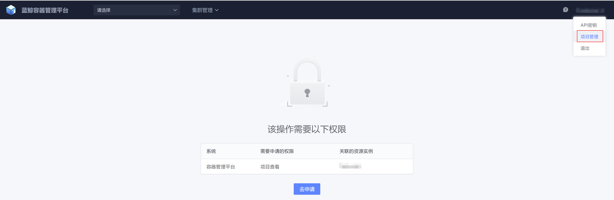

# 项目管理介绍
项目是容器管理平台的一级入口，所有的资源都是围绕项目进行划分。

## 创建项目
进入项目管理页面

通过点击【新建项目】按钮，完成个人项目的创建

如果是普通用户需要先申请创建项目的权限后方可有权限创建项目，等待审批完成，即可成功创建项目

进入项目后，可以绑定项目关联的CMDB业务，主要是绑定创建集群、添加节点时提供服务器资源的业务，关联CMDB需要在CMDB业务中是“业务运维”的角色

## 申请加入已存在的项目

对于已存在的项目，如果没有权限，可以点击项目名称，到权限中心完成权限的申请

