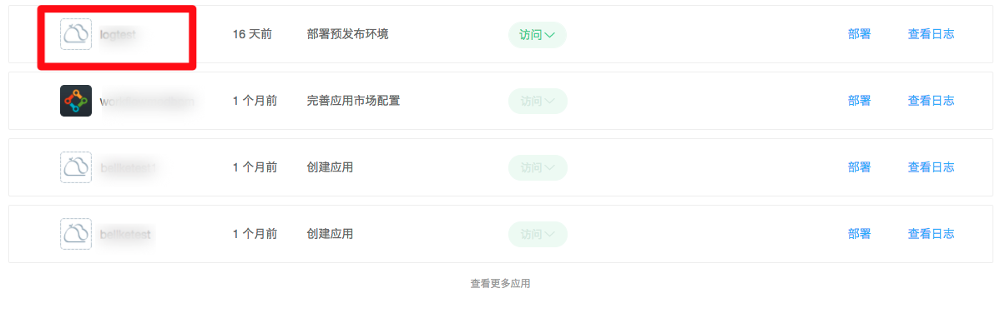
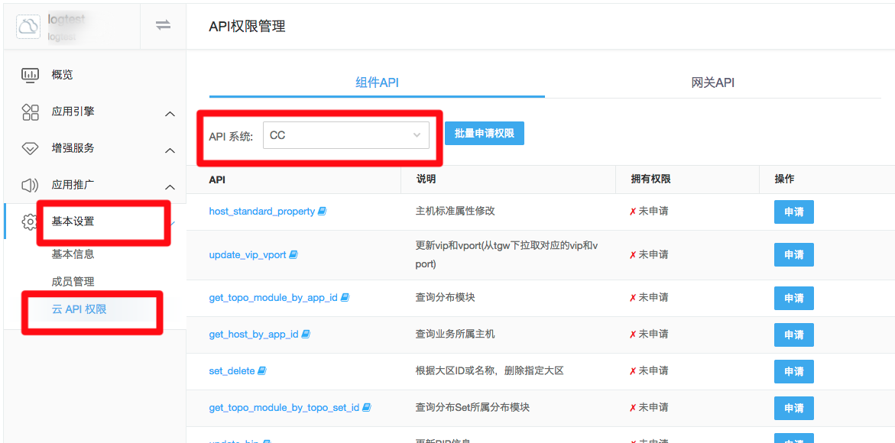
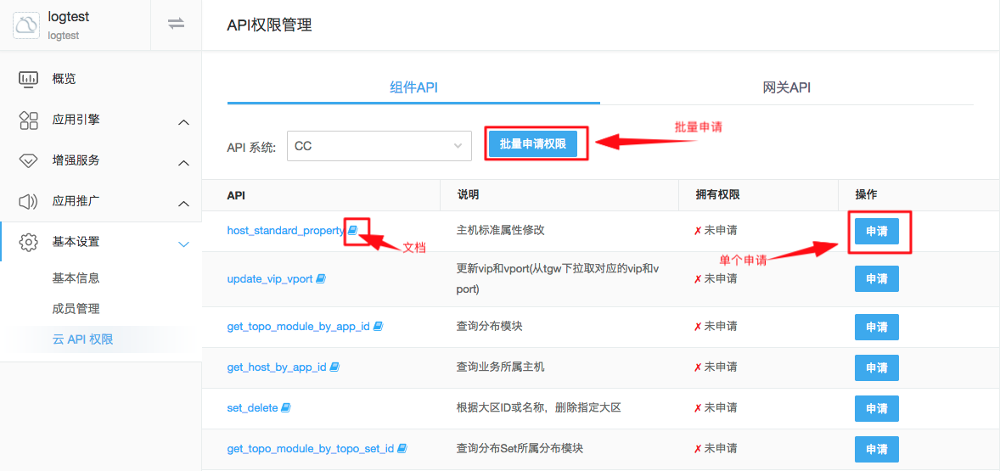

# 使用蓝鲸云 API
## 安装蓝鲸云 API SDK

## 申请 API 权限

访问蓝鲸云 API，必须要申请访问权限。

- 打开开发者中心，点击要申请资源权限的[蓝鲸应用]，具体如下

    

- 点击[基本设置]，点击[云 API 权限]，选择相应的[API 系统]，具体如下

    

- 根据要实现的功能和 API 说明及文档，申请相应的单个/多个 API，具体如下

    

> 提示：无需申请权限的 API，默认拥有权限，无需申请

- 管理员审批后，可以查看资源的拥有权限
    
> 提示：现阶段，申请 API 权限通过后，会拥有 180 天的访问权限；而且为了方便用户的持续使用，如果半年内有访问，则自动续期半年；否则，邮件通知蓝鲸应用开发者手动续期。


## SDK 使用说明

SDK 有两种使用方式：shortcuts、ComponentClient。蓝鲸互娱内部资源 SDK 使用示例如下

- shortcuts -- get_client_by_request

```python
    from blueking.component.shortcuts import get_client_by_request
    # 默认从django settings中获取APP认证信息：应用ID和安全密钥
    # 默认从django request中获取用户登录态bk_token
    client = get_client_by_request(request)
    # 参数
    kwargs = {'fields': ['bk_biz_id', 'bk_biz_name']}
    result = client.cc.search_business(kwargs)
```

- shortcuts -- get_client_by_user

```python
    from blueking.component.shortcuts import get_client_by_user
    # 默认从django settings中获取APP认证信息：应用ID和安全密钥
    # 默认从user中获取username，user为User对象或直接为User中username数据
    user = 'username'
    client = get_client_by_user(user)
    # 参数
    kwargs = {'fields': ['bk_biz_id', 'bk_biz_name']}
    result = client.cc.search_business(kwargs)
```

- ComponentClient

```python
    from blueking.component.client import ComponentClient
    # APP应用ID
    bk_app_code = 'xxx' 
    # APP安全密钥
    bk_app_secret = 'xxx-xxx-xxx-xxx-xxx' 
    # 用户登录态信息
    common_args = {'bk_token': 'xxx'}
    # APP应用ID和APP安全密钥如未提供，默认从django settings中获取
    client = ComponentClient(
        bk_app_code=bk_app_code, 
        bk_app_secret=bk_app_secret, 
        common_args=common_args
    )
    # 参数
    kwargs = {'fields': ['bk_biz_id', 'bk_biz_name']}
    result = client.cc.search_business(kwargs)
```
