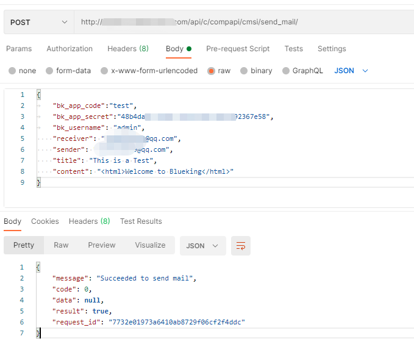

# 配置消息通知：邮件

配置地址：以“admin”的角色进入“开发者中心” -> “云 API” -> “网关管理” -> “组件管理” -> 选择系统 “[CMSI] 蓝鲸消息管理” -> 选择 “[CMSI] send_mail”

## 组件配置

- dest_url: 若用户不擅长用 Python，可以提供一个其他语言的接口，填到 dest_url，ESB 仅作请求转发即可打通邮件配置
- smtp_host: SMTP 服务器地址 (注意区分企业邮箱还是个人邮箱)
- smtp_port: SMTP 服务器端口 (注意区分企业邮箱还是个人邮箱)
- smtp_user: SMTP 服务器帐号
- smtp_pwd: SMTP 服务器帐号密码 (一般为授权码)
- smtp_usessl: 是否启用 SSL 加密连接
- smtp_usetls: 是否启用 TLS 加密连接
- mail_sender: 默认的邮件发送者 (smtp_user 相同)

## 组件示例

本示例已 QQ 邮箱为示例

### 1、开启 SMTP 服务

QQ 邮箱的 SMTP 服务，默认是关闭的。

登陆 QQ 邮箱，点击顶部导航栏的 “设置” -> 账户 -> 找到“POP3/SMTP 服务”和“IMAP/SMTP 服务”项，点“开启”。


<center>开启服务</center>

开启之后，点击“生成授权码”。

这个授权码将作为 smtp_pwd。

### 2、找到 SMTP 配置

```bash
smtp_host ：smtp.qq.com
smtp_port ：465 (如果启用 SSL 加密连接 smtp_usessl，那么需要填入对应端口号默认为 465)
smtp_user ：demo@qq.com （个人QQ邮箱地址）
smtp_pwd ：授权码
smtp_usessl ：勾选启用 SSL 加密连接
mail_sender: demo@qq.com (默认的邮件发送者可与 smtp_user 相同)
```


<center>填写变量值</center>

填写完成后保存

### 3、测试接口

使用 Postman 工具请求为例

```bash
http://bkapi.bkce7.bktencent.com/api/c/compapi/cmsi/send_mail/
```

```json
{
    "bk_app_code":"test",
    "bk_app_secret":"test",
    "bk_username": "admin",
    "receiver": "demo@qq.com",
    "sender": "demo@qq.com",
    "title": "This is a Test",
    "content": "<html>Welcome to Blueking</html>"
}
```
其中 sender 一定要跟管道配置 smtp_user 保持一致


<center>测试接口</center>

### 4、排查接口问题

1. 可根据 api 请求返回的 message 信息定位失败原因

2. 请检查是否将端口打开

