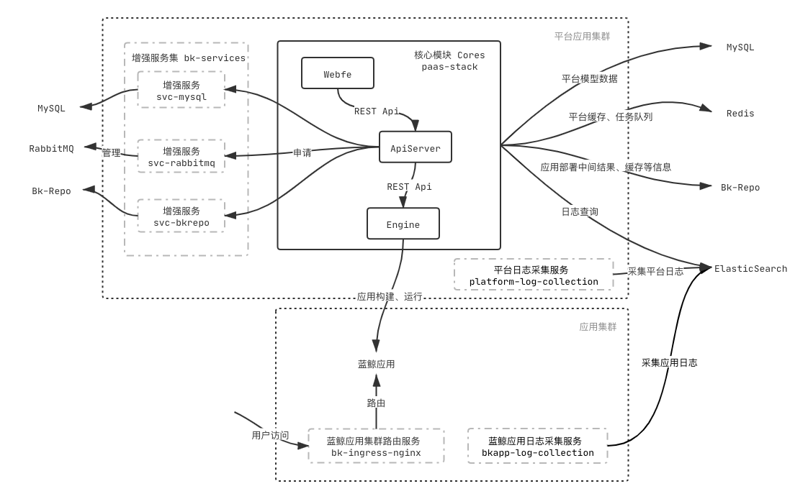

蓝鲸 PaaS 平台共包含 5 个子项目。按重要程度不同被分为两类： `Core（核心模块）` 、 `Addon（附属功能模块）` ，具体如下：

* `cores/paas-stack` 平台核心模块，仅在**平台集群**部署
* `addons/bk-services` 平台增强服务，仅在**平台集群**部署
* `addons/platform-log-collection` 平台日志采集，仅在**平台集群**部署
* `addons/bkapp-log-collection` 应用日志采集，在**每一个应用集群**部署
* `addons/bk-ingress-nginx` 应用访问入口 Ingress-Nginx， 在**每一个应用集群**部署

