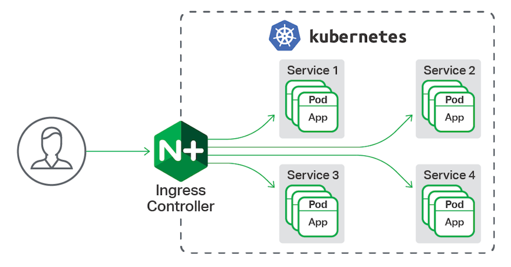
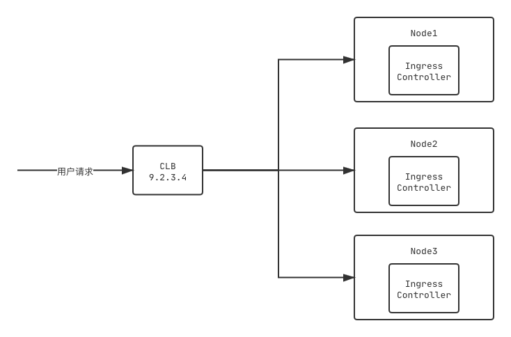

# 如何配置集群前置代理 IP (frontend_ingress_ip)

## 为什么需要配置？

平台按照应用 Code 给应用默认分配一个访问域名，形如 `apps.blueking.com/some-app-code`，通常情况下，开发者可以将此域名提供给用户作为应用访问入口，但是存在一些开发者希望使用更简洁、更容易记忆的独立域名，这时候就平台就需要提供一个用于独立域名 DNS 绑定的前置代理 IP。

## 如何配置？

首先我们需要简单了解当前的应用访问模型：



所有的应用请求都将通过 `Ingress-Controller` 代理到集群各个应用，所以用户自定义的独立域名需要配置解析，指向 `Ingress-Controller`。

需要注意的是，我们这里的配置内容**仅仅是作为展示页面**，方便平台用户线下操作。

### 集群外代理方案

我们以[腾讯云 CLB](https://cloud.tencent.com/product/clb)为例



如图所示，集群前置代理 IP 应该配置为 `10.1.1.1`。其他代理方案视具体情况填写。

### 部署快速验证

在部署验证阶段，我们的基建准备往往不够充分，缺乏集群外部的代理方案，那么允许临时性地填写节点 `NodeIP`。

首先，我们需要确定 `Ingress-Controller` 具体跑在哪些节点上

```bash
# 假定 bk-ingress-nginx 部署在 bk-ingress-nginx 命名空间下
kubectl get pod -n bk-ingress-nginx -o wide
```

会得到容器和所在节点信息，然后选择其中一台的 `NodeIP` 作为前置代理 IP 填写。

同时请注意，一旦当该节点被剔除出集群或者 `Ingress-Controller` 容器调度到其他节点，用户的 DNS 绑定都会出现不可访问的情况，所以**生产环境推荐使用集群外代理方案**。
