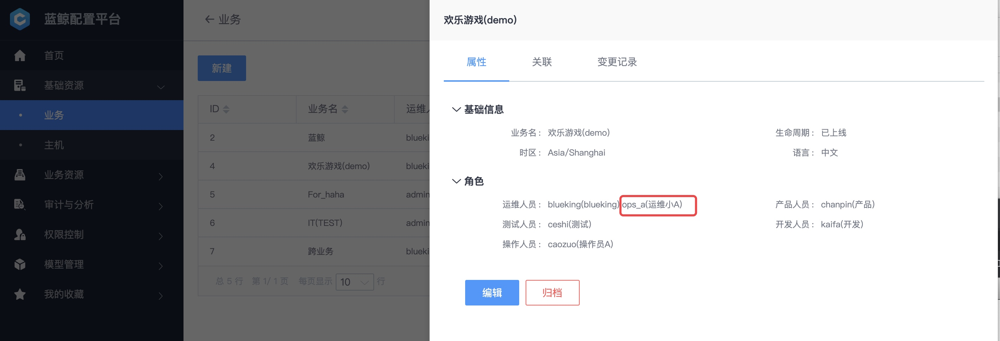

# 流程服务：服务器资源申请流程线上化

## 情景

传统的资源申请是 **通过邮件**，沟通成本太高，而且无法回溯。

新业务上线，需要申请几台服务器用于部署应用。接下来，看蓝鲸流程服务是如何 **实现服务器申请的流程线上化**。

## 前提条件

- 准备 1 个 管理员账号，用于**流程设计**；1 个运维账号用于**资源申请** ，1 个 [普通账号](../../../PaaS平台/产品白皮书/产品功能/系统管理/UserManageEE.md) `SA` 用于**审批和交付资源**。

## 操作步骤

- 梳理资源申请流程
- 创建资源申请服务目录及流程
- 一次资源申请示例

### 梳理资源申请流程

> 流程图中是一个实践案例，部分数据需要从周边系统获取，此处功能需要做二次开发，本教程专注流程本身。

### 创建资源申请服务目录及流程

先设计资源申请的**流程**，**流程依附在服务目录上对外提供服务**。

#### 角色设置

使用蓝鲸管理员账号给该业务**分配运维人员的角色**。

使用管理员账号**新增通用角色** SA ，并添加用户 sa_zhang（该账户是前提条件中准备的）。

#### 设计资源申请流程

##### 填写流程信息

选择菜单【流程设计】 ，点击【新增】按钮，按提示填写流程信息。

流程类型选择【请求】，需要【关联业务】，因为资源申请和业务相关，资源管理员需要知道将资源分配给哪个业务。

点击【下一步】，进入【定义与配置流程】环节。

##### 定义与配置流程

点击上图【流程画布】中的【齿轮】，配置【提单】流程节点的字段。

一般是业务的**运维**提服务器资源申请的单据，所以操作角色选择【CMDB 业务公用角色】-> 【运维人员】。

点击【新增字段】，参照 **梳理资源申请流程** ，新增每个环节中需要的字段。

参照 **梳理资源申请流程**，完成整个服务器申请流程的配置。

##### 启用流程

【启用流程】，选择适合的通知策略，点击【提交】完成流程设计。

##### 流程模板实例化

选择菜单【流程设计】，找到刚编辑的申请服务器流程，点击【部署】，生成流程实例。

#### 在服务目录中新增 "申请服务器" 服务，并绑定流程

选择菜单【服务】，点击【新增】按钮，新增"申请服务器"服务，并 **关联** 刚生成的流程实例。

选择菜单【服务目录】，选中【根目录】，点击右侧【 **⋮** 】，点击【新增】，按提示新增一个名为 **基础设施资源** 的服务目录，然后在 **基础设施资源** 下新建一个 **计算资源** 的服务目录。

选中刚刚创建的服务目录【计算资源】，右侧会显示【添加】按钮，点击该按钮添加 **申请服务器** 服务。

### 一次资源申请示例

创建完"申请服务器"流程及服务目录后，接下来做一次**服务器申请**演示。

#### 运维提单申请服务器

用`运维`账号登录流程服务，选择【请求管理】菜单，点击【新增请求】，选择【申请服务器】服务，点击【提交】。

在申请服务器的提单界面，填写服务器申请的关键信息：关联业务、期望交付时间以及服务器的配置和地域。为了安全起见，逻辑层和存储层一般不需要外网 IP。

点击【提交】，创建服务器申请需求。

> 注：点击【保存模板】可以记录提单环节的关键信息，下次提单只需修改少部分字段即可。

#### SA 审批单据

SA 收到一封**待处理**的**服务器申请**邮件。

使用 SA 账号登录流程服务，在待办列表中，找到一个刚刚运维提交的服务器申请单据。

点击链接，同时在周边系统查看该业务的低负载指标，确认达标，点击【通过】，完成本环节流程。

> 低负载指标：CPU、内存、网络等指标是否长期处于一个很低的水平，如果是的话，证明计算资源利用率低，SA 一般不予通过资源申请。

#### 交付服务器

SA 创建资源，并录入到【交付服务器】环节的服务器配置中。

至此，服务器申请流程结束。

运维登录流程服务，即可查看申请的服务器资源。

