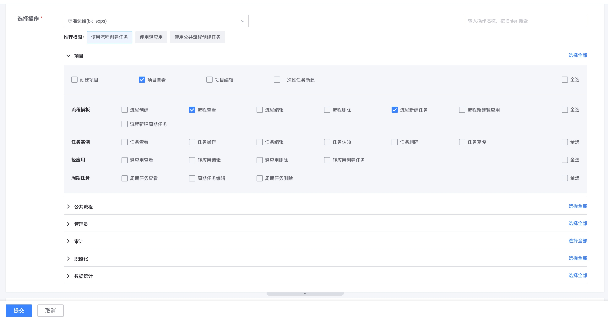

# 样例 6: 配置常用操作优化权限申请

## 1. 场景描述

在用户使用系统的时候, 为了完成某些事情, 需要申请`一批操作的权限`, 为了避免让用户自己一个个去申请, 或者申请过程中漏掉某些权限

接入系统可以将`一批操作`配置成`常用操作`

这样, 在申请页面, 用户通过点击`常用操作`, 可以快速批量勾选一批操作进行权限申请

## 2. 权限模型

通过 [常用操作配置(CommonActions) API](../../Reference/API/02-Model/17-CommonActions.md) 进行注册

例如标准运维的常用操作`使用流程创建任务` 关联了 3 个操作

```json
[
  {
    "name": "使用流程创建任务",
    "name_en": "Create task by flow",
    "actions": [
      {
        "id": "project_view"
      },
      {
        "id": "flow_view"
      },
      {
        "id": "flow_create_task"
      }
    ]
  },
  {
    "name": "使用轻应用",
    "name_en": "Use mini app",
    "actions": [
      {
        "id": "project_view"
      },
      {
        "id": "flow_view"
      },
      {
        "id": "mini_app_view"
      },
      {
        "id": "mini_app_create_task"
      }
    ]
  },
  {
    "name": "使用公共流程创建任务",
    "name_en": "Create task by common flow",
    "actions": [
      {
        "id": "project_view"
      },
      {
        "id": "common_flow_view"
      },
      {
        "id": "common_flow_create_task"
      }
    ]
  }
]
```

## 3. 产品交互

在权限申请页面, 将会有个`推荐权限`区域, 里面是接入系统注册进来的`常用操作`

选中某个常用操作时, 会勾选对应的`操作列表`中的所有操作;


