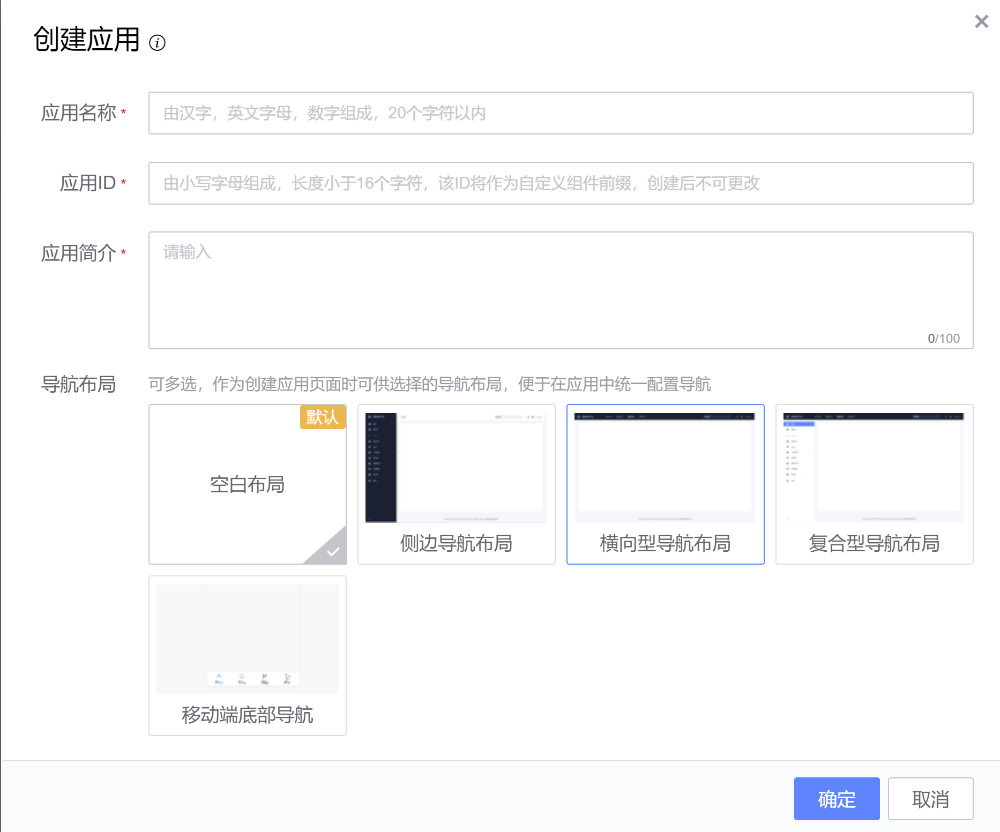
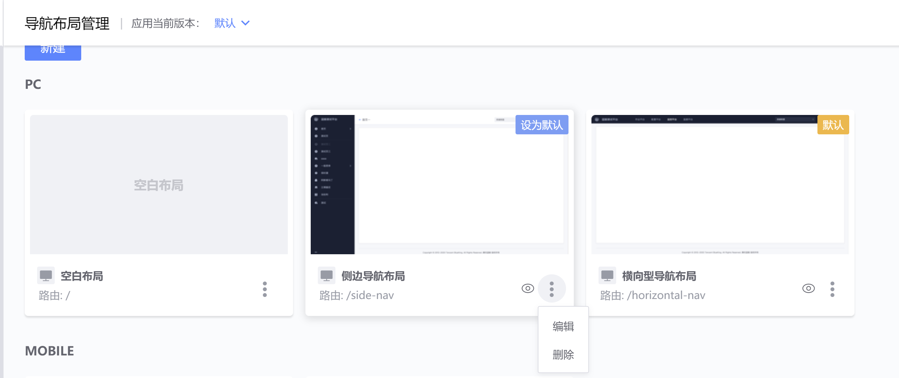

## 导航布局使用指引

### 1. 概念

导航布局是用来将具有相同布局（导航）的页面收纳在一起的方式，这样页面间就可以复用同一个布局，同时布局的路由也将成为页面的共同父路由。

### 2. 添加导航布局

:::info 共2种方式添加一个布局到应用
系统目前共提供了 5 种布局，分别是“空白布局”、“侧边导航布局”、“横向型导航布局”、“复合型导航布局”、“移动端底部导航布局”。
:::

#### 2.1 在新建应用时添加

- 其中，“空白布局”为系统默认布局，自动勾选且不能取消。
- 如果添加时未选择其它导航布局，可创建应用后，到“导航布局管理”功能页中添加。

#### 2.2 在导航布局管理中添加

- 进入“导航布局管理”页面，新建导航布局
:::tip
路由：最终所属布局的页面访问路由为“布局路由/页面路由”
:::

- 新建成功后，可看到应用中所有的导航布局。

### 3. 应用导航布局

:::info 完成导航布局添加后，在添加页面时即可应用添加的导航布局到页面
多个页面使用同一个布局，则可达到复用布局的效果。布局配置在所有页面间生效，同时页面拥有共同的父路由即布局的路由。
:::

- 新建页面时选择导航布局，可选择的模板为应用中所添加的所有模板。

### 4. 配置导航布局

:::info 页面应用了模板后，进入到页面编辑页，在画布中可看见模板内容，同时可以对提供的配置项进行设置
如使用的空白布局则无模板内容可见，画布中可视的即为页面内容。目前可提供的配置包括：站点名称、Logo和导航。
:::

- 示例图中使用的是“侧边导航布局”，正在对布局导航进入设置。其中，中间区域为页面内容编辑区。

### 5. 更多

#### 5.1 修改页面导航布局

- 进入页面编辑页在“页面配置”中进行修改

#### 5.2 修改导航布局实例名称和ID

- 进入“导航布局管理”页找到需要修改的模板

