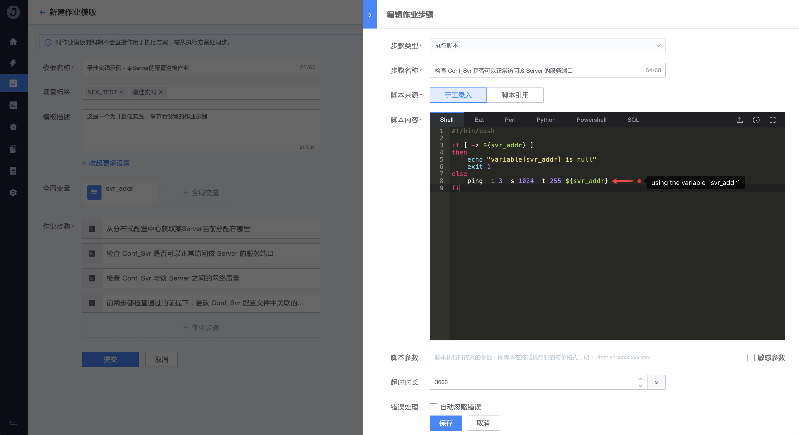

# 如何实现在不同步骤间传递参数

当我们的作业流程有多个步骤时，经常需要把某个步骤处理的结果值传递给下一个或后面的步骤使用；

例如，某个「配置巡检作业」的流程如下：

> 1. 从分布式配置中心获取某 Server 当前分配在哪里（获取该 Server 的 IP 地址）
> 2. 检查 Conf_Svr 是否可以正常访问该 Server 的服务端口
> 3. 检查 Conf_Svr 与该 Server 之间的网络质量
> 4. 前两步都检查通过的前提下，更改 Conf_Svr 配置文件中关联的字段指向该 IP
> 5. 后面省略……

在上述案例示例中，核心需求是需要在第一个步骤能够正常获取到 Server 的 IP 地址，后面的步骤才能够正常运行；

接下来，我们通过「全局变量」来演示作业平台是如何满足这种需求场景的。

## 操作步骤

1. 创建 `svr_addr` 字符串变量，并设置 `赋值可变`

   

2. 在第一个步骤的脚本处理中获取对应值，并赋值给 `svr_addr` 变量

   

3. 在后续步骤中获取 `svr_addr` 变量值进行处理

   

4. 保存作业模板并创建执行方案

   

5. 运行该执行方案检验结果

   

## 结论

如上图第 5 步，我们在第二个步骤的脚本逻辑里使用 ping 命令对 ${svr_addr} 进行网络监测，在实际的运行结果日志中也看到了变量值被正常传递过来了。

诸如此类的场景案例还有很多，希望通过该章节的示例能够帮助到你，感谢对蓝鲸作业平台的支持。