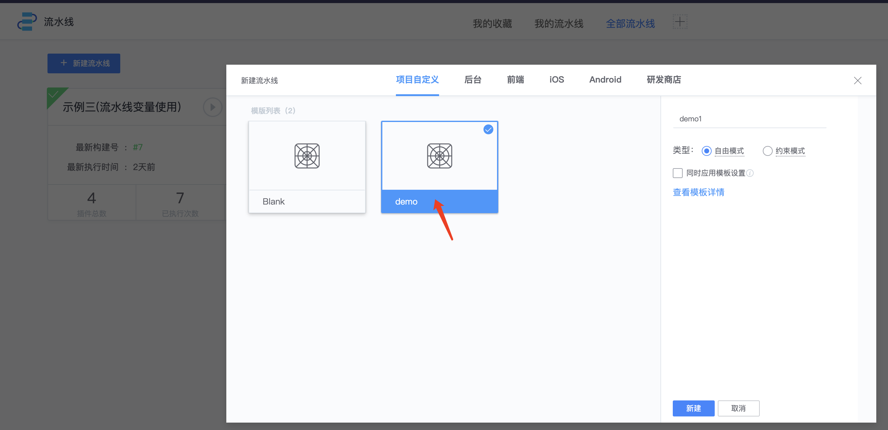

# 使用模板创建流水线

模板：流水线模板，通过创建流水线模板，预先设置好通用的流水线，新建流水线时可以选择模板来创建流水线。

* 流水线 -> 右上角选择模板管理，

简单新建一个stage测试

点击保存，保存为新版本v1（当前版本默认为init版本，也可以保存在当前版本)

点击右上角版本列表，可以查看当前版本，并且点击【加载】可以切换到其它版本

也可以在【设置】里针对流水线预先设置通知等

* 使用模板新建流水线，选择创建好的模板

创建之后可以看到预先在模板配置的内容

