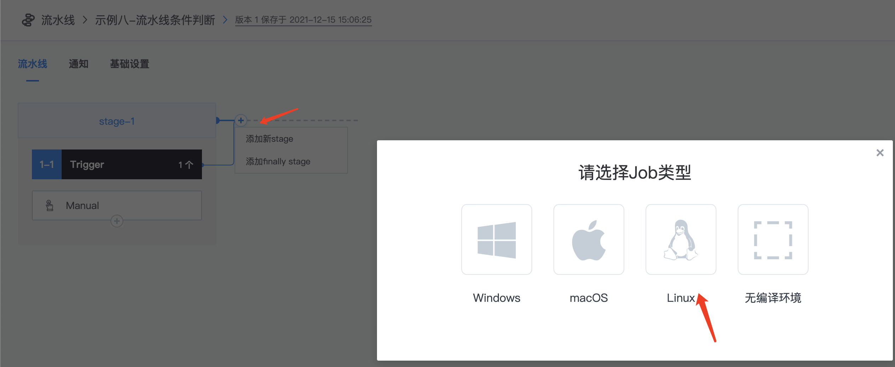
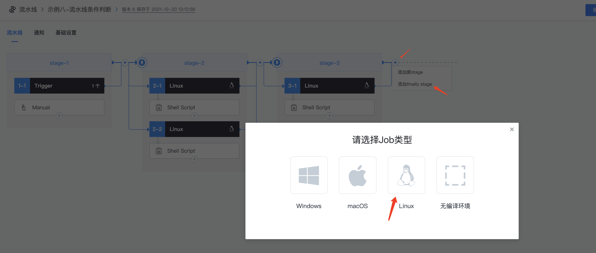
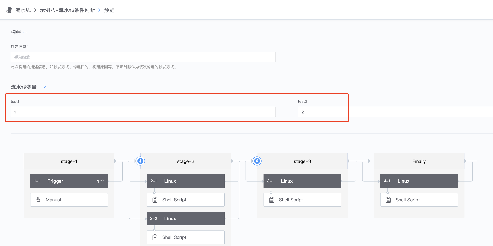
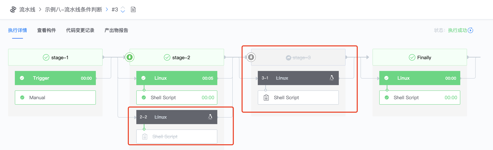

# 流水线条件判断

* 新建多个stage

添加shell script插件，随便输入脚本：echo 1

在添加一个并行的stage&#x20;

后面新加一个stage

添加finally stage

Finally stage: 流水线执行的最后一步，无论流水线执行失败还是成功，都会执行finally stage定义的步骤

*   场景：配置好上述的流水线之后，假如有这么一个使用需求，在满足一定条件下，只执行2-1的Job，并且跳过执行2-2和3-1

    通过配置变量的方式实现

    * 定义流水线变量，点击trigger，定义test1和test2两个变量

* 配置2-1的Job，选择【自定义变量全部满足时才运行】，输入刚刚自定义的两个变量test1、test2，变量值与trigger定义的值相同

* 配置2-2的Job，点击2-2 Linux，选择【自定义变量全部满足时才运行】，输入刚刚自定义的两个变量test1、test2，值随便写，与刚刚trigger定义的值不同即可

*   配置3-1 stage，选择【自定义变量全部满足时才运行】，输入刚刚自定义的两个变量test1、test2，值随便写，与刚刚trigger定义的值不同即可

    注：流水线可以针对stage/Job/插件来配置执行条件

* 执行流水线，test1和test2变量值保持默认

查看执行结果，可以看到2-2Job和stage3因为变量条件不满足，直接跳过不执行

