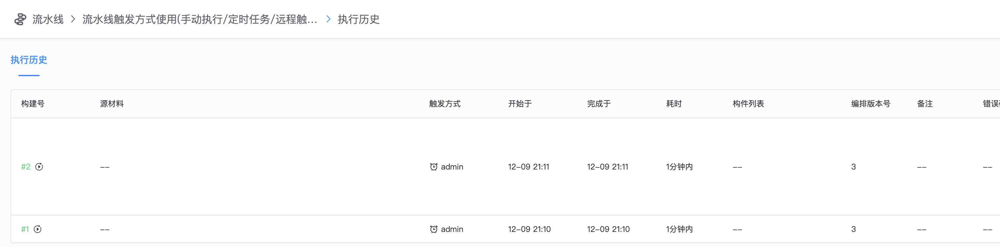

# 流水线触发方式使用-手动执行/定时任务/远程触发等

触发方式是在Trigger下通过选择不同类型的插件使用

*   手动执行

    创建流水线默认的触发方式为手动执行，这里简单添加一个stage\
    Manual插件：手动执行流水线，指流水线建立之后，可以在右上角点击保存，并且手动点击执行流水线的按钮

*   定时任务

    添加Timer插件，定义crontab表达式

因为没有选择Manual手动触发的方式，所以无法手动点击【执行】按钮来执行流水线

查看执行历史，可以看到流水线以每分钟自动定时执行一次

*   远程触发

    添加Remote插件--可以通过执行命令进行远程触发

    复制示例命令，如果trigger有定义变量的话，命令行会自动生成含变量参数的示例

命令行中执行curl命令

流水线执行历史上可以查看到执行记录

