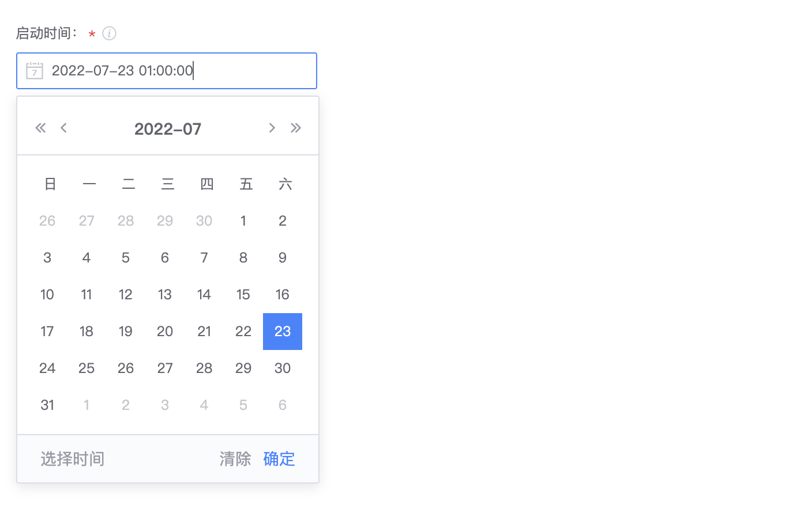
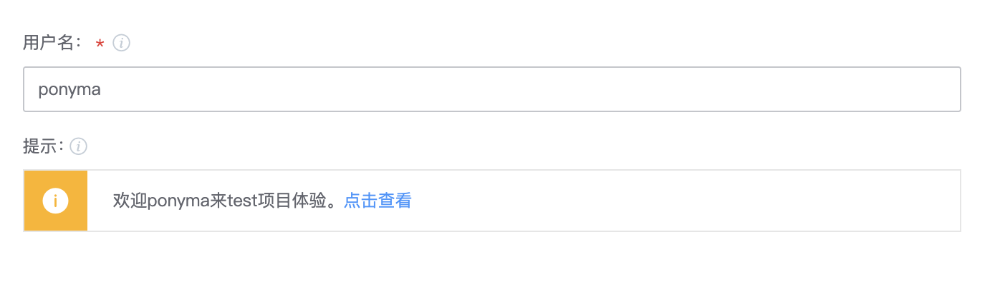
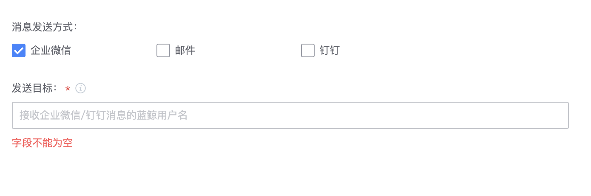
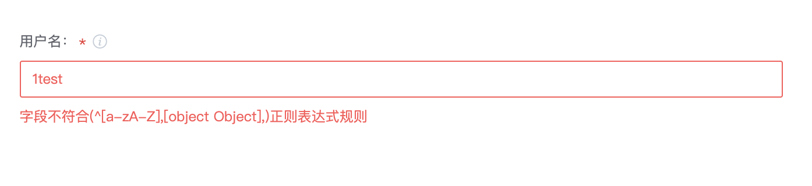

# UI组件使用示例

**系统支持如下UI组件**

| 组件type | 组件名称 | 备注 | 执行时插件后台获取到的值说明 |
| :--- | :--- | :--- | :--- |
| [vuex-input](#vuex-input) | 单行文本框 |  | 字符串 |
| [vuex-textarea](#vuex-textarea) | 多行文本框 |  | 字符串 |
| [atom-ace-editor](#atom-ace-editor) | 代码编辑框 |  | 字符串 |
| [selector](#selector) | 下拉框 | 只能选择，不能输入 | 字符串 |
| [select-input](#select-input) | 可输入下拉框 | 输入的值可以是下拉列表中没有的值（包括变量），选中后框里看到是的id | 字符串 |
| [devops-select](#devops-select) | 可输入下拉框 | 输入的值只能是变量，选中后框里看到是name | 字符串 |
| [atom-checkbox-list](#atom-checkbox-list) | 复选框列表 |  | 字符串，如：\[ "id1", "id2" \] |
| [atom-checkbox](#atom-checkbox) | 复选框（布尔） |  | 字符串 |
| [enum-input](#enum-input) | 单选 |  | 字符串 |
| [cron-timer](#cron-timer) | 时间选择器 |  | 字符串 |
| [time-picker](#time-picker) | 日期选择器 |  | 字符串 |
| [user-input](#user-input) | 人名选择器 |  | 字符串 |
| [tips](#tips) | 提示信息 | 支持动态预览用户输入的参数，支持超链接 | 字符串 |
| parameter | 不定参数列表 | 参数列表支持从接口获取 | 字符串 |
| dynamic-parameter | 不定参数列表 | 支持从接口获取，支持每行多列，支持动态增删 | 字符串 |

**每个输入字段配置支持如下公共属性**

| 属性名 | 属性说明 | 配置格式 | 备注 |
| :--- | :--- | :--- | :--- |
| label | 中文名 | 字符串 | 用于展示和描述组件的用途，允许为空（与其他字段组合的场景） |
| type | 组件类型 | 字符串 | 必填，指明使用的是哪个组件，即上述「系统支持如下UI组件」表格 |
| [inputType](#inputtype) | 输入类型 | 字符串 | 非必填，仅在部分组件有用|
| default | 默认值 | 根据不同组件默认值格式不一样 | 非必填 |
| placeholder | placeholder | 字符串 | 非必填，通常在用户未有任何输入时，以文字的形式提示该处需要输入的内容 |
| [groupName](#groupname) | 所属组 | 字符串 | 非必填，如果有定义inputGroups，使用groupName表名当前组件属于inputGroup中的哪个group |
| desc | 字段说明 | 字符串 | 非必填，字段说明，支持\r\n换行 |
| required | 是否必填 | 布尔 | 非必填 |
| disabled | 是否可编辑 | 布尔 | 非必填 |
| hidden | 是否隐藏 | 布尔 | 非必填 |
| [isSensitive](#issensitive) | 是否敏感 | 布尔 | 非必填，敏感信息在日志中不会展示明文 |
| [rely](#rely) | 根据条件显示/隐藏当前字段 | 对象 | 非必填 |
| [rule](#rule) | 值有效性限制 | 对象 | 非必填<br/>支持如下属性：<br/>alpha: 只允许英文字符，布尔，true/false <br/>numeric: 只允许数字，布尔，true/false <br/>alpha_dash: 可以包含英文、数字、下划线、中划线，布尔，true/ false <br/>alpha_num: 可以包含英文和数字，布尔，true/false<br/>max: 字符串最大长度, int <br/>min: 字符串最小长度, int <br/>regex: 正则表达式字符串 |

用户可在「研发商店」-「控制台」-「调试task.json」查看示例task.json的可视化结果，为方便描述，下文示例仅给出input字段，其他字段如atomCode等需要在插件打包之前自行补全。

## vuex-input
vuex-input为最常见的单行输入文本框，多用于获取用户文字输入。
**使用示例：**
```json
{
    "input": {
        "username": {
            "label":"用户名",
            "default":"",
            "placeholder":"请输入用户名",
            "type":"vuex-input",
            "desc":"用户名",
            "required": true
        }
    }
}
```
**插件获取输入：**
```python
import python_atom_sdk as sdk
username = sdk.get_input().get("username")
```
**组件可视化效果：**


## vuex-textarea
vuex-textarea为多行输入文本框，可输入多行文本，多行文本框支持右下方拖拽拉伸框体
**使用示例：**
```json
{
    "input": {
        "message": {
            "label":"消息内容",
            "default":"",
            "placeholder":"请输入消息内容",
            "type":"vuex-textarea",
            "desc":"消息内容",
            "required": true
        }
    }
}
```
**插件获取输入：**
```python
import python_atom_sdk as sdk
message = sdk.get_input().get("message")
```
**组件可视化效果：**


## atom-ace-editor
atom-ace-editor为代码编辑框，可以高亮用户输入的代码，目前支持json、python、sh、text、powershell、batchfile
**使用示例：**
```json
{
    "input": {
        "script": {
            "label":"脚本内容",
            "default":"",
            "placeholder":"请输入脚本内容",
            "type":"atom-ace-editor",
            "desc":"脚本内容",
            "required": true,
            "lang": "python"
        }
    }
}
```
**插件获取输入：**
```python
import python_atom_sdk as sdk
username = sdk.get_input().get("script")
```
**组件可视化效果：**


## selector
selector为下拉选择器, 用户无法输入，只能选择，选项可以是固定列表的，也可以是通过接口获取的
**使用示例1：**
```json
{
    "input": {
        "credential": {
            "label":"凭证",
            "default":"",
            "placeholder":"请选择凭证",
            "type":"selector",
            "desc":"用户凭证",
            "required": true,
            "optionsConf": {
              "searchable": true,
              "multiple": false,
              "url": "/ticket/api/user/credentials/{projectId}/hasPermissionList?permission=USE&page=1&pageSize=10000&&credentialTypes=SSH_PRIVATEKEY",
              "paramId": "credentialId",
              "paramName": "credentialId",
              "itemTargetUrl": "/ticket/{projectId}/",
              "itemText": "添加新的凭证",
              "hasAddItem": true
            }
        }
    }
}
```
**插件获取输入：**
```python
import python_atom_sdk as sdk

# multiple 设置为false
credential = sdk.get_input().get("credential")

# multiple 设置为true，需要将输入解析为python列表
import json
credentials = sdk.get_input().get("credential")
credential_list = json.loads(credentials)
```
**组件可视化效果：**


**使用示例2：**
```json
{
    "input": {
        "city": {
            "label":"城市",
            "default":"",
            "placeholder":"请选择城市",
            "type":"selector",
            "desc":"城市",
            "required": true,
            "optionsConf": {
              "searchable": true,
              "multiple": false
            },
            "options": [
                { 
                    "id": "sz",
                    "name": "深圳",
                    "desc": "深圳",
                    "disabled": false
                },
                {
                    "id": "sh",
                    "name": "上海",
                    "desc": "上海",
                    "disabled": false
                },
                {
                    "id": "gz",
                    "name": "广州",
                    "desc": "广州",
                    "disabled": false
                }
            ]
        }
    }
}
```
**插件获取输入：**
```python
import python_atom_sdk as sdk

# options定义固定列表，插件拿到的用户选择是选项id
# multiple 设置为false
city = sdk.get_input().get("city")  # 拿到的是id

# multiple 设置为true，需要将输入解析为python列表
import json
citys = sdk.get_input().get("citys")
city_list = json.loads(citys)   # 拿到的是id列表：["sz", "sh"]
```
**组件可视化效果：**


## select-input
select-input为用户可输入的下拉选择器，输入的值可以是下拉列表中没有的值，可以输入变量，比如内置变量`${{BK_CI_START_USER_NAME}}`，如果选择的是列表里的选项，选中后框里看到是的id

**使用示例：**
```json
{
    "input": {
        "city": {
            "label":"城市",
            "default":"",
            "placeholder":"请选择城市",
            "type":"select-input",
            "desc":"城市",
            "required": true,
            "options": [
                { 
                    "id": "sz",
                    "name": "深圳",
                    "desc": "深圳",
                    "disabled": false
                },
                {
                    "id": "sh",
                    "name": "上海",
                    "desc": "上海",
                    "disabled": false
                },
                {
                    "id": "gz",
                    "name": "广州",
                    "desc": "广州",
                    "disabled": true
                }
            ]
        }
    }
}
```
**插件获取输入：**
```python
import python_atom_sdk as sdk

city = sdk.get_input().get("city")
```
**组件可视化效果：**


## devops-select
devops-select是可输入下拉框，只允许输入变量，如果选择了选项，显示的是选项的name

**使用示例：**
```json
{
    "input": {
        "city": {
            "label":"城市",
            "default":"",
            "placeholder":"请选择城市",
            "type":"devops-select",
            "desc":"城市",
            "required": true,
            "options": [
                { 
                    "id": "sz",
                    "name": "深圳",
                    "desc": "深圳",
                    "disabled": false
                },
                {
                    "id": "sh",
                    "name": "上海",
                    "desc": "上海",
                    "disabled": false
                },
                {
                    "id": "gz",
                    "name": "广州",
                    "desc": "广州",
                    "disabled": true
                }
            ]
        }
    }
}
```
**插件获取输入：**
```python
import python_atom_sdk as sdk

city = sdk.get_input().get("city")
```
**组件可视化效果：**


## atom-checkbox-list
atom-checkbox-list是复选框列表，选项横向排列允许用户勾选多个选项，允许有默认勾选值
**使用示例：**
```json
{
    "input": {
        "city": {
            "label":"城市",
            "default":["sz", "bj"],
            "placeholder":"请选择城市",
            "type":"atom-checkbox-list",
            "desc":"城市",
            "required": true,
            "list": [
                { 
                    "id": "sz",
                    "name": "深圳",
                    "desc": "深圳",
                    "disabled": false
                },
                {
                    "id": "sh",
                    "name": "上海",
                    "desc": "上海",
                    "disabled": false
                },
                {
                    "id": "gz",
                    "name": "广州",
                    "desc": "广州",
                    "disabled": true
                },
                { 
                    "id": "nj",
                    "name": "南京",
                    "desc": "南京",
                    "disabled": false
                },
                {
                    "id": "bj",
                    "name": "北京",
                    "desc": "北京",
                    "disabled": false
                },
                {
                    "id": "cq",
                    "name": "重庆",
                    "desc": "重庆",
                    "disabled": false
                }
            ]
        }
    }
}
```
**插件获取输入：**
```python
import python_atom_sdk as sdk
import json

citys = sdk.get_input().get("city")
city_list = json.loads(citys) # ["sz", "bj"]
```
**组件可视化效果：**


## atom-checkbox
atom-checkbox是只有true和false两种状态的复选框，true和false分别代表勾选和没勾选

**使用示例：**
```json
{
    "input": {
        "isEnabled": {
            "label":"是否启用",
            "default":true,
            "type":"atom-checkbox",
            "text": "是否启用",
            "desc":"是否启用",
            "required": true
        }
    }
}
```
**插件获取输入：**
```python
import python_atom_sdk as sdk
import json

isEnabled = sdk.get_input().get("isEnabled") # 字符串'true'
is_enabled = True if isEnabled == 'true' else False  # 转为True
```
**组件可视化效果：**


## enum-input
enum-input是列表单选框

**使用示例：**
```json
{
    "input": {
        "lang": {
            "label": "语言",
            "default": "python",
            "type": "enum-input",
            "required": true,
            "list": [
                {
                    "value": "php",
                    "label": "php"
                },
                {
                    "value": "python",
                    "label": "python"
                }
            ]
        }
    }
}
```
**插件获取输入：**
```python
import python_atom_sdk as sdk
import json

lang = sdk.get_input().get("lang")
```
**组件可视化效果：**


## cron-timer
cron-timer是定时选择器

**使用示例：**
```json
{
    "input": {
        "runtime": {
            "label":"定时触发时间",
            "type":"cron-timer",
            "desc":"定时触发时间",
            "required": true
        }
    }
}
```
**插件获取输入：**
```python
import python_atom_sdk as sdk
import json

runtime = sdk.get_input().get("runtime") # 获取到的是字符串，需要解析成列表
runtime_list = json.loads(runtime) # ['0 0 9 ? * 2', '0 30 15 ? * 2']
```
**组件可视化效果：**


## time-picker
time-picker是日期时间选择器

**使用示例：**
```json
{
    "input": {
        "uptime": {
            "label":"启动时间",
            "type":"time-picker",
            "desc":"启动时间",
            "required": true,
            "datePickerConf": {
                "type": "datetime",
                "format": "yyyy-MM-dd HH:mm:ss"
            }
        }
    }
}
```
**插件获取输入：**
```python
import python_atom_sdk as sdk
import json

uptime = sdk.get_input().get("uptime") # 获取到的是字符串，需要转换成int
uptime_int= int(uptime) # 1658509200000  以毫秒为单位的unix timestamp 
```
**组件可视化效果：**



## user-input
user-input可以让用户输入以标签的形式显示

**使用示例：**
```json
{
    "input": {
        "receiver": {
            "label": "收件人",
            "type": "user-input",
            "inputType": "all",
            "desc": "可以填写公司任意用户，包括邮件组"
        }
    }
}
```
**插件获取输入：**
```python
import python_atom_sdk as sdk
import json

receiver = sdk.get_input().get("receiver")  # 字符串
receiver_list= json.loads(receiver)  # 转换成列表 [ "people1", "people2" ]
```
**组件可视化效果：**


## tips
tips给用户提供提示信息，支持引用插件内置变量，支持动态预览用户输入的参数，支持超链接

**使用示例：**
```json
{
    "input": {
        "username": {
            "label":"用户名",
            "default":"",
            "placeholder":"请输入用户名",
            "type":"vuex-input",
            "desc":"用户名",
            "required": true
        },
        "tiptext": {
            "label": "提示",
            "type": "tips",
            "tipStr": "欢迎{username}来{projectId}项目体验。[点击查看](http://www.qq.com)",
            "desc": "提示"
        }
    }
}
```

**组件可视化效果：**




## 公共属性

### inputType
**vuex-input**
**使用示例：**
```json
{
    "input": {
        "password": {
            "label":"密码",
            "placeholder":"请输入密码",
            "inputType": "password",
            "type":"vuex-input",
            "desc":"请输入密码",
            "required": true
        }
    }
}
```
**组件可视化效果：**


### groupName

使用inputGroup给input组件分组，组件里使用groupName字段指明当前组件属于哪个group

**inputGroup**
* 输入字段分组，可选，设置后，可按组展示输入字段，支持按组展开收起
* 值格式为数组
* 可设置多个分组，每个分组使用一个对象来描述，包括如下属性：

| 属性名 | 属性说明 | 格式 | 备注 |
| :--- | :--- | :--- | :--- |
| name | 分组名称 | 字符串 | 必填，配置在输入字段的groupName中，标识该字段属于哪个分组 |
| label | 分组标识 | 字符串 | 必填，用户直接看到的分组名称 |
| isExpanded | 是否展开 | 布尔 | 必填，是否默认展开分组 |

**使用示例：**
```json
{
  "inputGroups": [
    {
      "name": "fetch",
      "label": "fetch",
      "isExpanded": true
    },
    {
      "name": "submodule",
      "label": "子模块",
      "isExpanded": true
    }
  ],
  "input": {
    "fetchDepth": {
      "label": "git fetch的depth参数值",
      "default": "",
      "placeholder": "",
      "type": "vuex-input",
      "desc": "",
      "required": false,
      "disabled": false,
      "hidden": false,
      "isSensitive": false,
      "groupName": "fetch"
    },
    "enableSubmodule": {
      "label": "",
      "default": true,
      "placeholder": "",
      "type": "atom-checkbox",
      "text": "启用Submodule",
      "desc": "勾选则启用外链，不勾选则不启用",
      "required": false,
      "disabled": false,
      "hidden": false,
      "isSensitive": false,
      "groupName": "submodule"
    },
    "submodulePath": {
      "label": "",
      "default": "",
      "placeholder": "请填写需拉取的Submodule path，多个用逗号分隔，不填默认拉所有Submodule",
      "type": "vuex-input",
      "desc": "",
      "required": false,
      "disabled": false,
      "hidden": false,
      "isSensitive": false,
      "groupName": "submodule",
      "rely": {
        "operation": "AND",
        "expression": [
          {
            "key": "enableSubmodule",
            "value": true
          }
        ]
      }
    }
  }
}
```

**组件可视化效果：**


### isSensitive
如果用户需要输入敏感信息，使用isSensitive属性，默认在日志里就不会输出明文，除非用户主动使用sdk.log.info打印输入字段

**使用示例：**
```json
{
    "input": {
        "password": {
            "label":"密码",
            "placeholder":"请输入密码",
            "inputType": "password",
            "isSensitive": true,
            "type":"vuex-input",
            "desc":"请输入密码",
            "required": true
        }
    }
}
```

**组件可视化效果：**


### rely
rely可以让用户根据条件显示/隐藏当前组件，通常用在组件间的项目依赖关系上。依赖关系分AND和OR，分别代表逻辑与和逻辑或。逻辑与表明要所有条件满足才能显示，逻辑或表明任一条件满足即可。

**使用AND实例：**
```json
{
  "input": {
    "repositoryType": {
      "label": "代码库",
      "default": "ID",
      "desc": "值为ID/NAME/URL",
      "type": "enum-input",
      "required": true,
      "disabled": false,
      "hidden": false,
      "isSensitive": false,
      "list": [
        {
          "label": "按代码库选择",
          "value": "ID"
        },
        {
          "label": "按代码库别名输入",
          "value": "NAME"
        },
        {
          "label": "按仓库URL输入",
          "value": "URL"
        }
      ]
    },
    "repositoryUrl": {
      "label": "代码库链接",
      "default": "",
      "placeholder": "请输入代码库URL",
      "type": "vuex-input",
      "desc": "",
      "required": false,
      "disabled": false,
      "hidden": false,
      "isSensitive": false,
      "rely": {
        "operation": "AND",
        "expression": [
          {
            "key": "repositoryType",
            "value": "URL"
          }
        ]
      }
    },
    "authType": {
      "label": "授权类型",
      "default": "TICKET",
      "type": "selector",
      "required": false,
      "disabled": false,
      "hidden": false,
      "isSensitive": false,
      "options": [
        {
          "name": "空",
          "id": "EMPTY"
        },
        {
          "name": "凭证",
          "id": "TICKET"
        },
        {
          "name": "access token",
          "id": "ACCESS_TOKEN"
        },
        {
          "name": "username/password",
          "id": "USERNAME_PASSWORD"
        },
        {
          "name": "流水线启动人token",
          "id": "START_USER_TOKEN"
        },
        {
          "name": "工蜂personal_access_token",
          "id": "PERSONAL_ACCESS_TOKEN"
        }
      ],
      "rely": {
        "operation": "AND",
        "expression": [
          {
            "key": "repositoryType",
            "value": "URL"
          }
        ]
      }
    },
    "ticketId": {
      "label": "代码库凭证",
      "placeholder": "请选中对应凭证",
      "type": "select-input",
      "desc": "",
      "required": false,
      "disabled": false,
      "hidden": false,
      "isSensitive": false,
      "rely": {
        "operation": "AND",
        "expression": [
          {
            "key": "repositoryType",
            "value": "URL"
          },
          {
            "key": "authType",
            "value": "TICKET"
          }
        ]
      },
      "optionsConf": {
        "searchable": true,
        "multiple": false,
        "url": "/ticket/api/user/credentials/{projectId}/hasPermissionList?permission=USE&page=1&pageSize=10000",
        "paramId": "credentialId",
        "paramName": "credentialId",
        "itemTargetUrl": "/ticket/{projectId}/",
        "itemText": "添加新的凭证",
        "hasAddItem": true
      }
    }
  }
}
```

**组件可视化效果：**


**使用OR示例：**
```json
{    
"input": {
        "send_by": {
            "label": "消息发送方式",
            "type": "atom-checkbox-list",
            "list": [
                {
                    "id": "weixin",
                    "name": "企业微信",
                    "disable": false,
                    "desc": "消息会发送到企业微信应用号, 需先在ESB配置企业微信应用号信息"
                }, 
                {
                    "id": "mail",
                    "name": "邮件",
                    "disable": false,
                    "desc": "发送到邮件,支持蓝鲸用户以及非蓝鲸用户"
                },
                {
                    "id": "dingtalk",
                    "name": "钉钉",
                    "disable": false,
                    "desc": "发送单聊消息到蓝鲸用户对应的钉钉号,需先正确配置钉钉通知,参考: https://github.com/wenchao-h/ding-blueking"
                }
            ]
        },
        "send_to": {
            "label":"发送目标",
            "default":"",
            "placeholder":"接收企业微信/钉钉消息的蓝鲸用户名",
            "type":"user-input",
            "inputType": "all",
            "desc":"输入回车分隔多个用户名",
            "required": true,
            "rely":{
                "operation": "OR",
                "expression":[
                    {
                        "key": "send_by",
                        "value": ["weixin","dingtalk"]
                    }
                ]
            }
        }
    }
}
```

**组件可视化效果：**



### rule
rule属性限制用户输入，支持如下属性：
|属性名|属性说明|配置格式|备注|
|--|--|--|--|
|alpha|只允许英文字符|布尔|	示例：<br/>// 只允许填写字母，且字符串长度为3-7<br/>"rule": {<br/>    "min": 3,<br/>    "max": 7,<br/>    "alpha": true<br/>}|
|numeric|只允许数字|布尔| |
|alpha_dash|可以包含英文、数字、下划线、中划线|布尔| |
|alpha_num|可以包含英文和数字|布尔| |
|max|字符串最大长度|int||
|min|字符串最小长度|int||
|regex|正则表达式|string|示例：<br/>// 正则匹配以数字开头的字符串<br/>"rule": { "regex": "\^[0-9]" }|

**使用示例：**
```json
{
    "input": {
        "username": {
            "label":"用户名",
            "placeholder":"请输入用户名",
            "type":"vuex-input",
            "desc":"请输入用户名",
            "required": true,
            "rule": {
                "alpha_num": true,
                "max": 25,
                "min": 3,
                "regex": "^[a-zA-Z]"
            }
        }
    }
}
```

**组件可视化效果：**


