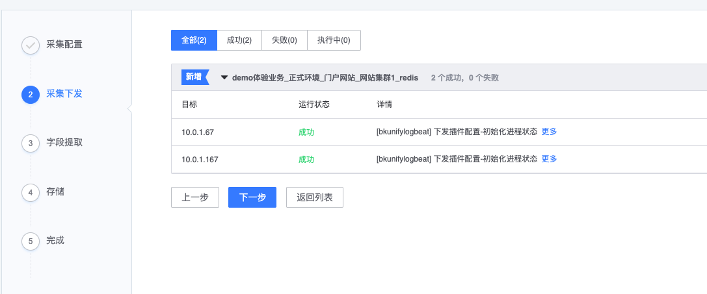

# 采集接入

日志采集是通过日志服务的自有链路，通过实时流的方式将日志采集到服务端，并且还可以在采集过程中运行 Agent 端的过滤和服务端的字段提取功能，可以快速的实现日志的格式化需求。

## 前置步骤

日志采集原理


## 功能列表

* 新建采集
* 采集运行状态
* 日志字段提取
* 数据采样

## 功能介绍

### 新建采集

**功能位置**：导航 →  管理 → 数据接入 →  采集接入 →  新建

**操作步骤**：

* (1) 采集配置
* (2) 采集下发
* (3) 字段提取&存储
* (4) 完成

### 采集配置


* 日志类型：先仅支持行日志文件，支持 Windows 和 Linux 系统
* 数据分类：具体查看术语解释 [数据分类](../../concepts/glossary.md)
* 采集目标：可以基于静态 IP 采集，也可以使用动态模块方式采集。动态采集就将随着 CMDB 模块的主机变化自动增删


* 日志路径：
    * 日志是绝对路径
    * 可以支持通配符方式，具体查看[常见通配符](../addenda/wildcard.md)
    * 可以支持 CMDB 的变量方式，具体查看[CMDB 变量使用](../addenda/cmdb_var.md)
    * 可以支持多日志文件
* 日志内容过滤：先支持 include 方式

### 采集下发

> 注意：在当前离开采集还是在继续异步执行的，但没有完成存储设置，所以在 24 小后没有完成第三步的存储，采集任务会被强制停用。



### 字段提取

非必需项，适用场景需要对日志进行格式化的时候，适用于需要对日志进行汇聚和维度的监控需求时。

字段提取提供三种提取方式：JSON，分隔符，正则表达式。


#### 正则提取

格式说明：

正则提取使用的是 Go 的正则语法：有两种形式，一种是普通提取组，另一种是命名提取组。这里使用的是命名提取组语法。

* 普通：(Expression)
* 命名：(?P<name>Expression)

如：

```bash
(?P<request_ip>\d+\.\d+\.\d+\.\d+)
```

代表的意思是：将正则匹配到的 `\d+\.\d+\.\d+\.\d+` 内容命名为 `request_ip`。

[在线正则表达式调试页面](https://www.debuggex.com/)

#### JSON 方式

采集上报的日志是标准的 JSON 格式，只提取第一级的 key。


#### 分隔符

通过分隔符来确定需要的字段内容，当前支持：竖线，逗号，反引号，空格，分号。


### 存储

采集的数据存储的索引名，在索引集中会使用到。


