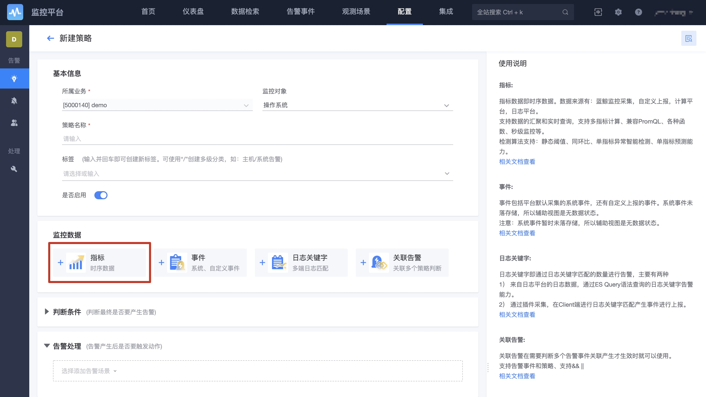

# 时序预测功能使用说明

### 适用的数据

1. 数据类型：指标数据，支持多维度的指标数据
2. 数据来源：监控采集，默认上报的，计算平台tspider的可以在监控查看到的数据。 自定义上报和日志的数据不包括在内。 

### 配置方法

1. 监控数据中选择添加监控指标。

2. 模型名称中选择“通用时间序列预测_小时级别”。

3. 配置 是否为线性预测 和 预测时长。
4. 配置阈值，当满足阈值条件时将触发告警。 
5. 接收到告警后，如果不准确，可以在告警详情中进行反馈，模型会定期持续训练

### 适用的数据场景

时序预测适用于大部分时序指标，特别适用于以下两种场景。

#### 场景一：指标呈现周期性波动 

当指标呈现周期性波动时，时序预测模型能自动从历史数据中学习该周期性规律。

#### 场景二：指标呈现趋势性增长或下降

当指标呈现合理的增长或下降趋势时，时序预测模型能够自适应曲线的增长或下降趋势，同时从历史数据中学习其他模式的变化。

