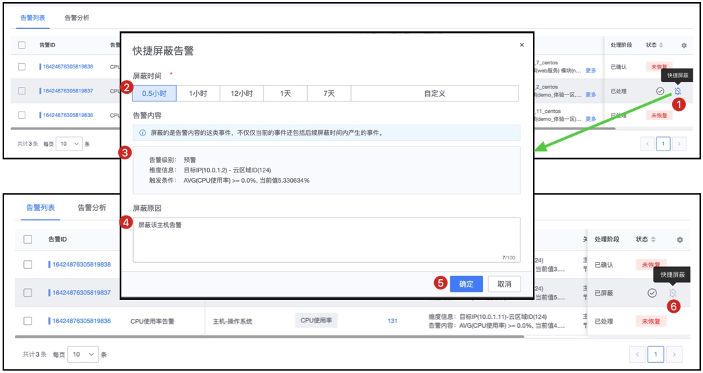

# 不同告警屏蔽的功能区别

告警屏蔽只有一个功能项，但实际上我们有三种告警屏蔽的能力，深入了解各个屏蔽功能的区别能满足不同用户和不同场景的诉求，更好的运行。 

三种分别为： 告警确认，快捷屏蔽、告警屏蔽

## 三种功能的区别

功能	 | 生效范围  | 	功能特点
---|---|---
告警确认	| 仅对当前事件确认后，不再产生该事件的通知，屏蔽范围小 | 同策略产生新的事件，则会再次被通知 
快捷屏蔽	| 同策略，仅对当前产生事件的维度屏蔽，屏蔽范围 | 如存在维度，按事件中的维度进行屏蔽
告警屏蔽	| 可以按策略、范围屏蔽，策略包括维度，屏蔽范围更大 | 按策略进行屏蔽

### 告警确认

### 快捷屏蔽

### 告警屏蔽

## 一、告警确认

告警确认，是当前的告警不再次被通知出来，注意告警确认是基于告警ID的，当策略触发新的告警后，即产生新的告警ID，则不受当前的告警确认影响。

## 二、快捷屏蔽

快捷屏蔽，是基于告警的级别，维度信息进行屏蔽的

另外在告警页面也可以告警确认和快捷屏蔽，如下图所示

## 三、告警屏蔽

具体查看[告警屏蔽功能说明](./block.md)

## 四、手机移动端操作

