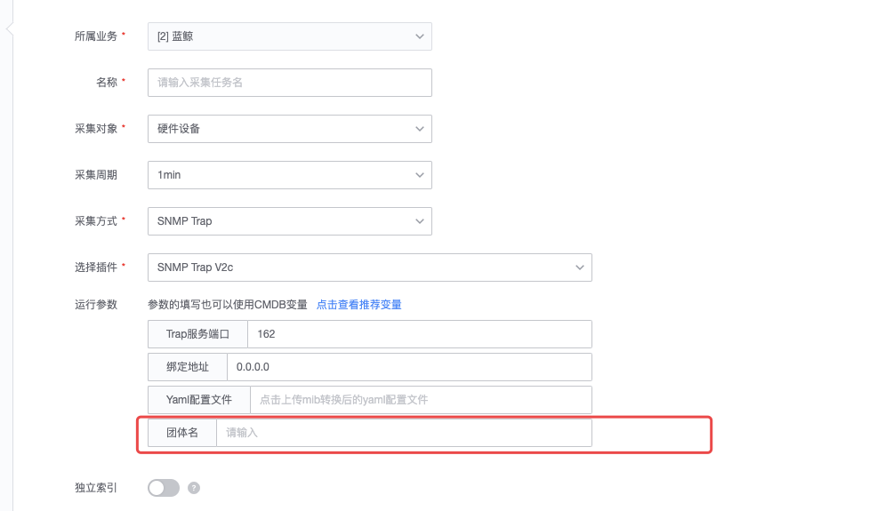

SNMP主动采集使用说明

### 一、基础概念:

#### 1.1 snmp相关概念

##### OID

设备通用的SNMP标识，格式是一段数字如1.3.6.1，使用snmp协议并通过oid访问 设备，即可获取对应oid下的设备信息,如启动时间等

##### MIB库

各设备官方提供的  设备oid描述文件，可以根据该文件得到能够用于监控的oid以及oid的内容描述信息

##### TRAP

snmp trap是一种事件类的snmp信息，当对应设备发生一些事件(如网卡离线)时，会向事先配置好的目标发送snmp trap报文

##### snmp协议版本

​    v1:是最简单的snmp采集

   v2/v2c:现阶段最普遍使用的snmp采集

   v3: 最新的snmp版本，增加了一系列安全参数

#### 1.2 监控snmp功能相关概念

##### snmp主动采集

指监控下发一个snmp_exporter，通过snmp协议远程主动采集客户其他设备的oid信息，并转换为时序数据的指标进行上报的功能

##### snmp trap采集

指监控下发一个snmp trap server,监听固定端口，被动接收从客户设备发来的snmp trap数据，并转换为自定义事件数据进行上报的功能

##### generator

监控平台提供的snmp.yml生成工具，通过使用该工具，能够解析MIB库，并将对应的指标组合成snmp.yml文件

##### generator.yml

generator的配置文件，用户需要在该配置文件中告诉generator需要采集哪些oid

##### snmp.yml 

snmp主动采集功能要求上报的yaml配置文件，由generator自动生成，也可根据一定规则手动写入，其内部包含所有将被采集的snmp指标信息,配置插件时需要上传

### 二、snmp主动采集

监控平台的snmp主动采集功能主要逻辑为:

1.generator解析mib库生成snmp.yml文件

2.下发snmp.yml文件与采集器,对开放了snmp端口的设备进行对应oid指标的主动采集

#### 2.1生成snmp.yml文件

注，本步骤只提供最简单版本的生成操作说明，复杂操作请参考generator使用介绍:https://github.com/prometheus/snmp_exporter/tree/master/generator

使用generator，基于generator.yml和mib库，生成snmp.yml

generator.yml举例,该文件将会遍历下面三个节点及其所有子节点获取mib信息:

注意: if_mib字段不能修改，该字段为监控默认字段

```yaml
modules:
  if_mib:  # The module name. You can have as many modules as you want.
    walk:       # List of OIDs to walk. Can also be SNMP object names or specific instances.
      - 1.3.6.1.2.1.2              # Same as "interfaces"
      - sysUpTime                  # Same as "1.3.6.1.2.1.1.3"
      - 1.3.6.1.2.1.31.1.1.1.6.40  # Instance of "ifHCInOctets" with index "40"
```

generator执行命令，其中generator.yml放置在generator相同目录下，所以这里不用在参数指定

mibs文件夹里存放了本次使用的MIB库文件

```cmd
MIBDIRS=mibs ./generator generate
```

获得snmp.yml文件如下:

```yaml
# WARNING: This file was auto-generated using snmp_exporter generator, manual changes will be lost.
if_mib:
  walk:
  - 1.3.6.1.2.1.2
  get:
  - 1.3.6.1.2.1.1.3.0
  - 1.3.6.1.2.1.31.1.1.1.6.40
  metrics:
  - name: sysUpTime
    oid: 1.3.6.1.2.1.1.3
    type: gauge
    help: The time (in hundredths of a second) since the network management portion of the system was last re-initialized. - 1.3.6.1.2.1.1.3
  - name: ifNumber
    oid: 1.3.6.1.2.1.2.1
    type: gauge
    help: The number of network interfaces (regardless of their current state) present on this system. - 1.3.6.1.2.1.2.1
  - name: ifType
    oid: 1.3.6.1.2.1.2.2.1.3
    type: gauge
    help: The type of interface - 1.3.6.1.2.1.2.2.1.3
    indexes:
    - labelname: ifIndex
      type: gauge
    enum_values:
      1: other
      2: regular1822
      3: hdh1822
      4: ddnX25
      5: rfc877x25
      6: ethernetCsmacd
      7: iso88023Csmacd
      8: iso88024TokenBus
      9: iso88025TokenRing
      10: iso88026Man
      11: starLan
      12: proteon10Mbit
      13: proteon80Mbit
      14: hyperchannel
      15: fddi
      16: lapb
      17: sdlc
      18: ds1
      19: e1
      20: basicISDN
      21: primaryISDN
      22: propPointToPointSerial
      23: ppp
      24: softwareLoopback
      25: eon
      26: ethernet3Mbit
      27: nsip
      28: slip
      29: ultra
      30: ds3
      31: sip
      32: frameRelay
      33: rs232
      34: para
      35: arcnet
      36: arcnetPlus
      37: atm
      38: miox25
      39: sonet
      40: x25ple
      41: iso88022llc
      42: localTalk
      43: smdsDxi
      44: frameRelayService
      45: v35
      46: hssi
      47: hippi
      48: modem
      49: aal5
      50: sonetPath
      51: sonetVT
      52: smdsIcip
      53: propVirtual
      54: propMultiplexor
      55: ieee80212
      56: fibreChannel
      57: hippiInterface
      58: frameRelayInterconnect
      59: aflane8023
      60: aflane8025
      61: cctEmul
      62: fastEther
      63: isdn
      64: v11
      65: v36
      66: g703at64k
      67: g703at2mb
      68: qllc
      69: fastEtherFX
      70: channel
      71: ieee80211
      72: ibm370parChan
      73: escon
      74: dlsw
      75: isdns
      76: isdnu
      77: lapd
      78: ipSwitch
      79: rsrb
      80: atmLogical
      81: ds0
      82: ds0Bundle
      83: bsc
      84: async
      85: cnr
      86: iso88025Dtr
      87: eplrs
      88: arap
      89: propCnls
      90: hostPad
      91: termPad
      92: frameRelayMPI
      93: x213
      94: adsl
      95: radsl
      96: sdsl
      97: vdsl
      98: iso88025CRFPInt
      99: myrinet
      100: voiceEM
      101: voiceFXO
      102: voiceFXS
      103: voiceEncap
      104: voiceOverIp
      105: atmDxi
      106: atmFuni
      107: atmIma
      108: pppMultilinkBundle
      109: ipOverCdlc
      110: ipOverClaw
      111: stackToStack
      112: virtualIpAddress
      113: mpc
      114: ipOverAtm
      115: iso88025Fiber
      116: tdlc
      117: gigabitEthernet
      118: hdlc
      119: lapf
      120: v37
      121: x25mlp
      122: x25huntGroup
      123: transpHdlc
      124: interleave
      125: fast
      126: ip
      127: docsCableMaclayer
      128: docsCableDownstream
      129: docsCableUpstream
      130: a12MppSwitch
      131: tunnel
      132: coffee
      133: ces
      134: atmSubInterface
      135: l2vlan
      136: l3ipvlan
      137: l3ipxvlan
      138: digitalPowerline
      139: mediaMailOverIp
      140: dtm
      141: dcn
      142: ipForward
      143: msdsl
      144: ieee1394
      145: if-gsn
      146: dvbRccMacLayer
      147: dvbRccDownstream
      148: dvbRccUpstream
      149: atmVirtual
      150: mplsTunnel
      151: srp
      152: voiceOverAtm
      153: voiceOverFrameRelay
      154: idsl
      155: compositeLink
      156: ss7SigLink
      157: propWirelessP2P
      158: frForward
      159: rfc1483
      160: usb
      161: ieee8023adLag
      162: bgppolicyaccounting
      163: frf16MfrBundle
      164: h323Gatekeeper
      165: h323Proxy
      166: mpls
      167: mfSigLink
      168: hdsl2
      169: shdsl
      170: ds1FDL
      171: pos
      172: dvbAsiIn
      173: dvbAsiOut
      174: plc
      175: nfas
      176: tr008
      177: gr303RDT
      178: gr303IDT
      179: isup
      180: propDocsWirelessMaclayer
      181: propDocsWirelessDownstream
      182: propDocsWirelessUpstream
      183: hiperlan2
      184: propBWAp2Mp
      185: sonetOverheadChannel
      186: digitalWrapperOverheadChannel
      187: aal2
      188: radioMAC
      189: atmRadio
      190: imt
      191: mvl
      192: reachDSL
      193: frDlciEndPt
      194: atmVciEndPt
      195: opticalChannel
      196: opticalTransport
      197: propAtm
      198: voiceOverCable
      199: infiniband
      200: teLink
      201: q2931
      202: virtualTg
      203: sipTg
      204: sipSig
      205: docsCableUpstreamChannel
      206: econet
      207: pon155
      208: pon622
      209: bridge
      210: linegroup
      211: voiceEMFGD
      212: voiceFGDEANA
      213: voiceDID
      214: mpegTransport
      215: sixToFour
      216: gtp
      217: pdnEtherLoop1
      218: pdnEtherLoop2
      219: opticalChannelGroup
      220: homepna
      221: gfp
      222: ciscoISLvlan
      223: actelisMetaLOOP
      224: fcipLink
      225: rpr
      226: qam
      227: lmp
      228: cblVectaStar
      229: docsCableMCmtsDownstream
      230: adsl2
      231: macSecControlledIF
      232: macSecUncontrolledIF
      233: aviciOpticalEther
      234: atmbond
      235: voiceFGDOS
      236: mocaVersion1
      237: ieee80216WMAN
      238: adsl2plus
      239: dvbRcsMacLayer
      240: dvbTdm
      241: dvbRcsTdma
      242: x86Laps
      243: wwanPP
      244: wwanPP2
      245: voiceEBS
      246: ifPwType
      247: ilan
      248: pip
      249: aluELP
      250: gpon
      251: vdsl2
      252: capwapDot11Profile
      253: capwapDot11Bss
      254: capwapWtpVirtualRadio
      255: bits
      256: docsCableUpstreamRfPort
      257: cableDownstreamRfPort
      258: vmwareVirtualNic
      259: ieee802154
      260: otnOdu
      261: otnOtu
      262: ifVfiType
  - name: ifMtu
    oid: 1.3.6.1.2.1.2.2.1.4
    type: gauge
    help: The size of the largest packet which can be sent/received on the interface, specified in octets - 1.3.6.1.2.1.2.2.1.4
    indexes:
    - labelname: ifIndex
      type: gauge
  - name: ifSpeed
    oid: 1.3.6.1.2.1.2.2.1.5
    type: gauge
    help: An estimate of the interface's current bandwidth in bits per second - 1.3.6.1.2.1.2.2.1.5
    indexes:
    - labelname: ifIndex
      type: gauge
  - name: ifAdminStatus
    oid: 1.3.6.1.2.1.2.2.1.7
    type: gauge
    help: The desired state of the interface - 1.3.6.1.2.1.2.2.1.7
    indexes:
    - labelname: ifIndex
      type: gauge
    enum_values:
      1: up
      2: down
      3: testing
  - name: ifOperStatus
    oid: 1.3.6.1.2.1.2.2.1.8
    type: gauge
    help: The current operational state of the interface - 1.3.6.1.2.1.2.2.1.8
    indexes:
    - labelname: ifIndex
      type: gauge
    enum_values:
      1: up
      2: down
      3: testing
      4: unknown
      5: dormant
      6: notPresent
      7: lowerLayerDown
  - name: ifLastChange
    oid: 1.3.6.1.2.1.2.2.1.9
    type: gauge
    help: The value of sysUpTime at the time the interface entered its current operational state - 1.3.6.1.2.1.2.2.1.9
    indexes:
    - labelname: ifIndex
      type: gauge
  - name: ifInOctets
    oid: 1.3.6.1.2.1.2.2.1.10
    type: counter
    help: The total number of octets received on the interface, including framing characters - 1.3.6.1.2.1.2.2.1.10
    indexes:
    - labelname: ifIndex
      type: gauge
  - name: ifInUcastPkts
    oid: 1.3.6.1.2.1.2.2.1.11
    type: counter
    help: The number of packets, delivered by this sub-layer to a higher (sub-)layer, which were not addressed to a multicast or broadcast address at this sub-layer - 1.3.6.1.2.1.2.2.1.11
    indexes:
    - labelname: ifIndex
      type: gauge
  - name: ifInNUcastPkts
    oid: 1.3.6.1.2.1.2.2.1.12
    type: counter
    help: The number of packets, delivered by this sub-layer to a higher (sub-)layer, which were addressed to a multicast or broadcast address at this sub-layer - 1.3.6.1.2.1.2.2.1.12
    indexes:
    - labelname: ifIndex
      type: gauge
  - name: ifInDiscards
    oid: 1.3.6.1.2.1.2.2.1.13
    type: counter
    help: The number of inbound packets which were chosen to be discarded even though no errors had been detected to prevent their being deliverable to a higher-layer protocol - 1.3.6.1.2.1.2.2.1.13
    indexes:
    - labelname: ifIndex
      type: gauge
  - name: ifInErrors
    oid: 1.3.6.1.2.1.2.2.1.14
    type: counter
    help: For packet-oriented interfaces, the number of inbound packets that contained errors preventing them from being deliverable to a higher-layer protocol - 1.3.6.1.2.1.2.2.1.14
    indexes:
    - labelname: ifIndex
      type: gauge
  - name: ifInUnknownProtos
    oid: 1.3.6.1.2.1.2.2.1.15
    type: counter
    help: For packet-oriented interfaces, the number of packets received via the interface which were discarded because of an unknown or unsupported protocol - 1.3.6.1.2.1.2.2.1.15
    indexes:
    - labelname: ifIndex
      type: gauge
  - name: ifOutOctets
    oid: 1.3.6.1.2.1.2.2.1.16
    type: counter
    help: The total number of octets transmitted out of the interface, including framing characters - 1.3.6.1.2.1.2.2.1.16
    indexes:
    - labelname: ifIndex
      type: gauge
  - name: ifOutUcastPkts
    oid: 1.3.6.1.2.1.2.2.1.17
    type: counter
    help: The total number of packets that higher-level protocols requested be transmitted, and which were not addressed to a multicast or broadcast address at this sub-layer, including those that were discarded or not sent - 1.3.6.1.2.1.2.2.1.17
    indexes:
    - labelname: ifIndex
      type: gauge
  - name: ifOutNUcastPkts
    oid: 1.3.6.1.2.1.2.2.1.18
    type: counter
    help: The total number of packets that higher-level protocols requested be transmitted, and which were addressed to a multicast or broadcast address at this sub-layer, including those that were discarded or not sent - 1.3.6.1.2.1.2.2.1.18
    indexes:
    - labelname: ifIndex
      type: gauge
  - name: ifOutDiscards
    oid: 1.3.6.1.2.1.2.2.1.19
    type: counter
    help: The number of outbound packets which were chosen to be discarded even though no errors had been detected to prevent their being transmitted - 1.3.6.1.2.1.2.2.1.19
    indexes:
    - labelname: ifIndex
      type: gauge
  - name: ifOutErrors
    oid: 1.3.6.1.2.1.2.2.1.20
    type: counter
    help: For packet-oriented interfaces, the number of outbound packets that could not be transmitted because of errors - 1.3.6.1.2.1.2.2.1.20
    indexes:
    - labelname: ifIndex
      type: gauge
  - name: ifOutQLen
    oid: 1.3.6.1.2.1.2.2.1.21
    type: gauge
    help: The length of the output packet queue (in packets). - 1.3.6.1.2.1.2.2.1.21
    indexes:
    - labelname: ifIndex
      type: gauge
  - name: ifHCInOctets
    oid: 1.3.6.1.2.1.31.1.1.1.6
    type: counter
    help: The total number of octets received on the interface, including framing characters - 1.3.6.1.2.1.31.1.1.1.6
    indexes:
    - labelname: ifIndex
      type: gauge

```


#### 2.2 建立snmp插件

通过监控平台插件页面，新建一个snmp插件，将snmp.yml文件上传


点击下一步进行调试工作

* 参数说明:

    * 监听端口:提供给监控采集器使用的端口，只要保证其可用即可

    * 绑定地址: 提供给监控采集器使用的ip，只要保证可用即可

    * community: 团体名，snmpv2版本的唯一认证信息

    

* 点击开始调试后，会进入debug流程

    

测试通过后会跳转到指标调整界面，此时可以根据需求进行指标删减

注:添加额外指标是无效的，无法采集，请在生成snmp.yml的时候就将指标添加完整


确认指标无误后，点击保存,完成插件创建


#### 2.3 下发采集

在新增采集页面，选择刚才建立的snmp插件，进行采集配置


点击下一步选择目标设备和采集器下发主机

注，采集器主机只能选择一台，设备ip可以选择多个


开始下发，等待下发结束


下发结束，检查视图查看采集数据


#### 2.4 配置策略


#### 2.5 观察告警


### 三、snmp trap采集

#### 3.1生成snmp.yml文件

generator.yml

```yaml
modules:
  if_mib:  # The module name. You can have as many modules as you want.
    walk:       # List of OIDs to walk. Can also be SNMP object names or specific instances.
      - 1.3.6.1.2.1.2              # Same as "interfaces"
      - sysUpTime                  # Same as "1.3.6.1.2.1.1.3"
      - 1.3.6.1.2.1.31.1.1.1.6.40  # Instance of "ifHCInOctets" with index "40"
```

使用命令，注意这里使用的命令与主动采集的不同点

```cmd
MIBDIRS=mibs ./generator all
```

snmp trap使用的snmp.yml指标会比主动采集多，因为主动采集会过滤一些非必要指标:

```yaml
asic_name:
  metrics:
  - name: dot1dNotifications
    oid: 1.3.6.1.2.1.17.0
    type: OTHER
    help: ""
  - name: risingAlarm
    oid: 1.3.6.1.2.1.16.0.1
    type: NOTIFTYPE
    help: ""
  - name: ssSwapOut
    oid: 1.3.6.1.4.1.2021.11.4
    type: INTEGER32
    help: ""
  - name: logMatchMaxEntries
    oid: 1.3.6.1.4.1.2021.16.1
    type: INTEGER32
    help: ""
  - name: snmpSet
    oid: 1.3.6.1.6.3.1.1.6
    type: OTHER
    help: ""
  - name: dot3Compliance2
    oid: 1.3.6.1.2.1.35.2.2.4
    type: MODCOMP
    help: ""
  - name: ipIfStatsInNoRoutes
    oid: 1.3.6.1.2.1.4.31.3.1.8
    type: COUNTER
    help: ""
  - name: transportDomainSctpIpv4
    oid: 1.3.6.1.2.1.100.1.9
    type: OBJIDENTITY
    help: ""
  - name: ipv6IfStatsInTooBigErrors
    oid: 1.3.6.1.2.1.55.1.6.1.3
    type: COUNTER
    help: ""
  - name: nsExtendOutNumLines
    oid: 1.3.6.1.4.1.8072.1.3.2.3.1.3
    type: INTEGER32
    help: ""
  - name: icmpStatsOutMsgs
    oid: 1.3.6.1.2.1.5.29.1.4
    type: COUNTER
    help: ""
  - name: snmpNotifyBasicCompliance
    oid: 1.3.6.1.6.3.13.3.1.1
    type: MODCOMP
    help: ""
  - name: ipv6IfReasmMaxSize
    oid: 1.3.6.1.2.1.55.1.5.1.5
    type: UNSIGNED32
    help: ""
  - name: logMatch
    oid: 1.3.6.1.4.1.2021.16
    type: OTHER
    help: ""
  - name: snmpNotifyEntry
    oid: 1.3.6.1.6.3.13.1.1.1
    type: OTHER
    help: ""
  - name: ipv6IfIcmpOutEchos
    oid: 1.3.6.1.2.1.56.1.1.1.25
    type: COUNTER
    help: ""
  - name: icmpOutAddrMaskReps
    oid: 1.3.6.1.2.1.5.26
    type: COUNTER
    help: ""
  - name: tunnelConfigRemoteAddress
    oid: 1.3.6.1.2.1.10.131.1.1.2.1.2
    type: IPADDR
    help: ""
  - name: sctpStatsGroup
    oid: 1.3.6.1.2.1.104.2.2.2
    type: OBJGROUP
    help: ""
  - name: hostTopNEntry
    oid: 1.3.6.1.2.1.16.5.2.1
    type: OTHER
    help: ""
  - name: hrSystemGroup
    oid: 1.3.6.1.2.1.25.7.3.1
    type: OBJGROUP
    help: ""
  - name: alarmTable
    oid: 1.3.6.1.2.1.16.3.1
    type: OTHER
    help: ""
  - name: bufferControlIndex
    oid: 1.3.6.1.2.1.16.8.1.1.1
    type: INTEGER32
    help: ""
  - name: smRunResult
    oid: 1.3.6.1.2.1.64.1.4.2.1.8
    type: OCTETSTR
    help: ""
  - name: tcpHCGroup
    oid: 1.3.6.1.2.1.49.2.2.5
    type: OBJGROUP
    help: ""
  - name: nlmLogContextEngineID
    oid: 1.3.6.1.2.1.92.1.3.1.1.7
    type: OCTETSTR
    help: ""
  - name: snmpTargetParamsMPModel
    oid: 1.3.6.1.6.3.12.1.3.1.2
    type: INTEGER
    help: ""
  - name: snmpTargetParamsSecurityLevel
    oid: 1.3.6.1.6.3.12.1.3.1.5
    type: INTEGER
    help: ""
  - name: alarmRisingThreshold
    oid: 1.3.6.1.2.1.16.3.1.1.7
    type: INTEGER32
    help: ""
  - name: memBuffer
    oid: 1.3.6.1.4.1.2021.4.14
    type: INTEGER32
    help: ""
  - name: ipv4GeneralGroup
    oid: 1.3.6.1.2.1.48.2.2.3
    type: OBJGROUP
    help: ""
  - name: ipForwardNextHopAS
    oid: 1.3.6.1.2.1.4.24.2.1.10
    type: INTEGER32
    help: ""
  - name: ipv6InterfaceRetransmitTime
    oid: 1.3.6.1.2.1.4.30.1.7
    type: UNSIGNED32
    help: ""
  - name: sunos4
    oid: 1.3.6.1.4.1.8072.3.2.2
    type: OTHER
    help: ""
  - name: sctpLayerParamsGroup
    oid: 1.3.6.1.2.1.104.2.2.1
    type: OBJGROUP
    help: ""
  - name: ianaLangSRSL
    oid: 1.3.6.1.2.1.73.5
    type: OBJIDENTITY
    help: ""
  - name: eventOwner
    oid: 1.3.6.1.2.1.16.9.1.1.6
    type: OCTETSTR
    help: ""
  - name: physicalInterfaceNumTXError
    oid: 1.3.6.1.4.1.63.501.3.4.2.1.9
    type: INTEGER
    help: ""
  - name: nsDebugGroup
    oid: 1.3.6.1.4.1.8072.5.2.7.1
    type: OBJGROUP
    help: ""
  - name: dskAvailHigh
    oid: 1.3.6.1.4.1.2021.9.1.14
    type: UNSIGNED32
    help: ""
  - name: sctpRtoMax
    oid: 1.3.6.1.2.1.104.1.2.3
    type: UNSIGNED32
    help: ""
  - name: versionConfigureOptions
    oid: 1.3.6.1.4.1.2021.100.6
    type: DisplayString
    help: ""
  - name: vacmAccessWriteViewName
    oid: 1.3.6.1.6.3.16.1.4.1.6
    type: DisplayString
    help: ""
  - name: ianaLangPerl
    oid: 1.3.6.1.2.1.73.3
    type: OBJIDENTITY
    help: ""
  - name: historyControlIndex
    oid: 1.3.6.1.2.1.16.2.1.1.1
    type: INTEGER32
    help: ""
  - name: ifLastChange
    oid: 1.3.6.1.2.1.2.2.1.9
    type: TIMETICKS
    help: ""
  - name: dot3PauseEntry
    oid: 1.3.6.1.2.1.10.7.10.1
    type: OTHER
    help: ""
  - name: sctpAssocRemAddrStartTime
    oid: 1.3.6.1.2.1.104.1.5.1.8
    type: TIMETICKS
    help: ""
  - name: inetCidrRouteNextHopType
    oid: 1.3.6.1.2.1.4.24.7.1.5
    type: INTEGER
    help: ""
  - name: channelDataControl
    oid: 1.3.6.1.2.1.16.7.2.1.4
    type: INTEGER
    help: ""
  - name: tcpListenerLocalAddress
    oid: 1.3.6.1.2.1.6.20.1.2
    type: InetAddress
    help: ""
  - name: ifTestStatus
    oid: 1.3.6.1.2.1.31.1.3.1.2
    type: INTEGER
    help: ""
  - name: ipFwAccDstAddr
    oid: 1.3.6.1.4.1.2021.13.1.1.1.4
    type: IPADDR
    help: ""
  - name: ipDefaultRouterGroup
    oid: 1.3.6.1.2.1.48.2.2.22
    type: OBJGROUP
    help: ""
  - name: bufferControlTable
    oid: 1.3.6.1.2.1.16.8.1
    type: OTHER
    help: ""
  - name: captureBufferPacketID
    oid: 1.3.6.1.2.1.16.8.2.1.3
    type: INTEGER32
    help: ""
  - name: snmpTargetAddrRetryCount
    oid: 1.3.6.1.6.3.12.1.2.1.5
    type: INTEGER32
    help: ""
  - name: nlmLogVariableCounter64Val
    oid: 1.3.6.1.2.1.92.1.3.2.1.11
    type: COUNTER64
    help: ""
  - name: ipv6TcpConnEntry
    oid: 1.3.6.1.2.1.6.16.1
    type: OTHER
    help: ""
  - name: captureBufferEntry
    oid: 1.3.6.1.2.1.16.8.2.1
    type: OTHER
    help: ""
  - name: agentxSessionDescr
    oid: 1.3.6.1.2.1.74.1.3.2.1.3
    type: DisplayString
    help: ""
  - name: nlmLogVariableOpaqueVal
    oid: 1.3.6.1.2.1.92.1.3.2.1.12
    type: OPAQUE
    help: ""
  - name: ipIfStatsInMcastOctets
    oid: 1.3.6.1.2.1.4.31.3.1.36
    type: COUNTER
    help: ""
  - name: mrModuleName
    oid: 1.3.6.1.4.1.2021.102.1.2
    type: DisplayString
    help: ""
  - name: hrFSFat
    oid: 1.3.6.1.2.1.25.3.9.5
    type: OBJIDENTITY
    help: ""
  - name: smTraps
    oid: 1.3.6.1.2.1.64.2.0
    type: OTHER
    help: ""
  - name: event
    oid: 1.3.6.1.2.1.16.9
    type: OTHER
    help: ""
  - name: mteTriggerBooleanEntry
    oid: 1.3.6.1.2.1.88.1.2.5.1
    type: OTHER
    help: ""
  - name: netSnmpUnixDomain
    oid: 1.3.6.1.4.1.8072.3.3.2
    type: OTHER
    help: ""
  - name: ucdShutdown
    oid: 1.3.6.1.4.1.2021.251.2
    type: NOTIFTYPE
    help: ""
  - name: tunnelInetConfigStatus
    oid: 1.3.6.1.2.1.10.131.1.1.3.1.7
    type: INTEGER
    help: ""
  - name: nsCacheEnabled
    oid: 1.3.6.1.4.1.8072.1.5.2
    type: INTEGER
    help: ""
  - name: dot1dStpPortDesignatedRoot
    oid: 1.3.6.1.2.1.17.2.15.1.6
    type: OCTETSTR
    help: ""
  - name: ipFwAccViaAddr
    oid: 1.3.6.1.4.1.2021.13.1.1.1.7
    type: IPADDR
    help: ""
  - name: logMatchCycle
    oid: 1.3.6.1.4.1.2021.16.2.1.11
    type: INTEGER32
    help: ""
  - name: sctpAssocRemAddrRTO
    oid: 1.3.6.1.2.1.104.1.5.1.5
    type: UNSIGNED32
    help: ""
  - name: hrPartitionIndex
    oid: 1.3.6.1.2.1.25.3.7.1.1
    type: INTEGER32
    help: ""
  - name: ipv6RouterAdvertMaxInterval
    oid: 1.3.6.1.2.1.4.39.1.3
    type: UNSIGNED32
    help: ""
  - name: tunnelMIBInetGroup
    oid: 1.3.6.1.2.1.10.131.2.2.2
    type: OBJGROUP
    help: ""
  - name: physicalInterfaceSpeed
    oid: 1.3.6.1.4.1.63.501.3.4.2.1.4
    type: INTEGER
    help: ""
  - name: snmpProxyCompliances
    oid: 1.3.6.1.6.3.14.3.1
    type: OTHER
    help: ""
  - name: hrPrinterStatus
    oid: 1.3.6.1.2.1.25.3.5.1.1
    type: INTEGER
    help: ""
  - name: ipNetToMediaTable
    oid: 1.3.6.1.2.1.4.22
    type: OTHER
    help: ""
  - name: udpEndpointLocalPort
    oid: 1.3.6.1.2.1.7.7.1.3
    type: UNSIGNED32
    help: ""
  - name: snmpProxyObjects
    oid: 1.3.6.1.6.3.14.1
    type: OTHER
    help: ""
  - name: ucdavis
    oid: 1.3.6.1.4.1.2021
    type: MODID
    help: ""
  - name: memSwapErrorMsg
    oid: 1.3.6.1.4.1.2021.4.101
    type: DisplayString
    help: ""
  - name: hrFSHPFS
    oid: 1.3.6.1.2.1.25.3.9.6
    type: OBJIDENTITY
    help: ""
  - name: icmpMsgStatsTable
    oid: 1.3.6.1.2.1.5.30
    type: OTHER
    help: ""
  - name: ifHCOutMulticastPkts
    oid: 1.3.6.1.2.1.31.1.1.1.12
    type: COUNTER64
    help: ""
  - name: memTotalSwap
    oid: 1.3.6.1.4.1.2021.4.3
    type: INTEGER32
    help: ""
  - name: smExtsnVendor
    oid: 1.3.6.1.2.1.64.1.2.1.4
    type: OBJID
    help: ""
  - name: ipv6IfIcmpTable
    oid: 1.3.6.1.2.1.56.1.1
    type: OTHER
    help: ""
  - name: ipv6RouteEntry
    oid: 1.3.6.1.2.1.55.1.11.1
    type: OTHER
    help: ""
  - name: etherStats100MbsGroup
    oid: 1.3.6.1.2.1.35.2.1.3
    type: OBJGROUP
    help: ""
  - name: hrSWInstalledType
    oid: 1.3.6.1.2.1.25.6.3.1.4
    type: INTEGER
    help: ""
  - name: tunnelConfigTable
    oid: 1.3.6.1.2.1.10.131.1.1.2
    type: OTHER
    help: ""
  - name: alarmSampleType
    oid: 1.3.6.1.2.1.16.3.1.1.4
    type: INTEGER
    help: ""
  - name: ipv6IfIcmpInEchos
    oid: 1.3.6.1.2.1.56.1.1.1.8
    type: COUNTER
    help: ""
  - name: dot1dStpPortPathCost
    oid: 1.3.6.1.2.1.17.2.15.1.5
    type: INTEGER32
    help: ""
  - name: wirelessPhysAddress
    oid: 1.3.6.1.4.1.63.501.3.2.2.1.1
    type: PhysAddress48
    help: ""
  - name: nlmLogVariableEntry
    oid: 1.3.6.1.2.1.92.1.3.2.1
    type: OTHER
    help: ""
  - name: ipv6IfIcmpOutRouterAdvertisements
    oid: 1.3.6.1.2.1.56.1.1.1.28
    type: COUNTER
    help: ""
  - name: matrixControlIndex
    oid: 1.3.6.1.2.1.16.6.1.1.1
    type: INTEGER32
    help: ""
  - name: sysLocation
    oid: 1.3.6.1.2.1.1.6
    type: DisplayString
    help: ""
  - name: agentxConnection
    oid: 1.3.6.1.2.1.74.1.2
    type: OTHER
    help: ""
  - name: mteTriggerThresholdStartup
    oid: 1.3.6.1.2.1.88.1.2.6.1.1
    type: INTEGER
    help: ""
  - name: snmpFrameworkMIBGroups
    oid: 1.3.6.1.6.3.10.3.2
    type: OTHER
    help: ""
  - name: sctpAssocT1expireds
    oid: 1.3.6.1.2.1.104.1.3.1.13
    type: COUNTER
    help: ""
  - name: ipv6IfIcmpOutPktTooBigs
    oid: 1.3.6.1.2.1.56.1.1.1.24
    type: COUNTER
    help: ""
  - name: dot3ControlTable
    oid: 1.3.6.1.2.1.10.7.9
    type: OTHER
    help: ""
  - name: nlmConfigLogEntryLimit
    oid: 1.3.6.1.2.1.92.1.1.3.1.3
    type: UNSIGNED32
    help: ""
  - name: ipIfStatsIPVersion
    oid: 1.3.6.1.2.1.4.31.3.1.1
    type: INTEGER
    help: ""
  - name: nsIETFWGChair2
    oid: 1.3.6.1.4.1.8072.2.2.1.1.3
    type: OCTETSTR
    help: ""
  - name: versionSavePersistentData
    oid: 1.3.6.1.4.1.2021.100.13
    type: INTEGER32
    help: ""
  - name: ipAddressPrefixAdvValidLifetime
    oid: 1.3.6.1.2.1.4.32.1.9
    type: UNSIGNED32
    help: ""
  - name: dot3StatsDeferredTransmissions
    oid: 1.3.6.1.2.1.10.7.2.1.7
    type: COUNTER
    help: ""
  - name: alarmOwner
    oid: 1.3.6.1.2.1.16.3.1.1.11
    type: OCTETSTR
    help: ""
  - name: snmpOutGenErrs
    oid: 1.3.6.1.2.1.11.24
    type: COUNTER
    help: ""
  - name: agentxRegistration
    oid: 1.3.6.1.2.1.74.1.4
    type: OTHER
    help: ""
  - name: bufferControlDownloadSliceSize
    oid: 1.3.6.1.2.1.16.8.1.1.6
    type: INTEGER32
    help: ""
  - name: ipLastChangeGroup
    oid: 1.3.6.1.2.1.48.2.2.7
    type: OBJGROUP
    help: ""
  - name: hostCreationOrder
    oid: 1.3.6.1.2.1.16.4.2.1.2
    type: INTEGER32
    help: ""
  - name: ifSpeed
    oid: 1.3.6.1.2.1.2.2.1.5
    type: GAUGE
    help: ""
  - name: netSnmpObjects
    oid: 1.3.6.1.4.1.8072.1
    type: OTHER
    help: ""
  - name: schedNotificationsGroup
    oid: 1.3.6.1.2.1.63.3.2.3
    type: NOTIFGROUP
    help: ""
  - name: ipv6IfOperStatus
    oid: 1.3.6.1.2.1.55.1.5.1.10
    type: INTEGER
    help: ""
  - name: hostControlDataSource
    oid: 1.3.6.1.2.1.16.4.1.1.2
    type: OBJID
    help: ""
  - name: tunnelInetConfigIfIndex
    oid: 1.3.6.1.2.1.10.131.1.1.3.1.6
    type: INTEGER32
    help: ""
  - name: logMatchName
    oid: 1.3.6.1.4.1.2021.16.2.1.2
    type: DisplayString
    help: ""
  - name: snmpUnavailableContexts
    oid: 1.3.6.1.6.3.12.1.4
    type: COUNTER
    help: ""
  - name: udpLocalAddress
    oid: 1.3.6.1.2.1.7.5.1.1
    type: IPADDR
    help: ""
  - name: netSnmpTLSTCPDomain
    oid: 1.3.6.1.4.1.8072.3.3.10
    type: OTHER
    help: ""
  - name: hrSystem
    oid: 1.3.6.1.2.1.25.1
    type: OTHER
    help: ""
  - name: filterStatus
    oid: 1.3.6.1.2.1.16.7.1.1.11
    type: INTEGER
    help: ""
  - name: system
    oid: 1.3.6.1.2.1.1
    type: OTHER
    help: ""
  - name: dot3HCStatsSymbolErrors
    oid: 1.3.6.1.2.1.10.7.11.1.6
    type: COUNTER64
    help: ""
  - name: netSnmpTCs
    oid: 1.3.6.1.4.1.8072.3.1.1
    type: MODID
    help: ""
  - name: dskDevice
    oid: 1.3.6.1.4.1.2021.9.1.3
    type: DisplayString
    help: ""
  - name: snmpEngine
    oid: 1.3.6.1.6.3.10.2.1
    type: OTHER
    help: ""
  - name: ipSystemStatsInDelivers
    oid: 1.3.6.1.2.1.4.31.1.1.18
    type: COUNTER
    help: ""
  - name: udpLocalPort
    oid: 1.3.6.1.2.1.7.5.1.2
    type: INTEGER32
    help: ""
  - name: hostControlStatus
    oid: 1.3.6.1.2.1.16.4.1.1.6
    type: INTEGER
    help: ""
  - name: snmpCommunityMIBCompliances
    oid: 1.3.6.1.6.3.18.2.1
    type: OTHER
    help: ""
  - name: ipv6IfIcmpOutGroupMembReductions
    oid: 1.3.6.1.2.1.56.1.1.1.34
    type: COUNTER
    help: ""
  - name: tunnelIfEntry
    oid: 1.3.6.1.2.1.10.131.1.1.1.1
    type: OTHER
    help: ""
  - name: snmpNotifyGroups
    oid: 1.3.6.1.6.3.13.3.2
    type: OTHER
    help: ""
  - name: bsdi
    oid: 1.3.6.1.4.1.2021.250.11
    type: OTHER
    help: ""
  - name: laErrMessage
    oid: 1.3.6.1.4.1.2021.10.1.101
    type: DisplayString
    help: ""
  - name: eventStatus
    oid: 1.3.6.1.2.1.16.9.1.1.7
    type: INTEGER
    help: ""
  - name: ifOldObjectsGroup
    oid: 1.3.6.1.2.1.31.2.1.12
    type: OBJGROUP
    help: ""
  - name: tunnelConfigStatus
    oid: 1.3.6.1.2.1.10.131.1.1.2.1.6
    type: INTEGER
    help: ""
  - name: hrSWOSIndex
    oid: 1.3.6.1.2.1.25.4.1
    type: INTEGER32
    help: ""
  - name: rfc1157Proxy
    oid: 1.3.6.1.6.2.1
    type: OTHER
    help: ""
  - name: snmpNotifyFilterSubtree
    oid: 1.3.6.1.6.3.13.1.3.1.1
    type: OBJID
    help: ""
  - name: hrFSDFS
    oid: 1.3.6.1.2.1.25.3.9.17
    type: OBJIDENTITY
    help: ""
  - name: egpNeighIntervalPoll
    oid: 1.3.6.1.2.1.8.5.1.13
    type: INTEGER
    help: ""
  - name: udpInDatagrams
    oid: 1.3.6.1.2.1.7.1
    type: COUNTER
    help: ""
  - name: prErrFixCmd
    oid: 1.3.6.1.4.1.2021.2.1.103
    type: DisplayString
    help: ""
  - name: ipFwAccNrSrcPorts
    oid: 1.3.6.1.4.1.2021.13.1.1.1.13
    type: INTEGER32
    help: ""
  - name: icmpStatsInMsgs
    oid: 1.3.6.1.2.1.5.29.1.2
    type: COUNTER
    help: ""
  - name: hostTopNIndex
    oid: 1.3.6.1.2.1.16.5.2.1.2
    type: INTEGER32
    help: ""
  - name: sysOREntry
    oid: 1.3.6.1.2.1.1.9.1
    type: OTHER
    help: ""
  - name: smLangLanguage
    oid: 1.3.6.1.2.1.64.1.1.1.2
    type: OBJID
    help: ""
  - name: smScriptRowStatus
    oid: 1.3.6.1.2.1.64.1.3.1.1.9
    type: INTEGER
    help: ""
  - name: ipNetToPhysicalType
    oid: 1.3.6.1.2.1.4.35.1.6
    type: INTEGER
    help: ""
  - name: ucdDemoResetKeys
    oid: 1.3.6.1.4.1.2021.14.1.1.1
    type: INTEGER32
    help: ""
  - name: ifCompliance2
    oid: 1.3.6.1.2.1.31.2.2.2
    type: MODCOMP
    help: ""
  - name: agentxRegIndex
    oid: 1.3.6.1.2.1.74.1.4.2.1.1
    type: UNSIGNED32
    help: ""
  - name: ipAddressPrefixTable
    oid: 1.3.6.1.2.1.4.32
    type: OTHER
    help: ""
  - name: icmpInTimestamps
    oid: 1.3.6.1.2.1.5.10
    type: COUNTER
    help: ""
  - name: physicalInterfaceIndex
    oid: 1.3.6.1.4.1.63.501.3.4.2.1.1
    type: INTEGER
    help: ""
  - name: netSnmpPassOID
    oid: 1.3.6.1.4.1.8072.2.255.2.1.3
    type: OBJID
    help: ""
  - name: sctpMIB
    oid: 1.3.6.1.2.1.104
    type: MODID
    help: ""
  - name: nlmLogVariableInteger32Val
    oid: 1.3.6.1.2.1.92.1.3.2.1.7
    type: INTEGER32
    help: ""
  - name: netSnmpIETFWGTable
    oid: 1.3.6.1.4.1.8072.2.2.1
    type: OTHER
    help: ""
  - name: logMatchTable
    oid: 1.3.6.1.4.1.2021.16.2
    type: OTHER
    help: ""
  - name: ipv6UdpIfIndex
    oid: 1.3.6.1.2.1.7.6.1.3
    type: INTEGER32
    help: ""
  - name: mteTriggerObjects
    oid: 1.3.6.1.2.1.88.1.2.2.1.13
    type: DisplayString
    help: ""
  - name: tcpMaxConn
    oid: 1.3.6.1.2.1.6.4
    type: INTEGER32
    help: ""
  - name: tcpConnLocalAddress
    oid: 1.3.6.1.2.1.6.13.1.2
    type: IPADDR
    help: ""
  - name: hostTopNDuration
    oid: 1.3.6.1.2.1.16.5.1.1.5
    type: INTEGER32
    help: ""
  - name: ifLinkUpDownTrapEnable
    oid: 1.3.6.1.2.1.31.1.1.1.14
    type: INTEGER
    help: ""
  - name: netbsd1
    oid: 1.3.6.1.4.1.2021.250.7
    type: OTHER
    help: ""
  - name: ipv6IcmpConformance
    oid: 1.3.6.1.2.1.56.2
    type: OTHER
    help: ""
  - name: ipForwardIfIndex
    oid: 1.3.6.1.2.1.4.24.2.1.5
    type: INTEGER32
    help: ""
  - name: netSnmpCallbackDomain
    oid: 1.3.6.1.4.1.8072.3.3.6
    type: OTHER
    help: ""
  - name: hrSWRunTable
    oid: 1.3.6.1.2.1.25.4.2
    type: OTHER
    help: ""
  - name: ipv6IfStatsInDiscards
    oid: 1.3.6.1.2.1.55.1.6.1.8
    type: COUNTER
    help: ""
  - name: ipv6TcpCompliances
    oid: 1.3.6.1.3.86.2.1
    type: OTHER
    help: ""
  - name: ipv6NetToMediaNetAddress
    oid: 1.3.6.1.2.1.55.1.12.1.1
    type: OCTETSTR
    help: ""
  - name: captureBufferPacketData
```

#### 3.2 下发trap任务

与snmp主动采集不同，trap不需要手动建立插件，直接使用内置插件配合snmp.yml下发即可:


下发后，在检查视图可以看到对应时间点是否有事件上报，以及上报了几次


#### 3.3 配置策略

注意，trap策略属于日志关键字分类


配置告警


#### 3.4 观察告警


### 四、认证相关

snmp主动采集与trap使用相同的认证参数，这里一并讨论

snmp的认证信息由客户设备定义，然后填写到监控的采集配置中

#### snmp v1与 snmp v2

这两种协议认证只有一个字段，即community,中文译为团体名

注1:snmp主动采集使用团体名作为采集设备的认证，所以是必填的

注2:snmptrap使用团体名作为trap数据的过滤措施，所以可以不填，不填时视为接收所有团体的trap,**多个需要过滤的团体名可用逗号分隔**




#### snmp v3

v3版本的snmp认证相对复杂，包括,具体含义请参考snmp协议相关文档

- 上下文名称 Context name
- 安全名 Security name
- 安全级别 Security level ， 选项有 noAuthNoPriv， authNoPriv ， authPriv
- 验证协议 Authentication protocol， 选项有 MD5，SHA
- 验证口令 Authentication passphrase
- 隐私协议 Privacy protocol ,选项有 DES ， AES
- 私钥 Privacy paasphrase
- 设备ID Engine ID


### 五、snmp版本兼容说明

snmp主动采集，各插件只能采集自己版本的设备，如snmpv2版本插件只能采集snmpv2协议的设备

snmp trap采集，可以向下兼容，如snmp v3的任务，向其中发送snmp v2/v1的trap数据，也同样能够接收并告警,对应该兼容效果，snmp v3的trap同样提供了团体名字段

## 相关文档

SNMP trap事件采集[查看文档](../integrations-events/snmp_trap.md)


