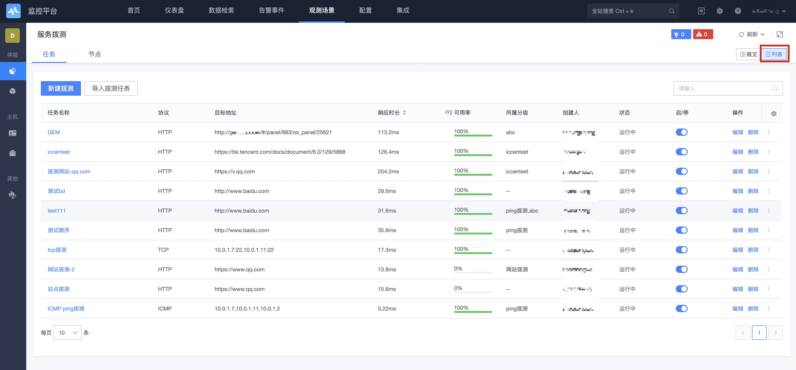

# 开启综合拨测

综合拨测是通过远程模拟用户访问的方式判断目标是否运行正常等，类似一种黑盒的监控方式。 

## 工作原理

* Remote Object 远程监控对象: 可以是 HTTP(s),TCP,UDP,ICMP等
* 拨测节点： 需要gse agent部署插件bkmonitorbeat,从此gse agent对外发起请求，请求的源地址为该IP，bkmonitorbeat部署参考监控采集器安装

## 配置流程

(1) 配置拨测节点 → (2) 新建拨测任务 → (3) 选择协议 → (4) 填写目标地址 → (5) 设置策略[如需要告警] → (6) 查看拨测任务

服务拨测的采集主要分为两个部分，先是：`添加拨测节点`，然后`添加拨测任务`。

如果已经有拨测节点，不是必需环节。

### 添加拨测节点

`拨测节点`是部署蓝鲸 Gse_Agent 的主机，服务拨测的逻辑是从`拨测节点`向`目标地址`探测服务可用性。

通过主机属性：`国家`、`地区` 和 `外网运营商` 从配置平台中筛选主机作为拨测节点。

`外网运营商`字段选择`内网`：为探测内网服务可用性而设，只会使用内网 IP ，不会筛选运营商等外网属性，选择`电信`等其他运营商：只会使用外网 IP，探测外网服务可用性。

> 管理员可以设置为公共的节点，其他业务都可以查看，默认是只有本业务可以使用。自建节点，选择的 IP 信息会同步配置平台的地区和运营商。

### 添加拨测任务

选择节点后，配置不同的协议对网站/应用服务进行主动拨测，就是服务拨测采集的第二步：添加拨测任务。

### 查看拨测任务

## 其他事项

目标选择说明

* 动态拓扑：CMDB中有拓扑改动，其下的节点信息，IP信息动态变化
* 静态拓扑：CMDB中的拓扑有改动，采集目标不随着变动
* 服务模板：根据CMDB中的服务实例下发采集目标
* 集群模板：根据CMDB中的集群模板下发采集目标
* 自定义输入：指手动输入外网 IP 地址,只要符合 IP 格式就可以不会进行 CMDB 的检验.

