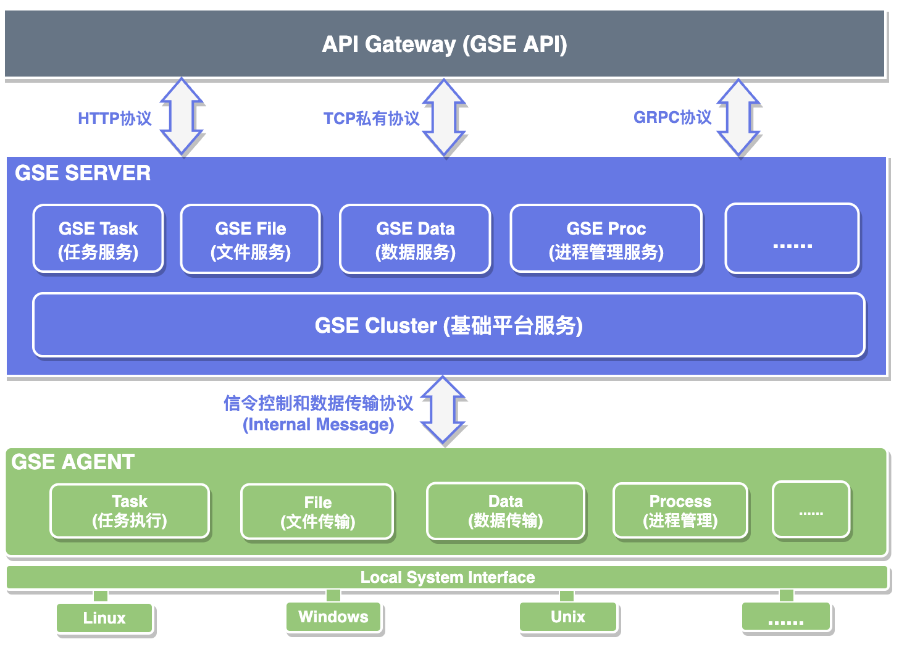
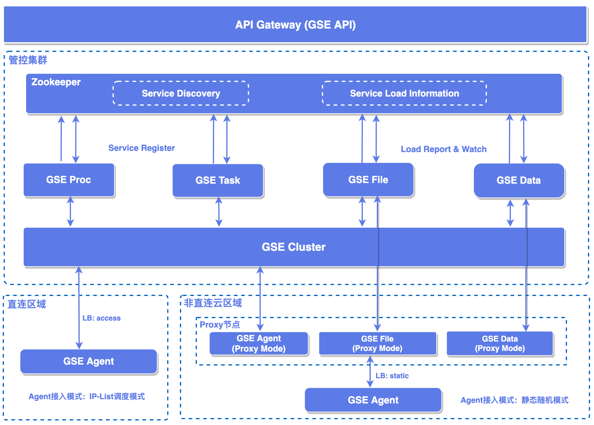

# 系统概述



如图所示为蓝鲸管控平台（Blueking General Service Engine）内部整体架构简图，API层面基于蓝鲸网关服务对外提供接口服务，内部支持HTTP、TCP私有协议、GRPC等多种协议族通讯。后台模块主要由任务服务（GSE Task）、进程管理服务（GSE Proc）、文件服务（GSE File）、数据服务（GSE Data）、基础平台服务（GSE Cluster）组成，其中基础平台服务（GSE Cluster）与管控节点的Agent配合，负责完成内部信令消息的上行下达。在管控节点层面，Agent负责完成任务执行、文件传输、数据传输、进程操作等工作，其针对主流操作系统发行版本进行了兼容适配，可以在混合环境中实现管控。

## 模块介绍

### 任务服务（GSE Task）

- **端口信息：**

| 端口号 | 协议类型 |                                               说明                                                         |
| ------ | -------- | ---------------------------------------------------------------------------------------------------------- |
| 48673  | Thrift   | 1.0 Thrift API兼容需要的监听端口, 与既往端口保持一致，主要为1.0任务执行相关操作提供服务, 后续会下掉该端口  |
| 59313  | Thrift   | 1.0 Thrift API兼容需要的监听端口, 与既往端口保持一致，主要为1.0节点Agent状态查询提供服务, 后续会下掉该端口 |
| 28863  | HTTP     | 2.0 任务服务端口, 提供任务执行相关操作的API                                                                |
| 59403  | HTTP     | 2.0 Metric、Healthz端口，提供指标数据拉取、健康检查服务                                                    |

- **依赖组件模块：**

|      模块     |     类型     |                     说明                     |
| ------------- | ------------ | -------------------------------------------- |
| Zookeeper     | 开源中间件   | 用于内部模块的服务发现和基础配置信息同步     |
| Redis Cluster | 开源中间件   | 用于任务数据的缓存和管理                     |
| GSE Cluster   | 内部服务模块 | 底层基础平台服务，基于该服务实现海量节点触达 |

### 进程管理服务（GSE Proc）

- **端口信息：**

| 端口号 | 协议类型 |                           说明                          |
| ------ | -------- | ------------------------------------------------------- |
| 52030  | HTTP     | 2.0 进程管理服务端口（与1.0保持一致）                   |
| 59406  | HTTP     | 2.0 Metric、Healthz端口，提供指标数据拉取、健康检查服务 |

- **依赖组件模块：**

|      模块     |      类型      |                   说明                     |
| ------------- | -------------- | ------------------------------------------ |
| Zookeeper     | 开源中间件     | 用于内部模块的服务发现和基础配置信息同步   |
| MongoDB       | 开源中间件     | 用于进程管理相关数据的存储和管理           |
| GSE Task      | 内部服务模块   | 基于任务服务实现对管控节点上进程的控制操作 |
| ESB（BK-CMDB）| 蓝鲸体系内组件 | 用于内部从蓝鲸CMDB获取主机和进程等信息     |

### 文件服务（GSE File）

- **端口信息：**

|  端口号 | 协议类型 |                               说明                                    |
| ------- | -------- | --------------------------------------------------------------------  |
| 58925   | TCP私有  | 1.0 面向GSE Agent侧提供内部指定模式下的文件传输服务，后续会下掉该端口 |
| 58930   | Thrift   | 1.0 文件服务内部实例之间信息同步与协调的RPC服务端口, 后续会下掉该端口 |
| 28925   | TCP私有  | 2.0 面向GSE Agent侧提供内部指定模式下的文件传输服务                   |
| 28930   | TCP私有  | 2.0 文件服务内部实例之间信息同步与协调的私有协议服务端口              |
| 10020   | TCP/UDP  | 2.0 文件服务内部BT协议服务端口，非区间值（端口与1.0保持一致）         |
| 10030   | UDP      | 2.0 文件服务内部Tracker服务端口，非区间值（端口与1.0保持一致）        |
| 59404   | HTTP     | 2.0 Metric、Healthz端口，提供指标数据拉取、健康检查服务               |

- **依赖组件模块：**

|    模块   |     类型    |                    说明                  |
| --------- | ----------- | ---------------------------------------- |
| Zookeeper | 开源中间件  | 用于内部模块的服务发现和基础配置信息同步 |

### 数据服务（GSE Data）

- **端口信息：**

|  端口号 | 协议类型 |                          说明                           |
| ------- | -------  | ------------------------------------------------------- |
| 58625   | TCP私有  | 1.0 面向GSE Agent侧提供数据上报服务, 后续会下掉该端口   |
| 28625   | TCP私有  | 2.0 面向GSE Agent侧提供数据上报服务                     |
| 59702   | HTTP     | 2.0 数据路由管理服务端口（与1.0保持一致）               |
| 58626   | UDP私有  | 2.0 面向GSE系统内部模块提供运营OPS数据上报服务          |
| 59402   | HTTP     | 2.0 Metric、Healthz端口，提供指标数据拉取、健康检查服务 |

- **依赖组件模块：**

|    模块   |     类型    |                    说明                  |
| --------- | ----------- | ---------------------------------------- |
| Zookeeper | 开源中间件  | 用于内部模块的服务发现和基础配置信息同步 |

### 基础平台服务（GSE Cluster）

- **端口信息：**

|  端口号 | 协议类型 |                          说明                           |
| ------- | -------- | ------------------------------------------------------  |
| 27707   | TCP私有  | 2.0 上层Service侧的TCP服务端口                          |
| 28808   | HTTP     | 2.0 上层Service侧的HTTP服务端口                         |
| 48668   | TCP私有  | 1.0 兼容Agent侧的TCP服务端口，后续会下掉该端口          |
| 28668   | TCP私有  | 2.0 Agent侧的TCP服务端口                                |
| 29527   | TCP私有  | 2.0 内部MsgBus组件广播服务端口                          |
| 29528   | TCP私有  | 2.0 内部MsgBus组件单播服务端口                          |
| 59405   | HTTP     | 2.0 Metric、Healthz端口，提供指标数据拉取、健康检查服务 |

- **依赖组件模块：**

|      模块     |     类型     |                     说明                     |
| ------------- | ------------ | -------------------------------------------- |
| Zookeeper     | 开源中间件   | 用于内部模块的服务发现和基础配置信息同步     |
| Redis Cluster | 开源中间件   | 用于任务数据的缓存和管理                     |

### 蓝鲸智能代理（GSE Agent）

- **端口信息：**

|  端口号       |   协议类型  |                                                     说明                                                                   |
| ------------- | ----------- | -------------------------------------------------------------------------------------------------------------------------- |
| 28668         | TCP私有协议 | 内部基础信令端口, 仅在Proxy模式下会监听该端口, 其下属的Proxy Agent会链接该端口建立信令会话                                 |
| 47000         | TCP私有协议 | Windows Agent用来接收本地采集器插件数据上报的服务端口，默认监听127.0.0.1网段, 如果该网段不存在尝试监听IPv6本地环回地址::1  |
| [60020,60030] | TCP,UDP协议 | 内部BT协议网络端口区间, 用于文件传输组网                                                                                   |

## 配置说明

### Zookeeper配置信息

Zookeeper在GSE系统内主要的作用有两个，一是基础资源类数据的存储和管理，二是内部模块之间的服务发现。

如下是GSE系统的Zookeeper存储路径规范, 2.0系统根路径为/gse/v2，与1.0路径隔离：

- **服务发现路径**：**/gse/v2/service/{module-name}/{service-id}**, service-id为UUID模式，每次进程生命周期值不同
```
/gse/v2/service/cluster/xxxxxx-xxxx-xxxx-xxxxxx
```

- **基础资源路径**：**/gse/v2/resource/{resource-name}**
```
/gse/v2/resource/plugin
```

- **模块私有配置路径**：**/gse/v2/config/{module-name}**
```
/gse/v2/config/cluster
```

### 模块本地配置信息

GSE系统内每个模块的本地配置文件都以**{module name}.conf**的模式命名，如gse_task.conf、gse_file.conf、gse_data.conf、gse_proc.conf、gse_cluster.conf、gse_agent.conf，所有进程模块都以**-f 或 --config**参数指定配置文件进行启动。

示例：
```sh
./gse_agent -f ./etc/gse_agent.conf
```

## 模块进程结构与控制参数
> 适用于二进制模式部署下的全部后台服务模块以及Agent的日常进程操作

### 进程结构

GSE系统中的模块，均采用双进程模式，即启动时master进程先运行，再由其拉起实际工作的worker进程，当worker进程发送异常退出时，master进程会将其重新拉起恢复服务。

进程结构示例：
```
> ps -ef | grep gse_cluster
root     55873       1  0 3月28 00:00:00 ./gse_cluster -f etc/gse_cluster.conf
root     55874   55873  0 3月28 00:37:21 ./gse_cluster -f etc/gse_cluster.conf
```

**注意**：尽管系统模块本身具备双进程（守护进程）的能力，但master进程本身也需要做进程保活。

### 进程控制参数

GSE系统中的模块，提供统一的基础命令行控制参数，包括进程启停、版本查看、进程和配置重载等操作。

后台服务模块控制参数示例:

```
> ./gse_{module name} --help

Usage:
  -h [ --help ]                                  this message
  -v [ --version ]                               show version

Command:
  -Q [ --quit ]                                  exit the current processes immediately
  -R [ --reload ]                                reload the new binary to recreate the processes
  --restart                                      soft restart the current worker process
  --stop                                         soft stop the current processes
  --reconfig                                     configure the hot update for the current process
  --upgrade                                      make process lossless upgrade
  --no-detach                                    don't run process in background mode

Config:
  -f [ --config ] arg (=./etc/gse_cluster.conf)  local config file
```

|      参数名    |          作用       |                                             备注                                             |
| -------------- | ------------------- | -------------------------------------------------------------------------------------------- |
| -v (--version) | 查看当前版本信息    | 版本中包含了二进制版本、编译时间、git仓库hash等信息（版本后面以小写字母'i'结尾则为内部版本） |
| -Q (--quit)    | 强制退出            | 强制kill掉运行中的进程，包括master进程                                                       |
| -R(--reload)   | 重新加载二进制启动  | 基于新的二进制重新启动模块进程                                                               |
| --restart      | 重启当前进程        | 基于当前的二进制尝试重新启动模块进程                                                         |
| --stop         | 停止进程            | 等待进程释放完资源后将其停止                                                                 |
| --reconfig     | 重新加载模块配置    | 触发模块进行配置加载，具体哪些配置项可以支持热加载依赖模块的内部实现                         |
| --upgrade      | 模块升级            | 用于部分模块的无损升级操作（数据服务）                                                       |
| --no-detach    | 前台启动            | 在启动模块进程时会控制器保持前台启动                                                         |
| --f (--config) | 配置文件路径        | 用于指定模块的配置文件路径                                                                   |

## 日志结构和存储控制

GSE系统中每个模块采用统一的日志存储模式，根据配置文件中的日志路径配置，在指定位置按照如下结构存储：

```
> ls -l logs
total 4
drwxr-xr-x 2 root root 4096 3月  9 12:56 bk-gse-{module name}-business.ERROR
drwxr-xr-x 2 root root 4096 3月  9 12:56 bk-gse-{module name}-business.WARN
drwxr-xr-x 2 root root 4096 3月  9 12:00 bk-gse-{module name}-system.ERROR
drwxr-xr-x 2 root root 4096 3月  9 12:00 bk-gse-{module name}-system.WARN
```

|  日志路径 |   含义   |                             说明                          |
| --------- | -------  | --------------------------------------------------------- |
| business  | 业务日志 | 模块服务的业务逻辑日志，如API调用信息、逻辑执行信息等     |
| system    | 系统日志 | 模块服务的系统日志，如进程日志、网络日志、内部组件日志等  |

GSE日志会按照不同级别输出到不同文件中，低日志级别包含高日志级别的内容。在日常运维中，通过观察不同分类的日志，可以针对性的了解系统实时运行状态。

- 每个级别单独存储在不同的日志文件中，不同日志级别包含上级日志的内容，即DEBUG日志中包含INFO、WARN、ERROR级别内容，INFO日志包含WARN、ERROR级别内容，WARN日志包含ERROR级别内容；
- 日志默认支持按照单日志文件大小和切割数量进行滚动，滚动的日志带日志后缀，不带后缀的日志文件为当前主写的index文件；
- 日志index文件默认会进行预创建，即没有日志输出时也会提前创建，在有实质日志输出之前大小为0；
- 默认将标准输出和标准出错信息重定向到单独特定的STD后缀日志文件中，该类日志文件默认只做新老备份替换不做多文件备份；
- 每次进程重启后日志将会进行一次滚动，包括STD日志文件也会滚动（将上一个生命周期的STD文件备份后重新创建新的日志文件）；

在运行环境的磁盘等资源存在限制的情况下，可以进行日志大小、日志数量、滚动方式和保留时间等维度的调整，以满足实际的运维要求，常用的配置如下：

```json
{
    "path": "/data/logs",
    "level": "WARN",
    "filesize_mb": 200,
    "filenum": 10,
    "flush_interval_ms": 1000
}
```

|      配置项       |     含义     |                                                说明                                       |
| ----------------- | ------------ | ----------------------------------------------------------------------------------------- |
| path              | 存储根路径   | 日志存储的根目录，模块进程会将其日志以'business' 'system'两种种分类的模式在该位置进程存储 |
| level             | 日志级别     | 日志级别，支持的级别为'DEBUG' 'INFO' 'WARN' 'ERROR' 'FATAL'                               |
| filesize_mb       | 日志文件大小 | 单个日志文件的大小，单位为MB                                                              |
| filenum           | 日志文件数量 | 两种日志分类中每类日志文件个数限制，超过该数量的日志文件内容会被滚动覆盖掉                |
| flush_interval_ms | 日志刷新频率 | 日志刷新写入到磁盘日志文件中的频率                                                        |

## 网络拓扑



GSE系统中由基础平台服务（GSE Cluster）负责承接所有管控节点的链接和会话，根据不同区域 Agent 唯一身份标识 Agent ID 构建并管理路由表，为内部其他通道服务模块提供基础信令服务。

所管控的节点Agent在不同的网络云区域内，非直连的区域通过GSE Proxy完成会话链接的静态接入。而对于直连区域 GSE Agent 2.0 版本会基于 GSE Cluster 的 Access 协议进行动态的接入调度，GSE Agent 1.0 旧版本会基于 GSE Cluster 向 Zookeeper 中原有路径写入的兼容信息进行接入调度。

## 网络策略

为保证GSE功能正常，需开通以下区域间端口策略：

- 1. GSE Server 与直连区域 Agent 之间的端口策略；
- 2. GSE Server 与 GSE Proxy 之间的端口策略；
- 3. GSE Proxy 与云区域内 Agent 之间的端口策略；

**GSE Server与直连区域Agent之间的端口策略**

| 源地址(模块) | 目标地址(模块) | 协议 | 端口 | 用途 |
| ------------ | -------------- | ---- | ---- | ---- |
| agent | zookeeper | TCP | 2181 | 1.0 版本组网配置  (仅限旧版本的Agent，2.1.x以上版本不需要) |
| agent | gse_cluster | TCP | 48668 | 1.0 版本信令端口  (仅限旧版本的Agent，2.1.x以上版本不需要) |
| agent | gse_cluster | TCP | 28668 | 2.0 版本信令端口（仅限2.1.x以上版本适用） |
| agent | gse_data | TCP | 58625 | 1.0 数据上报端口 |
| agent | gse_data | TCP | 28625 | 2.0 数据上报端口 |
| agent | gse_file | TCP | 58925 | 1.0 内部传输端口 |
| agent | gse_file | TCP | 28925 | 2.0 内部传输端口 |
| gse_file | gse_file | TCP | 58930 | 1.0 内部网络端口 |
| gse_file | gse_file | TCP | 28930 | 2.0 内部网络端口 |
| agent | gse_file | TCP,UDP | 10020 | 2.0 内部BT网络端口，与1.0 保持一致（注意：非区间模式，只是两个端口值）|
| agent | gse_file | UDP | 10030 | 2.0 内部Tracker网络端口，与1.0 保持一致（注意：非区间模式，只是两个端口值）|
| gse_file | agent | TCP,UDP | [60020,60030] | 2.0 agent侧BT网络端口区间，与1.0 保持一致 （注意：区间模式，表示端口段）|
| gse_file | gse_file | TCP,UDP | 10020 | 2.0 内部BT网络端口，与1.0 保持一致（注意：非区间模式，只是两个端口值）|
| gse_file | gse_file | UDP | 10030 | 2.0 内部Tracker网络端口，与1.0 保持一致（注意：非区间模式，只是两个端口值）|
| agent | agent | TCP,UDP | [60020,60030] | 2.0 agent侧BT网络端口区间，与1.0 保持一致 （注意：区间模式，表示端口段）|
| gse_data | zookeeper | TCP | 2181 | 2.0 服务发现配置（与1.0 保持一致）|
| gse_data | zookeeper | TCP | 2184 | 2.0 资源管理配置，若启用组网与资源存储分离则可按需开通（与1.0 保持一致）|
| gse_data | kafka | TCP | 9092 | 2.0 数据传输bkbase （与1.0 保持一致）|

**GSE Server与Proxy之间的端口策略**

| 源地址(模块) | 目标地址(模块) | 协议 | 端口 | 用途 |
| ------------ | -------------- | ---- | ---- | ---- |
| proxy(gse_agent) | gse_cluster | TCP | 48668 | 1.0 版本信令端口 (仅限旧版本的Agent，2.1.x以上版本不适用) |
| proxy(gse_agent) | gse_cluster | TCP | 28668 | 2.0 版本信令端口（仅限2.1.x以上版本适用） |
| proxy(gse_data) | gse_data | TCP | 58625 | 1.0 数据上报端口 |
| proxy(gse_data) | gse_data | TCP | 28625 | 2.0 数据上报端口 |
| proxy(gse_file) | gse_file | TCP | 58930 | 1.0 内部网络端口 |
| proxy(gse_file) | gse_file | TCP | 28930 | 2.0 内部网络端口 |
| proxy(gse_file) | gse_file | TCP,UDP | 10020  | 2.0 内部BT网络端口，与1.0 保持一致（注意：非区间模式，只是两个端口值） |
| proxy(gse_file) | gse_file | UDP | 10030 | 2.0 内部Tracker网络端口，与1.0 保持一致（注意：非区间模式，只是两个端口值） |
| gse_file | proxy(gse_file) | TCP | 58930 | 1.0 内部网络端口 |
| gse_file | proxy(gse_file) | TCP,UDP | 10020 | 2.0 内部BT网络端口，与1.0 保持一致（注意：非区间模式，只是两个端口值） |
| gse_file | proxy(gse_file) | UDP | 10030 | 2.0 内部Tracker网络端口，与1.0 保持一致（注意：非区间模式，只是两个端口值） |
| proxy(gse_file) | proxy(gse_file) | TCP | 58930 |1.0 内部网络端口 |
| proxy(gse_file) | proxy(gse_file) | TCP | 28930 |2.0 内部网络端口 |
| proxy(gse_file) | proxy(gse_file) | TCP,UDP | 10020 | 2.0 内部BT、Tracker网络端口，与1.0 保持一致（注意：非区间模式，只是两个端口值） |
| proxy(gse_file) | proxy(gse_file) | UDP | 10030 | 2.0 内部BT、Tracker网络端口，与1.0 保持一致（注意：非区间模式，只是两个端口值） |

**Proxy与云区域Agent之间的端口策略**

| 源地址(模块) | 目标地址(模块) | 协议 | 端口 | 用途 |
| ------------ | -------------- | ---- | ---- | ---- |
| agent | proxy(gse_agent) | TCP | 48668 | 1.0 版本信令端口 (仅限旧版本的Agent，2.1.x以上版本不适用) |
| agent | proxy(gse_agent) | TCP | 28668 | 2.0 版本信令端口（仅限2.1.x以上版本适用）|
| agent | proxy(gse_data) | TCP | 58625 | 1.0 数据上报端口 |
| agent | proxy(gse_data) | TCP | 28625 | 2.0 数据上报端口 |
| agent | proxy(gse_file) | TCP | 58925 | 1.0 内部传输端口 |
| agent | proxy(gse_file) | TCP | 28925 | 2.0 内部传输端口 |
| agent | proxy(gse_file) | TCP,UDP | 10020 | 2.0 内部BT网络端口，与1.0 保持一致（注意：非区间模式，只是两个端口值） |
| agent | proxy(gse_file) | UDP | 10030 | 2.0 内部Tracker网络端口，与1.0 保持一致（注意：非区间模式，只是两个端口值） |
| proxy(gse_file) | agent | TCP,UDP | [60020,60030] | 2.0 agent侧BT网络端口区间，与1.0 保持一致 （注意：区间模式，表示端口段） |
| agent | agent | TCP,UDP | [60020,60030] | 2.0 agent侧BT网络端口区间，与1.0 保持一致 （注意：区间模式，表示端口段） |

