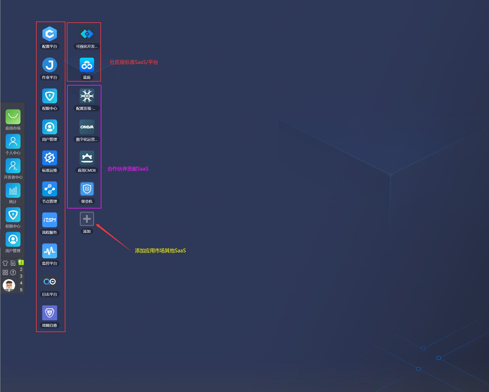

## 1、 工作台应用面板

以应用的方式展示蓝鲸部署的所有产品（包括后续自己开发的 SaaS），可以通过拖动图标排序来自定义 SaaS 位置；侧边栏有官方的文档指引和自定义的常用链接。

---

- 您可能需要：

    1. [立即下载蓝鲸](https://bk.tencent.com/download/)
    2. 了解更多企业定制化服务：[点击咨询](https://bk.tencent.com/applyinfo/ee/)