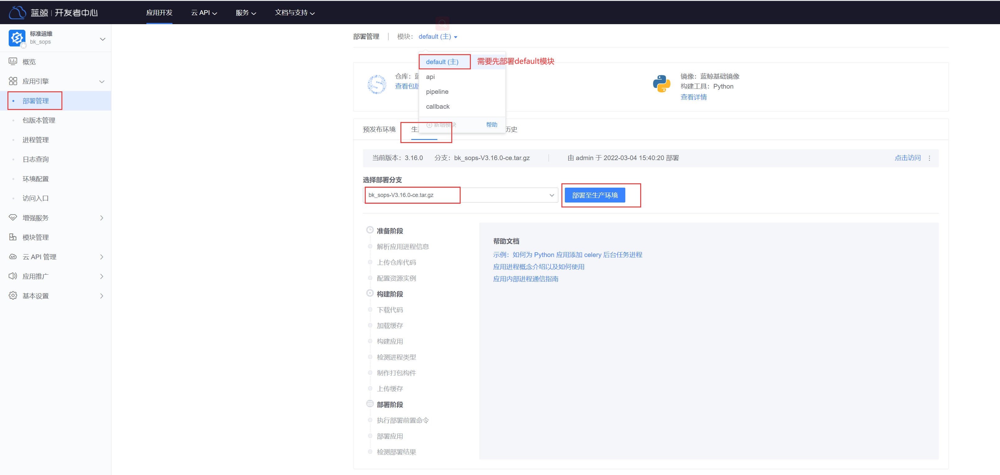
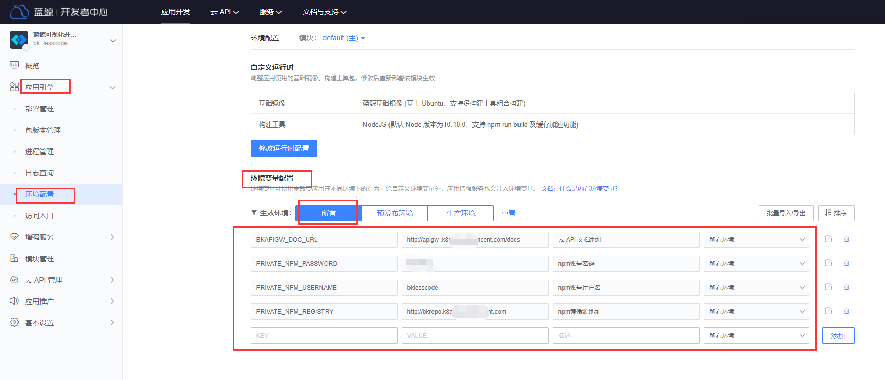
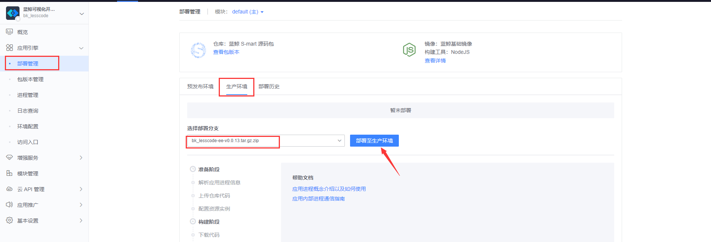
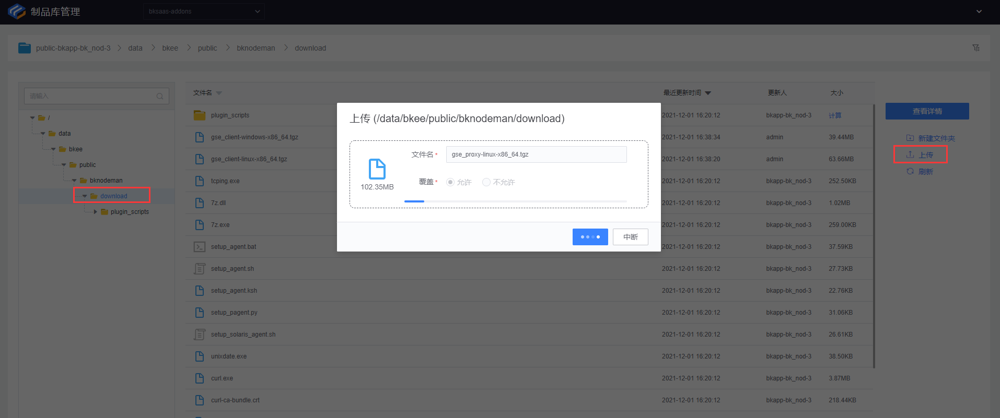
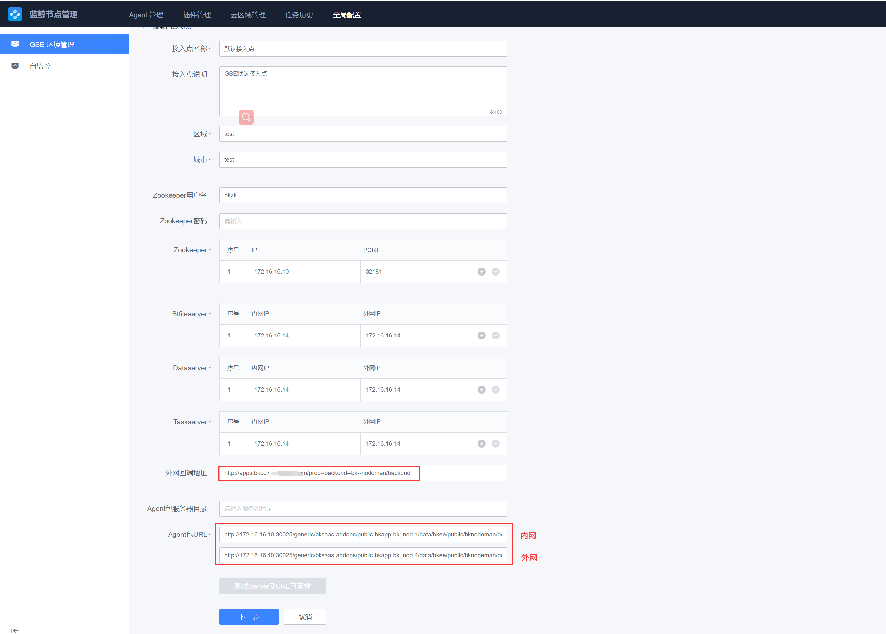

蓝鲸基础套餐的部署主要分为两个部分：先在中控机部署后台；然后在浏览器安装并配置 SaaS 。

# 部署基础套餐后台
## 一键部署基础套餐后台
为了便于您体验，我们封装了“一键部署” 脚本。

``` bash
# 下载部署脚本并添加可执行权限.
curl -Lo ~/setup_bkce7.sh http://bkopen-1252002024.file.myqcloud.com/ce7/setup_bkce7.sh && chmod +x ~/setup_bkce7.sh
```

假设您用于部署蓝鲸的域名为 `bkce7.bktencent.com`，使用如下的命令:
``` bash
~/setup_bkce7.sh --install base --domain bkce7.bktencent.com
```
此脚本耗时 15 ~ 30 分钟，请耐心等待。部署成功会高亮提示 `install finished，clean pods in completed status`。

> **提醒**
> 
> k8s 所有 `node` 机器均需保持网络畅通，可访问蓝鲸提供的镜像地址。

## 分步部署基础套餐后台
具体操作请查阅 [分步部署基础套餐后台](./base_installing_helmfile.md) 。

# 访问蓝鲸

## 配置用户侧 DNS
蓝鲸设计为需要通过域名访问使用。所以您需先配置所在内网的 DNS 系统，或修改本机 hosts 文件。

> **提示**
> 
> 请留意，这里指的不是 **k8s 集群内部** 所使用的 `coredns` 。

在中控机执行如下命令即可获得 hosts 文件的参考内容:
``` bash
cd ~/bkhelmfile/blueking/  # 进入蓝鲸helmfile目录

# 获取 ingress-controller pod所在机器的公网ip，记为$IP1
IP1=$(kubectl get pods -n blueking -l app.kubernetes.io/name=ingress-nginx -o jsonpath='{.items[0].status.hostIP}')
# 获取外网ip
IP1=$(ssh $IP1 'curl -sSf ip.sb')
# 获取 bk-ingress-controller pod所在机器的公网ip，记为$IP2，它负责SaaS应用的流量代理。
IP2=$(kubectl get pods -n blueking -l app.kubernetes.io/name=bk-ingress-nginx -o jsonpath='{.items[0].status.hostIP}')
# 获取外网ip
IP2=$(ssh $IP2 'curl -sSf ip.sb')
BK_DOMAIN=$(yq e '.domain.bkDomain' environments/default/custom.yaml)
# 人工检查取值
echo "BK_DOMAIN=$BK_DOMAIN IP1=$IP1 IP2=$IP2"
# 输出hosts
cat <<EOF
$IP1 $BK_DOMAIN
$IP1 bkrepo.$BK_DOMAIN 
$IP1 bkpaas.$BK_DOMAIN 
$IP1 bkuser.$BK_DOMAIN
$IP1 bkuser-api.$BK_DOMAIN
$IP1 bkapi.$BK_DOMAIN 
$IP1 apigw.$BK_DOMAIN
$IP1 bkiam.$BK_DOMAIN
$IP1 bkiam-api.$BK_DOMAIN
$IP1 cmdb.$BK_DOMAIN 
$IP1 job.$BK_DOMAIN 
$IP1 jobapi.$BK_DOMAIN 
$IP2 apps.$BK_DOMAIN
EOF
```

## 获取 PaaS 登录账户及密码
在 **中控机** 执行如下命令获取登录账户:

``` bash
helm status bk-user -n blueking
```
其关键输出如下: 
``` plain
登录账户名密码:
admin/密码略
```

## 浏览器访问
浏览器访问 `$BK_DOMAIN` 所指向的域名。此域名可以在 **中控机** 执行如下命令获取：
``` bash
cd ~/bkhelmfile/blueking/  # 进入蓝鲸helmfile目录
yq e '.domain.bkDomain' environments/default/custom.yaml  # 读取自定义的域名.
```

# 准备 SaaS 运行环境
## 上传 PaaS 基础镜像到 bkrepo
> **注意**
>
> 本步骤已经在 “一键部署蓝鲸基座” 脚本中自动完成。如需单独更新时可重复此操作。

在 **中控机** 获取需要执行的命令：
``` bash
helm status bk-paas -n blueking
```
其输出如图所示：

在 **中控机** 执行所提示的命令即可运行 `runtimes-download.sh` 脚本：
``` bash
kubectl run --rm \
--env="BKREPO_USERNAME=admin" \
--env="BKREPO_PASSWORD=略" \
--env="BKREPO_ENDPOINT=http://bkrepo.略" \
--env="BKREPO_PROJECT=bkpaas" \
--image="hub.bktencent.com/blueking/paas3-buildpack-toolkit:1.1.0-beta.70" \
-it bkpaas3-upload-runtime --command  -- /bin/bash runtimes-download.sh \
-n blueking
```

> `runtimes-download.sh` 脚本的主要动作就是从蓝鲸官方 cos 上下载依赖的运行时资源并上传到私有化环境中 bkrepo 仓库。
要求 k8s node 能访问外网，如果因网络问题下载异常，可以重复运行此脚本。

## 在 PaaS 界面配置 Redis 资源池
需要添加 SaaS 使用的 Redis 资源池，访问蓝鲸 PaaS Admin: `http://bkpaas.$BK_DOMAIN/backend/admin42/platform/pre-created-instances/manage` 。

共享资源池和独占资源池，各添加 10 个（如果复用则 json 一样）。如果部署 SaaS 时提示 “分配不到 redis”，需增大此处的设置。


在 **中控机** 执行如下命令可输出待填写的 json：
``` bash
redis_json_tpl='{"host":"bk-redis-master.blueking.svc.cluster.local","port":6379,"password":"%s"}'
printf "$redis_json_tpl\n" $(kubectl get secret --namespace blueking bk-redis -o jsonpath="{.data.redis-password}" | base64 --decode) | jq .
```
命令输出如下：


## （可选） 配置 SaaS 专用 node
在资源充足的情况下，建议单独给 SaaS 分配单独的 `node`。因为 SaaS 部署时，编译会产生高 IO 和高 CPU 消耗。原生 k8s 集群的 io 隔离暂无方案，这样会影响到所在 `node` 的其他 `pod`。

我们通过 k8s 的污点（`taint`）来实现专机专用。

### 配置 node 污点
假设该节点名为 `node-1`，给该 node 配置 label 和污点，确保 `pod` 默认不会分配到这些 `node`。
``` bash
kubectl label nodes node-1 dedicated=bkSaas
kubectl taint nodes node-1 dedicated=bkSaas:NoSchedule
```
### 在 PaaS 页面配置污点容忍
1. 访问 http://bkpaas.$BK_DOMAIN （确保完成登录）
2. 访问 http://bkpaas.$BK_DOMAIN/backend/admin42/platform/clusters/manage/
3. 点击集群 最右侧的编辑按钮，并滚动到最下面。
4. 在 **默认 nodeSelector** 栏填写：
``` json
{"dedicated": "bkSaas"}
```
5. 在 **默认 tolerations** 栏填写：
``` json
[{"key":"dedicated","operator":"Equal","value":"bkSaas","effect":"NoSchedule"}]
```
6. 保存


### SaaS 专用 node 问题排查
如果发现 SaaS 的 Pod 调度到了其他 `node`，请检查 PaaS 页面的配置是否正确。

如果因为资源不足导致 SaaS 运行异常，请先参考 **添加 k8s-node** 完成 k8s 扩容，然后参考 **配置 node 污点** 完成专机配置。


# 部署蓝鲸基础套餐 SaaS 
> **提示**
> 
> 1. 目前安装 SaaS 需要在浏览器操作，记得先完成 **访问蓝鲸** 章节的内容。
> 2. SaaS 运行前需要先完成 **准备 SaaS 运行环境** 章节的内容。

在前面部署蓝鲸套件里包含了 PaaS 平台 V3、配置平台、作业平台、gse 几个原子平台和用户管理、权限中心两个公共模块，其他社区版官方的 SaaS 应用，比如标准运维、节点管理、流程服务等通过开发者中心来自助部署

## 部署方法概述
SaaS 应用采用 s-mart 包部署方式：
打开开发者中心，创建应用，选择 **S-mart 应用** ，上传包然后部署到生产环境即可。


## 需要提前下载的资源
我们汇总整理了接下来需要下载的文件。

1. SaaS 集合包 文件名：ce7_saas.tgz
    - MD5：ad0f2bea16e52c496c5ec70f2097e5eb
    - 下载地址：http://bkopen-1252002024.file.myqcloud.com/ce7/ce7_saas.tgz
2. GSE Agent 集合包 文件名：gse_client_ce_3.6.16.zip
    - MD5：9a2d4f3d0034ea37a6c5cb8f7c4e399a
    - 下载地址：http://bkopen-1252002024.file.myqcloud.com/ce7/gse_client_ce_3.6.16.zip
3. Python 3.6 文件名：py36.tgz
    - MD5：7f9217b406703e3e3ee88681dd903bd1
    - 下载地址：http://bkopen-1252002024.file.myqcloud.com/common/py36.tgz

## 各 SaaS 安装及配置说明
### 部署流程服务（bk_itsm）
SaaS 包名：bk_itsm_xxx.tar.gz
无需配置额外环境变量，工作台进入开发者中心，直接创建应用，上传 `S-mart` 包部署即可。


### 部署 gsekit(进程配置管理)
无环境变量，直接部署，参考流程服务的部署
SaaS 包名：bk_gsekit-xxx.tar.gz

### 部署标准运维（bk_sops）
SaaS 包名：bk_sops-xxx.tar.gz
无环境变量直接部署，注意：有四个模块依次部署，default 需要先部署，其他的无顺序要求。


### 部署蓝鲸可视化平台（bk_lesscode）
SaaS 包名：bk_lesscode-ee-xxx.tar.gz
1. 上传 `S-mart` 包，参考流程服务 saas 部署。
2. 配置环境变量：
注意环境变量的作用范围，可以直接选所有环境
 
|环境变量名称 |VALUE |描述 |
| -- | -- | -- |
|`PRIVATE_NPM_REGISTRY` |按以下模板填写:  `${bkrepoConfig.endpoint}/npm/bkpaas/npm/`  , 其中 bkrepoConfig.endpoint 为 bkrepo 服务的网关地址,即http://bkrepo.$BK_DOMAIN |npm 镜像源地址 |
|`PRIVATE_NPM_USERNAME` |填写部署 PaaS3.0 时配置的  `bkrepoConfig.lesscodeUsername`  默认值是 bklesscode |npm 账号用户名 |
|`PRIVATE_NPM_PASSWORD` |填写部署 PaaS3.0 时配置的  `bkrepoConfig.lesscodePassword`  默认值是 blueking |npm 账号密码 |
|`BKAPIGW_DOC_URL` |填写部署 API 网关时，生成的环境变量 APISUPPORT_FE_URL 的值 默认值是 `http://apigw.$BK_DOMAIN/docs` |云 API 文档地址 |
最终配置界面如下图所示：

3. 部署应用到所需的环境

4. 配置独立域名，推荐使用： `lesscode.$BK_DOMAIN` 。
目前 bk_lesscode 只支持通过独立域名来访问，在 bk_lesscode 应用页中, 点击 「应用引擎」-「访问入口」中配置独立域名并保存。
如果没有配置公网 DNS 解析，则在本地 hosts 需要加上
1.1.1.1（ `bk-ingress-controller`  pod 所在机器的公网 IP）  `lesscode.$BK_DOMAIN`

在应用推广-发布管理中，将应用市场的访问地址类型设置为：主模块生产环境独立域名


### 部署节点管理（bk_nodeman）
>注意：节点管理 SaaS 分了 2 个模块，default 和 backend，需要分别部署（先部署 default，后部署 backend）！
步骤比较多，注意操作顺序

SaaS 包名：bk_nodeman-xxx.tar.gz
在部署之前，均需要在各自模块提前配置以下 3 个环境变量  `(注意: 配置一次default模块的变量后，backend的变量可以从default模块导入）`  。
Ps:环境变量的作用范围，可以直接选所有环境。


|环境变量名称 |VALUE |描述 |
|--|--| -- |
|STORAGE_TYPE |BLUEKING_ARTIFACTORY |存储类型 |
|BKAPP_RUN_ENV |ce |运行环境 |
|BKAPP_NODEMAN_CALLBACK_URL |http://apps.$BK_DOMAIN/prod--backend--bk--nodeman/backend |节点管理回调地址 |

**部署成功后，按以下指引做部署后配置：**
1. 下载 agent 合集包：下载 [http://bkopen-1252002024.file.myqcloud.com/ce7/gse_client_ce_3.6.16.zip](http://bkopen-1252002024.file.myqcloud.com/ce7/gse_client_ce_3.6.16.zip)
本机解压 zip 包后，分别上传 agent 包到 bkrepo 中（`bkrepo.$BK_DOMAIN 登陆账号密码可以通过： helm status -n blueking bk-repo 获取`。先找到 bksaas-addons 项目，节点管理对应的目录（public-bkapp-bk_nod-x > data > bkee > public > bknodeman > download），每次只能上传一个包，需要分多次上传。


2. 下载 py36 解释器包，部署 gse proxy 安装 gse p-agent 需要用到：[http://bkopen-1252002024.file.myqcloud.com/common/py36.tgz](http://bkopen-1252002024.file.myqcloud.com/common/py36.tgz) 上传到和第一步 agent 的同级目录。
3. 上传基础插件包（bknodeman 的页面上传），文件名为 `bk_nodeman-*.tar.gz` 。
4. 点击全局配置->gse 环境管理->默认接入点->编辑，相关信息需要用以下命令行获取
``` plain
zookeeper集群地址：nodePort=32181 参考 kubectl get pod -n blueking -o wide|grep zookeeper 对应的node IP。
zookeeper用户名和密码：helm get values bk-gse-ce -n blueking | grep token
Btserver，dataserver，taskserver的地址，先都填入 127.0.0.1 即可。后台任务一分钟后，根据zk的地址刷新真实的gse 后台服务的地址。
外网回调地址：http://apps.$BK_DOMAIN/prod--backend--bk--nodeman/backend
agent url: 将默认的 http://bkrepo.$BK_DOMAIN/ 部分换成 http://<node_ip>:30025/(任意node) 后面目录路径保持不变。30025是bkrepo的默认gateway暴露的NodePort，这样可以使用ip来下载，无需配置agent端的域名解析。
```


**节点管理安装成功后，可以给蓝鲸集群的 node 机器安装 gse_agent。**
1. （可选）如果存在，则先停掉 gse 部署时自动安装的 gse_agent daemonset 资源
 `kubectl delete daemonsets.apps bk-gse-agent -n blueking` 
2. 节点管理上，通过直连区域安装 gse_agent。如果 node 机器上，无法解析 apps.`$BK_DOMAIN和bkrepo.$BK_DOMAIN`域名，则需要在 node 机器上配置/etc/hosts 的解析。
apps.$BK_DOMAIN 解析到 `bk-ingress-controller`  pod 所在 node 机器
bkrepo.$BK_DOMAIN 解析到 `ingress-controller`  pod 所在 node 机器


