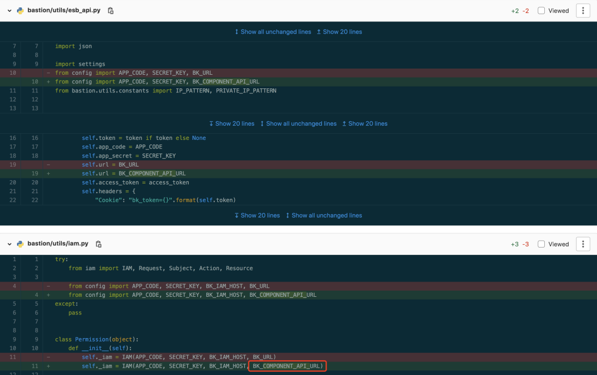

# 二进制升级至容器化 SaaS 改造（预览版本，请勿用于生产环境）

> 该文档适用于 `Python 开发框架 V2` 改造适配 `Python 开发框架 V3`

1. 请删除代码仓库中的 `blueking`, `blueapps` 这两个文件夹

2. 从官网下载最新的 [Python 开发框架 V3](https://bk.tencent.com/docs/document/6.0/149/6700) 的包

3. 将下载下来的 framework_*.tar.gz 开发框架包的的 `app_desc.yaml`，`runtime.txt` 文件，`blueking`  文件夹 放到您的代码的根目录中

4. 在项目的 `requirements.txt` 文件中新增

    ```bash
    # app_desc.yaml文件里依赖包
    blueapps==4.4.2
    eventlet==0.31.0 
    greenlet==1.1.3  
    gunicorn==19.7.1
    ```

5. 将以下内容添加 `config/__init__.py` 文件中

    ```bash
    def get_env_or_raise(key):
        """Get an environment variable, if it does not exist, raise an exception"""
        value = os.environ.get(key)
        if not value:
            raise RuntimeError(
                (
                    'Environment variable "{}" not found, you must set this variable to run this application.'
                ).format(key)
            )
        return value

    # SaaS应用ID
    APP_CODE = os.getenv("BKPAAS_APP_ID")

    # SaaS安全密钥，注意请勿泄露该密钥
    SECRET_KEY = os.getenv("BKPAAS_APP_SECRET")

    # PAAS平台URL
    BK_URL = os.getenv("BKPAAS_URL")

    # ESB API 访问 URL
    BK_COMPONENT_API_URL = os.getenv("BK_COMPONENT_API_URL")
    ```

6. 在 config/stag.py  config/prod.py 文件中确认是否有定义 MySQL、Redis 等服务，如有使用，请到 【开发者中心】-对应应用下-【增强服务】-【数据存储】启动相对应的数据库服务

    DATABASES 的信息在开发框架中已经定义好了，可以直接把这两个文件中定义的 DATABASES 信息删除，或者改成以下环境变量

    ```bash
    DATABASES = {
        'default': {
            'ENGINE': 'django.db.backends.mysql', 
            'NAME': os.environ.get('MYSQL_NAME'),
            'USER': os.environ.get('MYSQL_USER'),
            'PASSWORD': os.environ.get('MYSQL_PASSWORD'),
            'HOST': os.environ.get('MYSQL_HOST'), 
            'PORT': os.environ.get('MYSQL_PORT'),
        }
    }
    ```

    Redis 需要修改为通过以下环境变量

    ```bash
    REDIS_HOST = os.environ.get('REDIS_HOST')
    REDIS_PORT = int(os.environ.get('REDIS_PORT'))
    REDIS_PASSWORD = os.environ.get('REDIS_PASSWORD')
    ```

7. 全文搜索用到 BK_URL 的地方，如有用到，按以下情况修改

    - 用于调用 ESB 的 API，如  {BK_URL}/api/c/compapi ，则需要修改为使用 BK_COMPONENT_API_URL

    

    - 用于拼接登录地址，如 BK_URL + "/login/"，则替换为环境变量 BKPAAS_LOGIN_URL
    - 用于拼接桌面地址，如 BK_URL + "/console/"，则替换为环境变量 BKPAAS_CONSOLE_URL

8. 迁移 SaaS 应用

    > 如果原来使用的是 GitHub 的仓库地址，请确保没有被墙的风险，否则请将仓库更换为 Gitee

    - 前往开发者中心，选择【一键迁移】将需要迁移的应用【迁移到新版开发者中心】，勾选全部选项，开启迁移
    - 返回开发者中心首页，选择对应应用进行部署，【应用引擎】-【部署管理】，如果存在多模块，请注意切换模块按应用顺序依次部署
    - 应用上架应用市场，【应用推广】-【应用市场】，点击【查看风险】后，确认风险。开启【未发布到应用市场】，最后保存即可
    - 返回开发者中心【一键迁移】页面，完成剩下确认迁移步骤即可

9. 如遇报错，请参考文档 [https://bk.tencent.com/docs/document/7.0/170/13878](https://bk.tencent.com/docs/document/7.0/170/13878) 解决
