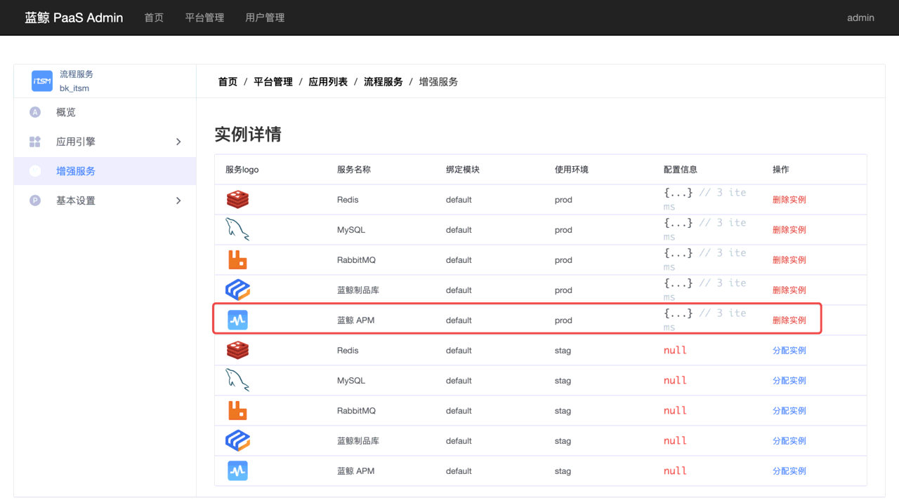

蓝鲸监控日志套餐由监控平台及日志平台组成。


# 部署与访问

## 部署监控平台
在 中控机 执行
``` bash
cd ~/bkhelmfile/blueking/  # 进入工作目录
helmfile -f monitor-storage.yaml.gotmpl sync  # 部署监控依赖的存储
helmfile -f 04-bkmonitor.yaml.gotmpl sync  # 部署监控后台和saas以及监控数据链路组件
# 在admin桌面添加应用，也可以登录后自行添加。
scripts/add_user_desktop_app.sh -u "admin" -a "bk_monitorv3"
# 设为默认应用。
scripts/set_desktop_default_app.sh -a "bk_monitorv3"
```
约等待 5 ~ 10 分钟，期间 `bk-monitor-consul` pod 可能 `Error` 且自动重启。

如果部署中报错：
``` plain
hook[presync] logs | bkrepo没有blueking项目，请检查bkrepo安装是否正确
hook[presync] logs |
in ./04-bklog-search.yaml.gotmpl: failed processing release bk-logsearch: hook[./scripts/add_bkrepo_bucket.sh]: command `./scripts/add_bkrepo_bucket.sh` failed: command "./scripts/add_bkrepo_bucket.sh" exited with non-zero status:
```
请检查中控机解析到的 `bkrepo` 域名是否正确，以及 `scripts/add_bkrepo_bucket.sh` 脚本中的 `BKREPO_ADMIN_PASSWORD` 是否正确。

## 访问监控平台
需要配置域名 `bkmonitor.$BK_DOMAIN`，操作步骤已经并入《基础套餐部署》文档的 “[配置用户侧的 DNS](install-bkce.md#hosts-in-user-pc)” 章节。

配置成功后，即可在桌面打开 “监控平台” 应用了。

此时访问 “观测场景” —— “Kubernetes” 界面会出现报错。为未启用容器监控所致，完成下文的 “配置容器监控” 章节即可正常使用。


## 部署日志平台
在 中控机 执行
``` bash
cd ~/bkhelmfile/blueking/  # 进入工作目录
helmfile -f 04-bklog-search.yaml.gotmpl sync  # 部署
# 在admin桌面添加应用，也可以登录后自行添加。
scripts/add_user_desktop_app.sh -u "admin" -a "bk_log_search"
# 设为默认应用。
scripts/set_desktop_default_app.sh -a "bk_log_search"
```

>**提示**
>
>**如果部署期间出错，请先查阅 《[问题案例](troubles.md)》文档。**
>
>问题解决后，可重新执行 `helmfile` 命令。


## 访问日志平台
需要配置域名 `bklog.$BK_DOMAIN`，操作步骤已经并入《基础套餐部署》文档的 “[配置用户侧的 DNS](install-bkce.md#hosts-in-user-pc)” 章节。

配置成功后，即可在桌面打开 “日志平台” 应用了。


# 配置可选功能
在完成了平台部署后，如下功能还需要额外配置才能使用：
* 监控平台
  * 容器监控
  * 蓝鲸服务 SLI 看板
  * 应用监控（APM）
  * 蓝鲸 SaaS 接入应用监控
* 日志平台
  * 容器日志采集

请阅读下方对应章节进行操作。


<a id="bkmonitor-install-operator" name="bkmonitor-install-operator"></a>

## 容器监控
在配置了容器监控后，我们可以访问 “监控平台” 的 “观测场景” —— “Kubenetes” 界面了。

### 前置检查
容器监控功能需要在所有 k8s node （包括 master ）部署 gse-agent。请先在 “节点管理” 中完成 agent 安装。

容器监控功能依赖 **容器管理平台** （BCS），请先完成 [容器管理平台部署](install-bcs.md) 。

容器监控功能依赖 **监控平台** ，请先完成 “部署监控平台” 章节。

### 调整 bkmonitor
需要能读取 bcs 管理接口。
``` bash
cd ~/bkhelmfile/blueking/  # 进入工作目录
./scripts/config_monitor_bcs_token.sh  # 获取bcs token，写入monitor及log的custom.yaml文件。
helmfile -f 04-bkmonitor.yaml.gotmpl apply   # apply 仅增量更新
```

### 部署 bkmonitor-operator

``` bash
cd ~/bkhelmfile/blueking/  # 进入工作目录
helmfile -f 04-bkmonitor-operator.yaml.gotmpl sync  # 部署
```

然后在新窗口中检查 pod 稳定状态为 `Running` 即可：
``` bash
kubectl get pod -n bkmonitor-operator -w
```

>**提示**
>
>**如果部署期间出错，请先查阅 《[问题案例](troubles.md)》文档。**
>
>问题解决后，可重新执行 `helmfile` 命令。


## 蓝鲸服务 SLI 看板
启用 SLI Metrics 后，可以在 “监控平台” —— “仪表盘” 里查看详细的蓝鲸服务报表。

>**提示**
>
>启用 SLI 后，会大幅提高 influxdb 及 elasticsearch 的磁盘及内存开销。建议额外准备 300G 磁盘及 4GB 内存余量。

### 检查 servicemonitor 资源
在 **中控机** 执行如下命令，预期看到 `bkmonitor-operator` 命名空间下的多个资源：
``` bash
kubectl get servicemonitors.monitoring.coreos.com -A
```
如果没有输出，请先配置容器监控。


### 配置指标上报

修改全局配置文件，启用指标上报。
``` bash
cd ~/bkhelmfile/blueking/  # 进入工作目录
# 启用指标上报：
case $(yq e '.serviceMonitor.enabled' environments/default/custom.yaml) in
  null)
    tee -a environments/default/custom.yaml <<< $'serviceMonitor:\n  enabled: true'
  ;;
  true)
    echo "environments/default/custom.yaml 中配置了 .serviceMonitor.enabled=true, 无需修改."
  ;;
  *)
    echo "environments/default/custom.yaml 中配置了 .serviceMonitor.enabled 为其他值, 请手动修改值为 true."
  ;;
esac
```

### 重启待上报指标的平台
为了实现指标上报，需要调整对应平台的 helm release。

在 中控机 执行如下命令：
``` bash
cd ~/bkhelmfile/blueking/  # 进入工作目录
helmfile -f base-blueking.yaml.gotmpl apply  # 变更蓝鲸基础套餐
helmfile -f 03-bcs.yaml.gotmpl apply  # 变更容器管理平台
helmfile -f 04-bkmonitor.yaml.gotmpl apply  # 变更监控平台
helmfile -f 04-bklog-search.yaml.gotmpl apply  # 变更日志平台
```

如果看到如下报错，说明没有正确配置容器监控功能，请重新配置。
``` plain
Error: unable to build kubernetes objects from release manifest: unable to recognize "": no matches for kind "ServiceMonitor" in version "monitoring.coreos.com/v1"
```

### 导入仪表盘
登录监控平台，并切换到“仪表盘”界面。

点击左侧导航栏的“批量导出和导入”菜单，点击“点击导入”按钮，进入导入界面。

请下载如下文件导入:
* [bk_monitor-dashboards-sli-20221008.tar.gz](https://bkopen-1252002024.file.myqcloud.com/ce7/files/bk_monitor-dashboards-sli-20221008.tar.gz)

导入成功后，无需配置监控目标，点击完成结束整个导入流程。

然后请回到“仪表盘”界面，找到并进入 “\[BlueKing] 各产品看板入口” 仪表盘。您可以从这里快速访问蓝鲸各平台的仪表盘。

>**提示**
>
>您可以收藏此仪表盘。刷新页面后，即可在左侧导航栏看到。

### 已知问题
目前部分 panel 加载时可能出现报错，请等待我们后续优化。
``` plain
请求系统'unify-query'错误，返回消息: {"error":"expanding series: db: process, err:[get cluster failed]"}，请求URL: http://bk-monitor-unify-query-http:10205/query/ts
```

## 应用监控（APM）
应用监控支持 OpenTelemetry 标准。蓝鲸提供部署 OTel 服务器的方案，以便与监控平台集成。

### 启动 OTel 服务
通过蓝鲸 “节点管理” 系统部署 OTel 服务端。

请通过蓝鲸桌面访问 “节点管理” 系统，在 “插件状态” 界面选择至少 1 台服务器。

然后点击 “安装/更新” 按钮，在弹框中选择 `bk-collector` 插件。连续点击 “下一步” 确认版本后，点击 “立即执行” 开始部署。

当插件安装成功后，我们得到了一批 OTel 服务端。

### 调整蓝鲸监控配置
让蓝鲸 “监控平台” 知晓我们部署的 OTel 服务端 IP，以便推送配置信息。

请通过蓝鲸桌面访问 “监控平台” 系统，点击顶部导航右侧的齿轮图标，在弹出菜单中选择 “全局设置”。

在 “全局设置” 界面，找到配置项 “自定义上报默认服务器”，填写刚才部署的 OTel 服务端 IP。如果有多个 IP，需要逐个 IP 填写。填写完毕后点击页脚 “提交” 按钮保存配置。


### 接入应用监控
您可以参考使用文档接入自己的应用。

蓝鲸已有部分 SaaS 接入了应用监控，请参考 “蓝鲸 SaaS 接入应用监控” 章节进行配置。

蓝鲸其他产品还在陆续接入中，敬请期待。


## 蓝鲸 SaaS 接入应用监控
蓝鲸的 “流程服务” 和 “标准运维” 适配了应用监控，完成如下配置即可上报 Trace 数据。

### 前置检查
请先参考 “应用监控（APM）” 章节完成配置。

### 调整 PaaS 启用 OTel
PaaS 启用 OTel 相关配置后，如 SaaS 有声明依赖 `otel` 服务，则会为其提供相关环境变量。

操作步骤如下：

修改 bk-paas 的 values 文件，目前仅支持单个 IP 地址，请按需自备负载均衡服务。
``` bash
cd ~/bkhelmfile/blueking/  # 进入工作目录
BK_OTEL_IP=    # 请填写 OTel 服务端 IP 或者负载均衡器 IP。
# 启用 OTel：
case $(yq e '.global.bkOtel.enabled' environments/default/bkpaas3-custom-values.yaml.gotmpl) in
  null|"")
    tee -a environments/default/bkpaas3-custom-values.yaml.gotmpl <<< $'global:\n  bkOtel:\n    enabled: true\n    bkOtelGrpcUrl: http://'"$BK_OTEL_IP:4317"
  ;;
  true)
    echo "environments/default/bkpaas3-custom-values.yaml.gotmpl 中配置了 .global.bkOtel.enabled=true, 无需修改."
  ;;
  *)
    echo "environments/default/bkpaas3-custom-values.yaml.gotmpl 中配置了 .global.bkOtel.enabled 为其他值, 请手动修改值为 true."
  ;;
esac
```
重新部署 bk-paas：
``` bash
helmfile -f base-blueking.yaml.gotmpl -l name=bk-paas apply
```
检查 helm release 的配置是否生效：
``` bash
helm get values -n blueking bk-paas | yq e '.global.bkOtel' -
```
预期输出：
``` yaml
bkOtelGrpcUrl: http://OTel服务端IP:4317
enabled: true
```
增强服务的配置项使用了缓存技术，刷新间隔约为 1 小时。

为了确保 SaaS 可以获得 OTel 配置，请在中控机执行如下命令删除 Redis 缓存：
``` bash
redis_pass=$(kubectl get secrets -n blueking bk-redis -o go-template='{{index .data "redis-password" | base64decode }}{{"\n"}}')  # 取得redis密码
kubectl exec -i -n blueking bk-redis-master-0 -- redis-cli -h bk-redis-master -p 6379 -a "$redis_pass" -n 0 del "1remote:service:config:a31e476d-5ec0-29b0-564e-5f81b5a5ef32"  # 删除增强服务 蓝鲸apm 的缓存
```

然后重建缓存：
``` bash
kubectl exec -i -n blueking deploy/bkpaas3-apiserver-web -- python manage.py shell <<< 'from paasng.platform.scheduler.jobs import update_remote_services; update_remote_services()'  # 重建缓存，此命令无输出。
```
如果重建缓存时抛出异常 `ValueError: Service uuid=a31e476d-5ec0-29b0-564e-5f81b5a5ef32 with a different source already exists`，说明旧缓存没有删除掉，请先重试删除缓存的命令。

### 重新部署 SaaS
流程服务 及 标准运维 接入了应用监控，但是之前部署时还没有配置 PaaS 启用 OTel，所以需要 **重新部署** 一次才能让相关环境变量生效。

重新部署成功后，访问左侧导航栏的 “增强服务” —— “健康监测” 界面。在 “已启用的服务” 中找到 “蓝鲸 APM”，点击进入。

在新界面的 “实例详情” 面板中，我们可以看到 OTel 相关的环境变量（如下图所示），这个说明我们的 SaaS 已经成功配置了蓝鲸 APM。


如果提示 “暂无增强服务配置信息”，说明 PaaS OTel 配置不正确或者缓存未刷新。请参考 “调整 PaaS 启用 OTel” 章节重新操作一次。

>**提示**
>
>如果您的 OTel 配置发生了变动，但是 SaaS “增强服务”——“健康检测” 里显示的配置信息依旧为旧版本，可以访问后台管理界面手动删除：
>1. 在登录状态下访问 `http://bkpaas.替换为BK_DOMAIN/backend/admin42/applications/` 进入 “蓝鲸 PaaS Admin” 的 “应用列表” 界面.
>2. 点击对应的 SaaS 名称进入管理页。
>3. 在左侧导航点击 “增强服务”，进入 “实例详情” 列表。找到使用环境对应的 “蓝鲸 APM” 服务，点击 “删除实例”。然后重新部署对应环境的 SaaS 即可。
>   


### 访问蓝鲸 APM
通过 “蓝鲸桌面” 打开 “监控平台”，在顶部导航栏选择 “观测场景”，然后侧栏选择 “APM”。

此时可以看到已经出现了应用列表。如果提示 “无数据”，请耐心等待 10 分钟左右。如果长时间没有数据，请检查步骤是否错漏，以及监控平台是否正常。


## 容器日志采集

### 前置检查
容器日志采集功能需要在所有 k8s node （包括 master ）部署 gse-agent。请先在 “节点管理” 中完成 agent 安装。

容器日志采集功能依赖 **容器管理平台** （BCS），请先完成 [容器管理平台部署](install-bcs.md) 。

容器日志采集功能依赖 **日志平台** ，请先完成 “部署日志平台” 章节。

### 配置 bcs token
>**提示**
>
>如果此前已经完成了“配置容器监控”章节，则可跳过本步骤。

需要能读取 bcs 管理接口。
``` bash
cd ~/bkhelmfile/blueking/  # 进入工作目录
./scripts/config_monitor_bcs_token.sh  # 获取bcs token，写入monitor及log的custom.yaml文件。
```

### 部署 bklog-collector
修改全局配置文件，启用日志采集。
``` bash
cd ~/bkhelmfile/blueking/  # 进入工作目录
# 启用日志采集：
case $(yq e '.bkLogConfig.enabled' environments/default/custom.yaml) in
  null)
    tee -a environments/default/custom.yaml <<< $'bkLogConfig:\n  enabled: true'
  ;;
  true)
    echo "environments/default/custom.yaml 中配置了 .bkLogConfig.enabled=true, 无需修改."
  ;;
  *)
    echo "environments/default/custom.yaml 中配置了 .bkLogConfig.enabled 为其他值, 请手动修改值为 true."
  ;;
esac
```

部署或重启日志采集器：
``` bash
cd ~/bkhelmfile/blueking/  # 进入工作目录
helmfile -f 04-bklog-collector.yaml.gotmpl sync
# 等待1分钟，如果 pod 稳定状态为 Running ，则部署完成。
timeout 60 kubectl get pods -n blueking -w | grep bklog-collector
```

如果 pod 状态异常，请检查 pod 的日志。
``` bash
kubectl logs -n blueking bklog-collector-bk-log-collector-补全名称 bkunifylogbeat-bklog
```

未在 “节点管理” 中为所有 node 安装 agent 时，`bklog-collector-bk-log-collector` 系列 pod 的日志中会出现如下报错：
``` plain
failed to initialize libbeat: error initializing publisher: dial unix /data/ipc/ipc.state.report: connect: no such file or directory
```

在部署 gse agent 成功后，上述 pod 会逐步自动恢复。也可直接删除出错的 pod，会立刻重新创建。

### 重启日志平台
1. 为了显示 “检索” -- “数据查询” 里的索引集。
2. 为了实现上述索引集里的 bklogsearch 采集项上报。

``` bash
cd ~/bkhelmfile/blueking/  # 进入工作目录
helmfile -f 04-bklog-search.yaml.gotmpl apply
```

### 重启待采集日志的平台
为了实现采集项上报，需要调整对应平台的 helm release。

``` bash
cd ~/bkhelmfile/blueking/  # 进入工作目录
helmfile -f base-blueking.yaml.gotmpl apply  # 变更蓝鲸基础套餐
helmfile -f 03-bcs.yaml.gotmpl apply  # 变更容器管理平台
helmfile -f 04-bkmonitor.yaml.gotmpl apply  # 变更监控平台
```

注：
1. 如需重启蓝鲸基础套餐的指定 helm release，请使用此命令： `helmfile -f base-blueking.yaml.gotmpl -l name=release名字 sync`。
2. bk-ci 的日志采集还在调试中，暂未预置采集项。
