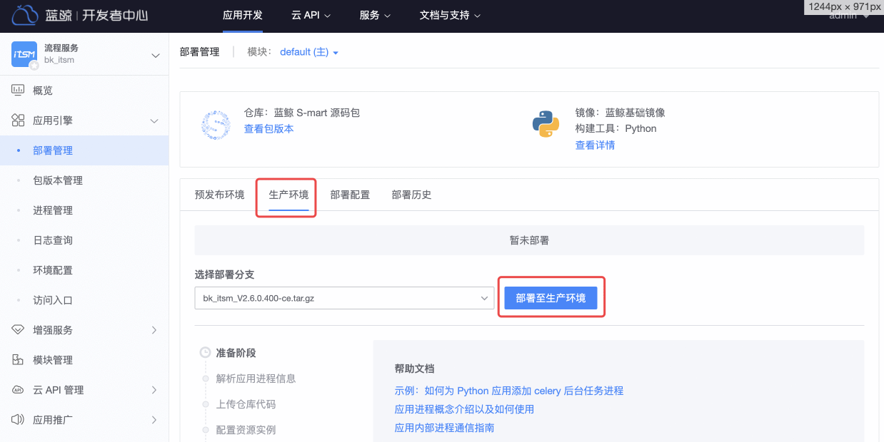
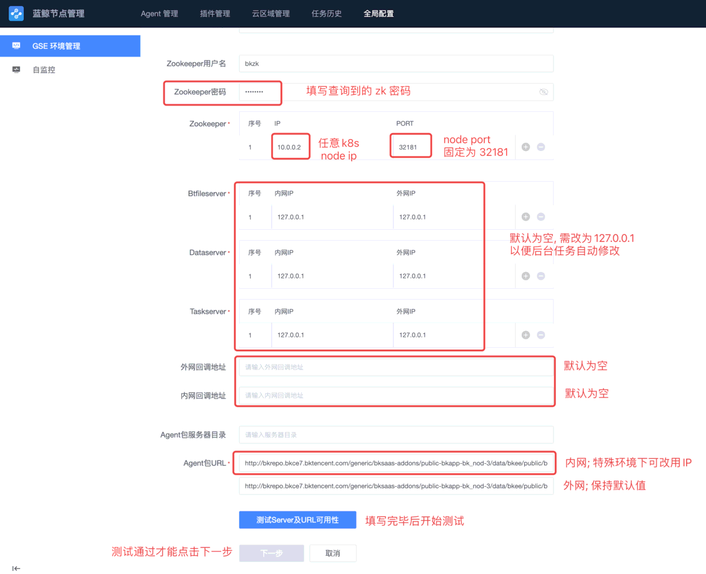

我们已经提供了“一键脚本”，可以完成本文档的大部分内容，如果还没阅读过《[基础套餐部署](install-bkce.md)》文档，请先阅读一次。

# 手动部署基础套餐 SaaS

<a id="saas-res-download" name="saas-res-download"></a>

## 需要提前下载的资源
资源一共分为 2 类：
1. SaaS 安装包。
2. 托管在节点管理上的文件： GSE 客户端、插件及其他文件。

在您开始下载后，可以继续跟随文档完成一些初始设置，待下载完成后部署 SaaS。

### SaaS 安装包
需要您在浏览器中下载，随后在开发者中心上传并部署。

| 名字及 app_code | 版本号 | 下载链接 |
|--|--|--|
| 流程服务（bk_itsm） | 2.6.2 | https://bkopen-1252002024.file.myqcloud.com/saas-paas3/bk_itsm/bk_itsm-V2.6.2.tar.gz |
| 标准运维（bk_sops） | 3.25.12 | https://bkopen-1252002024.file.myqcloud.com/saas-paas3/bk_sops/bk_sops-V3.25.12.tar.gz |
| 节点管理（bk_nodeman） | 2.2.27 | 使用 helmfile 部署时自动下载 Charts，此处无需下载 |

### 节点管理托管文件

鉴于需要下载上传的文件众多，浏览量下载上传会非常繁琐，因此我们推荐使用下载脚本处理。

请在 **中控机** 下载所需的文件，后续步骤中会在中控机调用脚本上传。

*  一般只需下载节点管理托管的常用文件（包含 Linux 及 Windows 的 64 位 GSE 客户端及插件包）：
    ``` bash
    curl -sSf https://bkopen-1252002024.file.myqcloud.com/ce7/7.0-stable/bkdl-7.0-stable.sh | bash -s -- -ur latest nodeman  # 下载节点管理托管的常用文件
    ```
* 如果需要下载完整的托管文件（包含多云区域管理所需的 `gse_proxy`，以及其他不常用 CPU 及操作系统的客户端及插件包）：
    ``` bash
    curl -sSf https://bkopen-1252002024.file.myqcloud.com/ce7/7.0-stable/bkdl-7.0-stable.sh | bash -s -- -ur latest nm_gse_full
    ```

<a id="paas-svc-redis" name="paas-svc-redis"></a>

## 在 PaaS 界面配置 Redis 资源池
添加 SaaS 使用的 Redis 资源池。如果部署 SaaS 时提示 “分配不到 redis”，则需补充资源实例。

>**提示**
>
>目前 Redis 资源池分为 2 类：
>- `0shared`：共享实例。池内实例允许重复以供多个 SaaS 复用。由 SaaS 自主规避 `key` 冲突。
>- `1exclusive`：独占实例。池内实例不应该重复，否则可能因为 `key` 冲突而影响 SaaS 运行。

先登录「开发者中心」。访问 `http://bkpaas.$BK_DOMAIN` （需替换 `$BK_DOMAIN` 为您配置的蓝鲸基础域名。）

访问蓝鲸 PaaS Admin（如果未登录则无法访问）： `http://bkpaas.$BK_DOMAIN/backend/admin42/platform/pre-created-instances/manage` 。

在 「`0shared`」这行点击 「添加实例」，重复添加 5 - 10 次（蓝鲸基础套餐会占用 4 个实例，余量可供后续安装的 SaaS 使用）。如需保障 SaaS 性能，可使用自建的 Redis 服务（需确保 k8s node 可访问）。


启用 “可回收复用” 开关，并在 “实例配置” 贴入配置代码，在 **中控机** 执行如下命令生成：
``` bash
redis_json_tpl='{"host":"%s","port": %d,"password":"%s"}'
redis_host="bk-redis-master.blueking.svc.cluster.local"  # 默认用蓝鲸默认的redis，可自行修改
redis_port=6379  # 按需修改
redis_pass=$(kubectl get secret --namespace blueking bk-redis \
  -o jsonpath="{.data.redis-password}" | base64 --decode)  # 读取默认redis的密码，按需修改赋值语句
printf "$redis_json_tpl\n" "$redis_host" "$redis_port" "$redis_pass" | jq .  # 格式化以确保json格式正确
```

命令输出如下图所示：


浏览器界面如下图所示：


<a id="upload-bkce-saas" name="upload-bkce-saas"></a>

## 上传安装包
私有化环境里需要先行创建应用并上传安装包，后续更新需在该应用的管理界面上传。

蓝鲸 SaaS 应用采用 `S-Mart` 包分发。你可以在 [S-Mart 市场](https://bk.tencent.com/s-mart/market) 中找到更多应用，也是通过此方法安装。

>**注意**
>
>请选择适配蓝鲸 7.0 的应用，未适配版本可能无法正常运行。
>
>旧版包的安装过程需要构建工具，默认没有安装，请完成《[上传 PaaS runtimes 到 bkrepo](paas-upload-runtimes.md)》文档。

### 创建应用
登录 “蓝鲸桌面”，在侧栏导航里打开 “开发者中心”。

点击右上角的 “创建应用” 按钮，进入“创建应用”界面。

选择 “S-mart 应用”，点击上传区域，选择提前下载的 SaaS 安装包。操作步骤如下图所示：


文件选择成功后，后台会开始检查安装包。并显示解析到的包信息，点击 “确认并创建应用” 按钮开始创建。

>**提示**
>
>如果报错 `应用ID: xxx 的应用已存在!`，说明已经存在应用，需要执行下文的 更新安装包 流程。
>
>其他异常请查阅《[问题案例](troubles.md#install-saas)》文档。

稍等片刻后，会显示成功页面：`恭喜，应用 "应用名称" 创建成功`。此时可点击提示下方常用操作里的 “部署应用” 链接，进入“部署管理”界面开始部署。


### 更新安装包
登录 “蓝鲸桌面”，在侧栏导航里打开 “开发者中心”。

从顶部导航栏进入“应用开发”界面。

点击名称进入应用概览界面，在左侧展开 “应用引擎”目录，点击 “包版本管理”。

在包版本管理界面，点击“上传新版本”按钮，会弹出上传窗口。后续流程和上文 创建应用 类似，此处不再赘述。

新版本上传成功后，在页面左侧导航栏展开 “应用引擎”目录，点击 “部署管理” 开始部署。


<a id="deploy-bkce-saas" name="deploy-bkce-saas"></a>

## 各 SaaS 部署过程

<a id="deploy-bkce-saas-itsm" name="deploy-bkce-saas-itsm"></a>

### 部署流程服务（bk_itsm）
请参考上文 上传安装包 章节完成应用创建或者安装包更新。

流程服务（bk_itsm） **无需额外配置**，所以可以直接在 “部署管理” 界面开始部署。

共有 **一个模块** 需要部署，详细步骤如下：
1. 顶部的“模块”可以选择要部署的模块。流程服务（bk_itsm）只有 `default` 模块，故无需切换。
2. 然后切换下方面板到 “生产环境”。
3. 展开“选择部署分支”下拉框，在 `image` 分组下选择刚才上传的版本（如果计划部署 `package` 分组下的版本，需要先完成《[上传 PaaS runtimes 到 bkrepo](paas-upload-runtimes.md)》文档）。
4. 点击右侧的“部署至生产环境”按钮。部署期间会显示进度及日志。

>**提示**
>
>部署如有异常，请先查阅《[问题案例](troubles.md#install-saas)》文档。

步骤示例图：



<!--
<a id="deploy-bkce-saas-gsekit" name="deploy-bkce-saas-gsekit
"></a>

### 部署进程配置管理（bk_gsekit）

**无需额外配置**，只有 `default` 模块需要部署。

具体步骤可参考 “[部署流程服务（bk_itsm）](#deploy-bkce-saas-itsm)” 章节。
-->

<a id="deploy-bkce-saas-sops" name="deploy-bkce-saas-sops"></a>

### 部署标准运维（bk_sops）
请参考上文 上传安装包 章节完成应用创建或者安装包更新。

标准运维（bk_sops）**无需额外配置**，共有 **四个模块** 需要部署，详细操作可参考 流程服务，此处仅为概述：
1. 选择部署模块，需要先部署 `default` 模块。
2. 选择 生产环境。
3. 选择版本。
4. 点击 “部署至生产环境” 按钮。
5. 等 `default`模块 **部署成功后**，开始部署 `api`、`pipeline`与`callback` 等 3 个模块（无次序要求，可同时部署）。重复步骤 1-4，每轮操作注意**切换模块**。

模块位置及点击次序见图：


<a id="deploy-bkce-saas-nodeman" name="deploy-bkce-saas-nodeman"></a>

### 部署节点管理（bk_nodeman）
目前节点管理已经改为了 Charts 形态，通过 `helmfile` 命令进行部署。

安装节点管理之前，保障中控机上能解析 `bkrepo.$BK_DOMAIN` 的域名，因为安装时会自动调用脚本在 bkrepo 中创建 bucket。
``` bash
cd ~/bkhelmfile/blueking/  # 进入工作目录
helmfile -f base-blueking.yaml.gotmpl -l name=bk-nodeman sync
```

<a id="bkconsole-add-app-saas" name="bkconsole-add-app-saas"></a>

## 为用户桌面添加应用
>**提示**
>
>使用“一键部署” 脚本部署 标准运维、流程服务及节点管理 时，会自动完成此步骤。

用户初次登录蓝鲸桌面时，会在第一个桌面看到自动添加的 **默认应用**。当然也可由用户手动添加其他应用。

在部署 SaaS 成功后，管理员可能希望让全部用户桌面直接出现这个应用。

那么可以组合如下的脚本达成效果：
* 使用 `set_desktop_default_app.sh` 将应用设置为 **默认应用**。<br/>
  如果用户已经登录，则 **此后设置的默认应用** 不会添加到该用户的桌面。
* 使用 `add_user_desktop_app.sh` 为 **已登录过桌面的用户** 添加应用到第一个桌面。<br/>
  如果用户未曾登录过，不应该使用此脚本，因为这样做会导致为新用户桌面添加 **默认应用** 的逻辑失效。

脚本用法如下：
``` bash
cd ~/bkhelmfile/blueking/  # 进入工作目录
# 将 bk_itsm, bk_sops 和 bk_nodeman 设为默认应用。
./scripts/set_desktop_default_app.sh -a "bk_itsm,bk_sops,bk_nodeman"
# 在之前的步骤中，用户 admin 已经登录过桌面。默认应用对其无效，需要主动为其添加。
./scripts/add_user_desktop_app.sh -u "admin" -a "bk_itsm,bk_sops,bk_nodeman"
```

脚本执行成功无输出；如果失败，会显示报错。

常见报错：
* app_code 有误，输出为 `App(app-code-not-exist) not exists`。


<a id="post-install-bk-saas" name="post-install-bk-saas"></a>

## SaaS 部署后的设置
>**提示**
>
>一些 SaaS 在部署成功后，还需要做初始化设置。

<!--
<a id="post-install-bk-lesscode" name="post-install-bk-lesscode"></a>

### 蓝鲸可视化平台（bk_lesscode）部署后配置
目前 bk_lesscode 只支持通过独立域名来访问。我们约定使用了 `lesscode` 作为前缀，暂时不能自定义其他名称。

操作步骤：
1. 在 bk_lesscode 应用页中, 点击 「应用引擎」-「访问入口」中配置独立域名并保存。
2. 在应用推广-发布管理中，将应用市场的访问地址类型设置为：主模块生产环境独立域名

步骤示例图：


-->

<a id="post-install-bk-nodeman" name="post-install-bk-nodeman"></a>

### 节点管理（bk_nodeman）部署后配置

<a id="post-install-bk-nodeman-gse-client" name="post-install-bk-nodeman-gse-client"></a>

#### agent 资源上传
>**提示**
>
>* “一键部署” 脚本部署节点管理（ `-i nodeman`）时 ，已经上传过一次 agent 及插件。
>* 当您需要更新客户端或者加装云区域代理时，可以在下载后使用此命令重新上传。

在前面的操作中，我们已经在中控机下载了所需的文件，如需更新文件，请查阅本文“提前下载资源”章节。

在 **中控机** 执行如下命令同时上传 agent 资源及 gse 插件：
``` bash
cd ~/bkhelmfile/blueking/  # 进入工作目录
./scripts/setup_bkce7.sh -u agent  # 更新节点管理托管的agent资源。
```


<a id="post-install-bk-nodeman-gse-plugin" name="post-install-bk-nodeman-gse-plugin"></a>

#### 上传 gse 插件包
>**提示**
>
>* “一键部署” 脚本部署节点管理（ `-i nodeman`）时 ，已经上传过一次 agent 及插件。
>* 当您需要更新插件时，可以在下载后使用此命令重新上传。

在前面的操作中，我们已经在中控机下载了所需的文件，如需更新文件，请查阅本文“提前下载资源”章节。

在 **中控机** 执行如下命令同时上传 agent 资源及 gse 插件：
``` bash
cd ~/bkhelmfile/blueking/  # 进入工作目录
./scripts/setup_bkce7.sh -u plugin  # 更新节点管理托管的gse插件。
```
结尾提示 `[INFO] upload agent package success` （客户端及 proxy） 和 `[INFO] upload open tools success` （proxy 所需的 nginx 及 py36 等）即为上传成功。

脚本执行完成后，访问节点管理的 「插件管理」——「插件包」界面，可以看到上传成功的插件包：


插件集合包中各子包的用途：
| 插件包名 | 用途 | 描述 |
| -- | -- | -- |
| bkmonitorbeat | 蓝鲸监控指标采集器 | 蓝鲸监控拨测采集器 支持多协议多任务的采集，监控和可用率计算，提供多种运行模式和热加载机制 |
| bkmonitorproxy | 自定义上报服务 | 自定义数据上报服务，用来收集用户自定义上报的时序数据，或事件数据。 |
| bkunifylogbeat | 高性能日志采集 | 数据平台，蓝鲸监控，日志检索等和日志相关的数据. 首次使用插件管理进行操作前，先到日志检索/数据平台等进行设置插件的功能项 |
| gsecmdline | 自定义上报命令行工具 | 蓝鲸监控脚本采集，自定义监控等自定义上报数据 |
| bk-collector | 多协议数据采集 | 蓝鲸监控，日志检索，应用性能监控使用的高性能 Trace、指标、日志接收端，支持 OT、Jaeger、Zipkin 等多种数据协议格式。 |


>**提示**
>
>`bkmonitorbeat-2.x` 完成了采集功能的统一，故新版插件集合包中移除了下列包：
>| 包名 | 用途 | 描述 |
>| -- | -- | -- |
>| exceptionbeat | 系统事件采集器 | 系统事件采集器，用来收集系统事件如磁盘只读，corefile 产生等。 |
>| basereport | 基础性能采集器 | 负责采集 CMDB 上的实时数据，蓝鲸监控里的主机监控，包含 CPU，内存，磁盘等 |
>| processbeat | 主机进程信息采集器 | 蓝鲸监控主机监控里面的进程信息. 首次使用插件管理进行操作前，先到蓝鲸监控进行设置插件的功能项 |


<a id="post-install-bk-nodeman-gse-env" name="post-install-bk-nodeman-gse-env"></a>

#### 配置 GSE 环境管理
请先登录到蓝鲸桌面，打开“节点管理”应用。然后点击顶部导航栏 “全局配置”，会默认进入“gse 环境管理” 界面。

点击 “默认接入点” 右侧的 “编辑” 图标，进入 “编辑接入点” 界面。根据你的使用场景不同，请阅读对应的章节：
* 内网环境使用 IP 访问节点管理及制品库（兼容性最佳）
* 内网环境使用域名访问节点管理及制品库（要求建设内网 DNS 系统，且机器默认可解析相关域名）
* 公网环境配置（多云管理等复杂场景）

#### 内网环境使用 IP 访问节点管理及制品库
填写要求如下：
1. 不建议编辑默认接入点的名字及说明。
2. **切勿修改区域及城市**。此配置和 GSE 集群配置相关，如果和 GSE 配置不一致则会禁止安装。
3. **zookeeper**系列配置：
   * 用户名和密码可执行如下命令获取 auth 字符串，其格式为 `用户名:密码`。
      ``` bash
      kubectl get -n blueking cm bk-gse-task-config -o go-template --template '{{index .data "gse_task.conf" }}' | jq -r ".zookeeper.token"
      # 蓝鲸bkhelmfile包7.0.0-beta.2及更早版本使用如下命令
      # kubectl get -n blueking cm bk-gse-ce-task-config -o go-template --template '{{index .data "task.conf" }}' | jq -r ".zkauth"
      ```
   * 集群地址填写 **任意 k8s node IP**，端口填写 `bk-zookeeper` 服务的 NodePort： `32181` （注意不是默认的 `2181`）。
4. GSE 服务端系列配置：部署后会填写当前的 IP，可暂不修改。<br />今后如需更新某个字段（`BtfileServer`、`DataServer` 或 `TaskServer` ），请将该字段的**内网 IP**改为 `127.0.0.1`，以指示节点管理自动修改。自动修改仅进行一次，会使用 zookeeper 中的服务发现地址填充**内网 IP**及**外网 IP**。
5. 节点管理回调地址：用于安装日志上报等。需配置为节点管理 `bk-nodeman-backend-api` 服务的 NodePort 地址：`IP:30300`。
   * **外网回调地址**：和内网回调地址保持一致。
   * **内网回调地址**：填写 `http://任意Node的IP:30300/backend` （注意结尾没有斜杠）。
6. 部署文件下载地址。用于下载安装脚本、安装文件及用户自定义的监控插件等。
   * **Agent 包服务器目录**：请保持为空。
   * **agent 包 URL**：需配置为制品库 `bk-repo-bkrepo-gateway` 服务的 NodePort 地址： `IP:30025`。
     * **内网下载 URL**：第一个输入框。填写 `http://任意Node的IP:30025/generic/blueking/bknodeman/data/bkee/public/bknodeman/download`。
     * **外网下载 URL**：第二个输入框。内容同**内网地址**。
7. 点击 “测试 Server 及 URL 可用性”。
8. 测试通过后，可以点击“下一步”。
9. 在新的 “Agent 信息” 及 “Proxy 信息” 确认界面点击 “确认” 按钮即完成。

操作步骤如下图所示：




如果在步骤 4 中将 **内网 IP** 改为 `127.0.0.1`，则回到查看界面后，请 **等待 1 ~ 2 分钟**，然后刷新页面。如果 `BtfileServer`、`DataServer` 或 `TaskServer` 字段的地址有从 `127.0.0.1` 变更为 node 的内网 IP ，则说明读取 zookeeper 成功，否则需检查 zookeeper 的 IP、 端口以及用户名密码是否正确。

#### 内网环境使用域名访问节点管理及制品库
>**提示**
>
>仅当你的内网具备 DNS 服务，且新系统默认能解析 DNS 时，才能顺畅地使用域名作为入口。如果每次安装 agent 前还需要通过其他方式批量修改 `/etc/resolv.conf` 文件，则使用域名并不划算。

请先参考 “内网环境使用 IP 访问节点管理及制品库” 完成配置。然后调整部分字段：
1. 修改节点管理的 **外网回调地址** 和 **内网回调地址** 为域名，链接使用下方代码生成。
2. 修改**agent 包 URL** 的 内网下载 URL 和外网下载 URL 为域名，链接使用下方代码生成。

在 **中控机** 运行如下命令生成 URL 及 域名解析信息：
``` bash
cd ~/bkhelmfile/blueking/  # 进入工作目录
BK_DOMAIN=$(yq e '.domain.bkDomain' environments/default/custom.yaml)  # 从自定义配置中提取, 也可自行赋值
IP1=$(kubectl get svc -A -l app.kubernetes.io/instance=ingress-nginx -o jsonpath='{.items[0].spec.clusterIP}')
cat <<EOF
节点管理外网及内网回调地址（注意结尾没有斜杠）： http://bknodeman.$BK_DOMAIN/backend
agent包URL内网及外网下载URL： http://bkrepo.$BK_DOMAIN/generic/blueking/bknodeman/data/bkee/public/bknodeman/download

配置 DNS 系统或者待纳管主机的 hosts 文件：
$IP1 bkrepo.$BK_DOMAIN
$IP1 bknodeman.$BK_DOMAIN
EOF
```

然后参考上述输出，配置 DNS 系统。

#### 接入点公网配置
>**提示**
>
>TODO

请先参考 “内网环境使用 IP 访问节点管理及制品库” 完成配置。然后调整部分字段。

TODO
